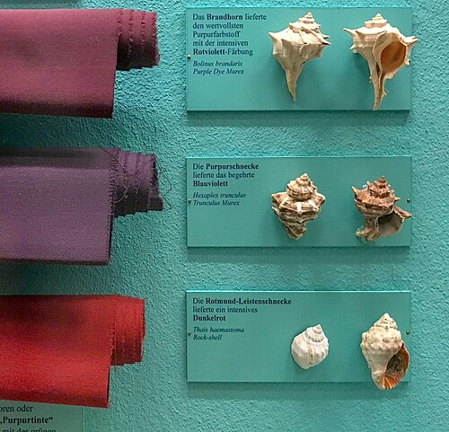

The most expensive color of the ancient world came out of a sea snail. Several Mediterranean species of **murex**, rock snails that hunt other shellfish, carry a gland whose colorless juice turns, in air and sunlight, through green and blue to a deep red-purple that does not fade. Heaps of crushed murex shells on **[Crete](kloom:e/crete)** suggest that Minoan dyers were making it by about the nineteenth century BC. **[Tyrian purple](kloom:e/tyrian-purple)** is named for **[Tyre](kloom:e/tyre-lebanon)**, the Phoenician city whose dyeworks made it famous and whose stench the ancient writers complained of. In the fourth century BC the historian Theopompus wrote that purple dye fetched its weight in silver, and by the fourth century AD only a Roman emperor might wear it.

## Twelve thousand snails

What the color is took until 1909 to learn. The chemist **[Paul Friedländer](kloom:e/paul-friedlander-chemist)** took the glands of 12,000 _Murex brandaris_, spread them on filter paper, let the sun develop the color, and extracted and crystallized what formed. He got 1.4 grams. The crystals were black with a coppery luster, and their analysis gave the formula C₁₆H₈Br₂N₂O₂, which surprised him: it held **[bromine](kloom:e/bromine)**, an element found in sea life and almost never in the dyes of land plants. Two syntheses confirmed that it was **6,6′-dibromoindigo**, the dye of the indigo plant with a bromine atom fixed to each half. The plate draws it: two identical halves turned through half a circle about the central double bond.

Friedländer's patience was not the first tried. The English chemist Edward Schunck had isolated 7 milligrams of the purple from 400 snails in 1879, the chemist Christopher Cooksey writes in his 2001 review, "after which his patience was exhausted".

## How the purple is made

The dye is not in the snail. The gland holds colorless precursors, the sulfates of brominated indoxyls. When the gland is broken an enzyme cuts off the sulfate, and the indoxyls that are left join in pairs in the air, and in light, to make the dye. William Cole, painting the juice of a dog whelk on linen at Minehead in 1685, watched it go light green, deep green, sea green, blue, purplish red and finally a very deep purple "beyond which the Sun can do no more".

The finished dye will not dissolve in water, so it cannot soak into wool. The ancient dyer's answer, as for indigo, was a vat. **[Pliny the Elder](kloom:e/pliny-the-elder)** gives a recipe in his _Natural History_: salt the glands for three days, then heat them gently for about ten more in a vessel of _plumbum_, which can mean lead or tin, and test the color on a fleece. Chemists read it as a reduction. Something in the vat, a metal or bacteria fermenting, as in a woad vat, turned the insoluble purple into a soluble, pale "leuco" form, which went into the fibers and turned purple again as the air oxidized it. A modern dyer, following Pliny and the woad vat, made it work again in 1998.

## Finding purple by its weight

Bromine does something useful for chemists who hunt the purple on old potsherds and cloth. It has two stable isotopes, of mass 79 and 81, in almost equal amounts, 51 to 49. A molecule with two bromines can hold two light ones, one of each, or two heavy ones, and "one of each" can happen two ways. So a mass spectrometer, which weighs molecules, shows dibromoindigo as three peaks two units apart. By our arithmetic, with nominal masses:

| Bromines | Molecule's mass | Chance, with 79 and 81 at 51 : 49 |
| -------- | --------------: | --------------------------------: |
| 79 + 79  |             418 |                 0.51 × 0.51 = 26% |
| 79 + 81  |             420 |             2 × 0.51 × 0.49 = 50% |
| 81 + 81  |             422 |                 0.49 × 0.49 = 24% |

The 1 : 2 : 1 triplet is the signature of two bromine atoms, and chemical analysts have used it since the late 1960s to find the dye on archaeological finds.

## The oldest cloth

Chemistry has now found the purple itself, not only the shells. In 2021 Naama Sukenik and her colleagues identified murex dye by chromatography on three scraps of wool from **[Timna Valley](kloom:e/timna-valley)** in southern Israel, from a copper-smelting camp called Slaves' Hill. One scrap was radiocarbon dated to between 1114 and 924 BC. Wikipedia calls it the first direct evidence of purple cloth from antiquity; the paper itself says only that it is the earliest from the southern Levant, and lists purple textiles from Syria of the eighteenth to sixteenth centuries BC.

The ancients told a different story of the discovery: Heracles' dog bit a snail on the beach at Tyre and came back with a purple mouth. It is a legend, first told more than a thousand years after the dyers began.

Instructions for dyeing wool purple were also written on clay, and the next frame is chemistry's first written recipes.
