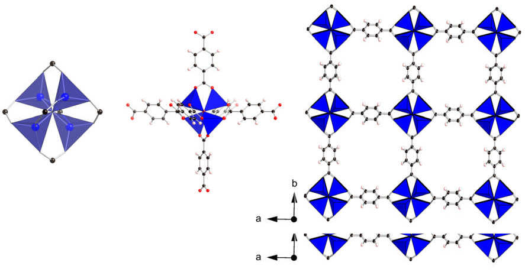

This spine began with green stones in a Serbian fire. It ends on 30 September 2026, with a science that makes new substances faster than anyone can study them, that has begun to hand parts of its work to machines, and that is still paying for some of what it made in the last century. This frame is a snapshot of where things stood on that date.

## How much there is

Since 1907 the **[Chemical Abstracts Service](kloom:e/chemical-abstracts-service)**, a division of the American Chemical Society in Columbus, Ohio, has read the world's chemical literature and given each new substance a number. Its registry now holds "over 290 million substances", in its own words. Wikipedia's account splits a slightly older count into more than 204 million organic and inorganic substances and 69 million protein and DNA sequences, and gives the pace as about 15,000 new substances a day. By our arithmetic that is about 5.5 million a year, or one every six seconds.

## The prizes

The **[Nobel Prize in Chemistry](kloom:e/nobel-prize-in-chemistry)** for 2024 went to David Baker for designing proteins and to Demis Hassabis and John Jumper for predicting their shapes with AlphaFold, the story of the AlphaFold frame. It was announced on 9 October 2024, the day after the physics prize went to John Hopfield and Geoffrey Hinton for the neural networks behind machine learning: two prizes in two days for work that runs on the same kind of machine.

The 2025 prize, announced on 8 October 2025, went to Susumu Kitagawa, Richard Robson and **[Omar Yaghi](kloom:e/omar-m-yaghi)** "for the development of metal–organic frameworks". A **[metal–organic framework](kloom:e/metal-organic-framework)** is a crystal built like scaffolding: metal ions at the joints, long organic molecules as the struts, and empty space between. Robson made the first in 1989, from copper ions and a four-armed molecule; it collapsed easily. Between 1992 and 2003 Kitagawa showed that gases can flow in and out of such frameworks, and Yaghi made stable ones and designed them to order. The picture shows his MOF-5: clusters of zinc and oxygen joined by six rings of terephthalate, repeated into a cubic lattice. The Nobel committee lists what tens of thousands of such frameworks may do: harvest water from desert air, capture carbon dioxide, and take the so-called forever chemicals out of water.

The 2026 prize will be announced on 7 October, a week after this frame's date.

## Machines in the laboratory

In November 2023 two papers in _Nature_ showed chemistry by machine. A team at Google DeepMind reported 2.2 million predicted crystal structures that should be stable, and the A-Lab at Berkeley reported that its robots, planning with models trained on the literature, had made 41 new compounds out of 58 targets in 17 days. In 2024 the chemists Robert Palgrave, Leslie Schoop and their colleagues, reading the X-ray patterns again, concluded that no new material had been made: about two-thirds of the claimed successes were likely known compounds with their atoms disordered. In January 2026 the A-Lab's authors published a correction. They wrote that "new" had meant new to their prediction platform, not to science, and that a manual re-analysis confirmed 36 of the 40 successes it counted, with four inconclusive. Palgrave no longer thought the paper needed retracting, but told _Chemical & Engineering News_ that the correction did not engage with the disorder, "the more fundamental point".

The older movement goes the other way, towards making less. **[Green chemistry](kloom:e/green-chemistry)** took its twelve principles in 1998 from Paul Anastas of the US **[Environmental Protection Agency](kloom:e/united-states-environmental-protection-agency)** and John Warner, then of Polaroid: prevent waste rather than clean it up, use safer solvents, design products to break down.

## Forever chemicals

**[PFAS](kloom:e/pfas)**, per- and polyfluoroalkyl substances, were made not to break down. Fluorine forms the strongest single bond carbon makes:

| Bond in CH₃–X or CF₄ | Bond energy (kcal/mol) | kJ/mol, by our arithmetic |
| -------------------- | ---------------------: | ------------------------: |
| C–F in CF₄           |                  130.5 |                       546 |
| C–F in CH₃F          |            115 (109.9) |                 481 (460) |
| C–H in CH₄           |                  104.9 |                       439 |
| C–Cl in CH₃Cl        |                   83.7 |                       350 |

Wikipedia's article on the bond gives 115 kcal/mol for fluoromethane in its text and 109.9 in its own table; either way, each fluorine added to a carbon makes all its C–F bonds stronger, and a PFAS chain is sheathed in them. The plate draws PFOA, C₈HF₁₅O₂: seven carbons carrying fifteen fluorines, and an acid head.

The same agency set limits for PFOA and PFOS in drinking water in April 2024 of 4.0 parts per trillion, 4 nanograms in a liter. By our arithmetic, with PFOA's molar mass of 414 grams, a liter at that limit still holds 4 × 10⁻⁹ ÷ 414 × 6.02 × 10²³ ≈ 5.8 × 10¹² molecules, nearly six million million. On 18 May 2026 the agency proposed to keep those two limits, to let water systems ask for two more years, to 2031, and to rescind its limits on three other PFAS and on mixtures of them with a fourth. In Europe, the **[European Chemicals Agency](kloom:e/european-chemicals-agency)**'s risk committee adopted its opinion on 3 March 2026 on a proposal to restrict all PFAS and all their uses, first made by five countries in January 2023; its socio-economic committee is due to finish by the end of 2026, and the European Commission then proposes the law.

This spine began when fire first pulled a metal out of stone. Seven thousand years on we can make, name and count hundreds of millions of substances, and we are still learning which of them we should not have made.
