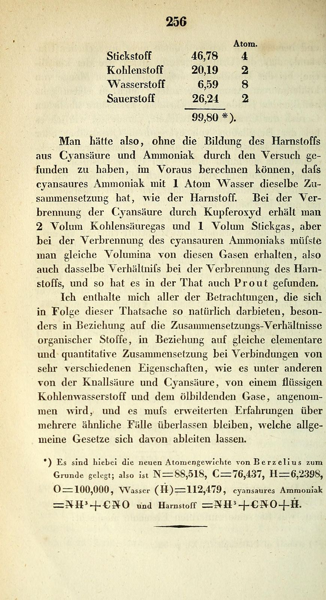

In 1828 **[Friedrich Wöhler](kloom:e/friedrich-wohler)**, a twenty-seven-year-old teacher at the trade school in Berlin, wrote to his old master in Stockholm that he could no longer hold his chemical water. As Wikipedia quotes the letter, he could "make [urea](kloom:e/urea) without the use of kidneys, or indeed of any animal, be it man or dog". **Urea** is the chief nitrogen-bearing substance in the urine of mammals, isolated from it in the eighteenth century. Wöhler had made it in a flask from cyanic acid and ammonia, which no one counted as the products of life, and the paper he published that year, _Ueber künstliche Bildung des Harnstoffs_ (on the artificial formation of urea), is usually called the start of organic chemistry, and the reaction is still called the **[Wöhler synthesis](kloom:e/wohler-synthesis)**. What it did is smaller, and stranger, than the legend.

## A crystal that was not a salt

Wöhler was chasing cyanates. Mixing a cyanate with ammonia by the usual double exchange (lead cyanate with ammonia, or silver cyanate with sal ammoniac) should have given ammonium cyanate, a salt. Instead he got long, clear, four-sided crystals that behaved like no cyanate. Potash drove no ammonia out of them; acids released no cyanic acid; they would not throw down lead or silver salts. With nitric acid they gave shining scales, which he nearly took for a new acid. That behaviour sent him to compare them with "completely pure urea separated from urine", and the two were identical.

Then he did the arithmetic. If cyanic acid and ammonia gave only urea, urea must have the composition of ammonium cyanate, and he set the analysis that **[William Prout](kloom:e/william-prout)** had published of urea beside the composition he calculated for the salt from the newest atomic weights, those just published in Stockholm. We add the formula's percentages, by our arithmetic from today's atomic weights:

| Element  | Urea, Prout's analysis | Ammonium cyanate, Wöhler's sum | CH₄N₂O today |
| -------- | ---------------------: | -----------------------------: | -----------: |
| nitrogen |                 46.650 |                          46.78 |        46.65 |
| carbon   |                 19.975 |                          20.19 |        20.00 |
| hydrogen |                  6.670 |                           6.59 |         6.71 |
| oxygen   |                 26.650 |                          26.24 |        26.64 |

"One could therefore," he wrote, "have calculated in advance" that ammonium cyanate has the same composition as urea. Both are CH₄N₂O: one carbon, four hydrogens, two nitrogens and one oxygen. The plate draws the two. In ammonium cyanate the four hydrogens sit on one nitrogen, as the ion NH₄⁺, beside a separate ion, O=C=N⁻; the salt falls apart in water and gives up ammonia to potash. In urea the carbon holds the oxygen by a double bond and one NH₂ group on each side, all in one neutral molecule, (NH₂)₂CO. Warm the salt and the ammonia and cyanic acid it is in balance with join into urea, which is why Wöhler's crystals were never the salt he meant to make.

## Same parts, different things

The same page says what interested Wöhler more. He "refrains from all the considerations" the fact suggests, especially about compounds of "the same elementary and quantitative composition" with very different properties, such as fulminic acid and cyanic acid. That pair was his and **[Justus von Liebig](kloom:e/justus-von-liebig)**'s. The explosive silver fulminate that Liebig analysed and the stable silver cyanate that Wöhler made had come out the same by analysis in the 1820s.

In 1830, in a paper on tartaric and racemic acids, **[Jöns Jacob Berzelius](kloom:e/jons-jacob-berzelius)**, Wöhler's teacher in Stockholm, gave such bodies a name. He weighed "homosynthetic" against "isomeric" and chose the second, from the Greek for "of equal parts", for its brevity and sound: bodies with the same composition and the same atomic weight but different properties. His examples were the two oxides of tin, fulminic and cyanic acid, and the phosphoric acids; racemic acid, he wrote, had come "at just the right time". Urea and ammonium cyanate are one of the plainest pairs of **[isomers](kloom:e/isomer)**, and the idea was a hard one for a chemistry that knew only what compounds were made of, not how their atoms were joined.

## The death of vitalism?

Textbooks long said that Wöhler's urea killed **[vitalism](kloom:e/vitalism)**, the belief that the substances of living things need a vital force to make them. Historians call that a legend: Douglas McKie in 1944, in a paper titled "a chemical legend", then John Hedley Brooke in 1968 and Peter Ramberg in 2000, on whom Wikipedia's account draws. Vitalism lingered for decades. Wöhler's paper does call urea an example of an organic, "so-called animal", substance made from inorganic ones, and Berzelius wrote back that it was a jewel in Wöhler's laurel wreath, but neither drew the grand conclusion. The next such synthesis, of acetic acid by Hermann Kolbe, came in 1845, and Marcellin Berthelot made many more in the 1850s. The legend was built later, by Hermann Kopp's history of the 1840s and above all by a popular history of 1931 that, in the words Wikipedia quotes, turned Wöhler "into a crusader". Ramberg found some version of it in about nine textbooks in ten.

In 1848 Louis Pasteur would find isomers that are mirror images of each other, the frame on chirality. First, in London, Michael Faraday weighed electricity by the metal it lays down: the next frame.
