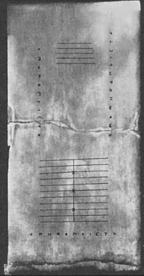
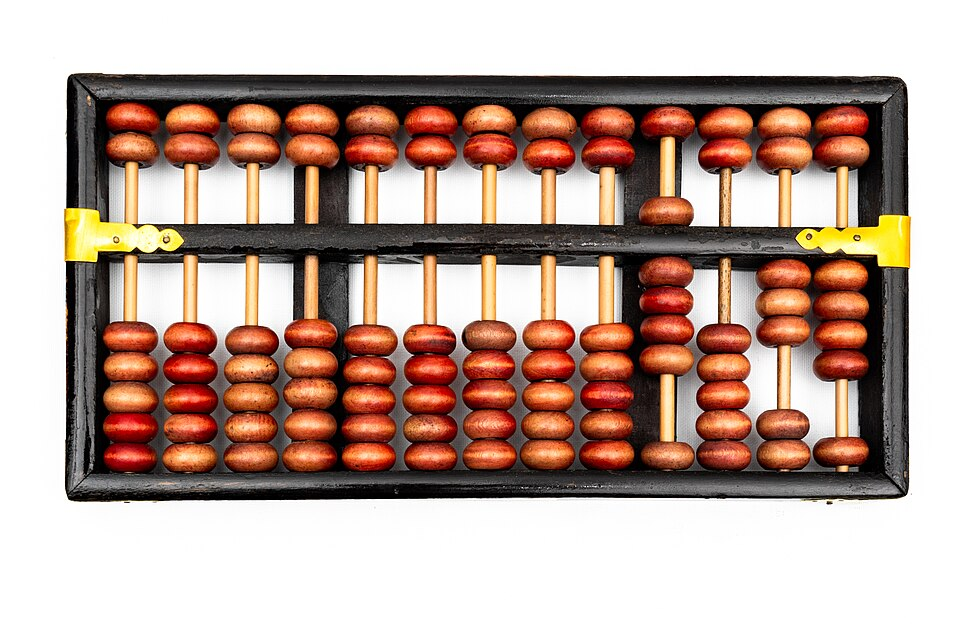

Before there were machines to calculate, there were places to do it: a
board ruled into columns and a handful of pebbles. The columns gave each
pebble a value by where it lay, a one here, a ten or a hundred there. That
idea, _place value_ held in a physical layout, is the oldest part of
computing, and it outlived almost every machine in this story.

## Pebbles on a board

The oldest counting board known is the **[Salamis tablet](kloom:e/salamis-tablet)**, a slab of white
marble about 150 by 75 centimetres, dated to around 300 BC and now in the
Epigraphical Museum in [Athens](kloom:e/athens). It carries two sets of ruled lines, one of
five lines and one of eleven, with a crack between them, and rows of Greek
numeral signs along its edges. Nobody wrote down how it was used; the usual
reading is that counters on a line counted units of a power of ten and
counters between the lines counted fives. Even its story is unsettled. One
Wikipedia article says it was found on Salamis in 1846; another gives 1899,
the year Wilhelm Kubitschek published the study that the photograph comes
from, and calls it more likely a gaming board.

The Romans reckoned the same way, and called their counters _calculi_,
"little stones". To reckon was _calculos ponere_, "to place pebbles", and
_calculate_ comes from it. They also
made a pocket version. The **[Roman hand abacus](kloom:e/roman-abacus)** was a metal plate with
beads held in slots: for each of seven decimal columns, four beads in a
long slot counted ones, and one in a short slot above counted five. It is a
_bi-quinary_ code, five and one, and the pattern comes back below.

## The Exchequer's cloth

Counting boards ran governments. England's treasury took its name from one.
The [_Dialogue Concerning the Exchequer_](kloom:e/dialogus-de-scaccario), written around 1180 by the
treasurer **[Richard FitzNeal](kloom:e/richard-fitzneal)**, describes a table ten feet by five, with a
rim four fingers high so that nothing rolled off, covered with a black
cloth striped a hand's breadth apart. Twice a year each sheriff sat across
it from the treasurer to account for the king's revenue, and a
_calculator_ in the middle of the bench laid out the sums in coins. Pennies
went in the first space, up to eleven; shillings in the second, up to
nineteen; then pounds, tens, hundreds and thousands of pounds, and, rarely,
ten thousands. The cloth looked like a chessboard, the _Dialogue_ says, and
so the table, and then the whole court, was called the _exchequer_.

## Beads on rods

The bead frame spread widest in East Asia. A bead [abacus](kloom:e/abacus) is plain on an
apothecary's counter in Zhang Zeduan's twelfth-century scroll _Along the
River During the Qingming Festival_. The Chinese **[suanpan](kloom:e/suanpan)** settled, in
the late Ming dynasty, into two beads above the beam and five below, which
lets one rod hold up to fifteen, enough for the old Chinese weights,
which were counted in sixteens.
Japan took the abacus from China in the fourteenth century as the
**[soroban](kloom:e/soroban)**, and in the 1940s trimmed it to one bead above and four below,
the Roman proportion again.

| Abacus            | Where and when              | Beads above | Beads below |
| ----------------- | --------------------------- | ----------: | ----------: |
| Roman hand abacus | Roman world, 1st century AD |           1 |           4 |
| Suanpan           | China, from the late Ming   |           2 |           5 |
| Soroban           | Japan, since the 1940s      |           1 |           4 |
| Schoty            | Russia and the Soviet Union |   (no beam) |          10 |

The plate draws a soroban set to 1,946. A digit is read from its rod: the
upper bead, pushed down to the beam, counts five, and each lower bead
pushed up counts one. The dots on the beam mark every third rod, so that a
long number can be read in thousands.

## The machine age steps back

The bead frame was not a curiosity even in the twentieth century. On 11
November 1946, in Tokyo, a contest was held between **Kiyoshi
Matsuzaki** with a soroban and Private **Thomas Nathan Wood** of the US
Army with an electric desk calculator. They raced through long additions, subtractions,
multiplications, divisions and a composite problem. The soroban won four
rounds to one, losing only multiplication. _Stars and Stripes_ wrote that
the machine age "took a step backward"; the _Nippon Times_ that
"Civilization ... tottered". (Both are quoted in the Soroban article, not
read at first hand.) In the Soviet Union the ten-bead _schoty_ stayed in
shops until mass-produced Soviet calculators began to replace it after 1974.

A board or a frame holds a number and does nothing with it; the hand does
all the work. Within two centuries of the Salamis tablet, someone in the
Greek world built a box that did the working itself, with bronze gears.
