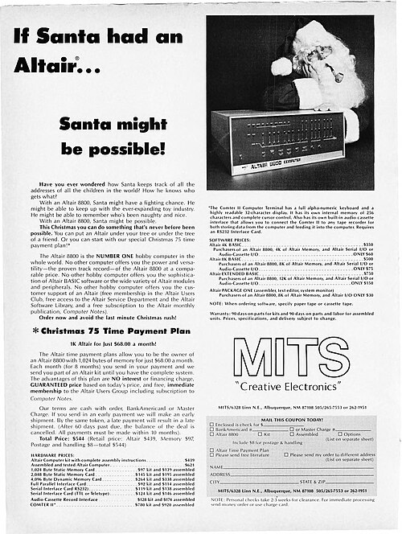
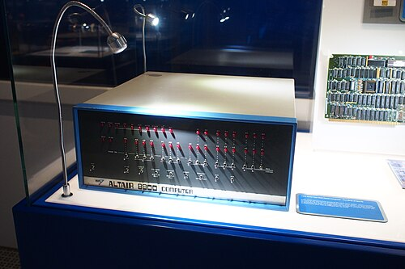

In the week before Christmas 1974 the January issue of _Popular
Electronics_ reached the newsstands with a blue-grey box on its cover, a
row of lamps and a row of switches across its face. "The era of the
computer in every home", the article began, "has arrived!" The machine
cost about as much as a colour television, if you built it yourself. Within a
year thousands had, and the two young programmers who wrote its first
programming language had started a software company.

## A kit from Albuquerque

**[Micro Instrumentation and Telemetry Systems](kloom:e/micro-instrumentation-and-telemetry-systems)** (MITS) was a small firm in
Albuquerque, New Mexico, founded in 1969 in **[Ed Roberts](kloom:e/ed-roberts-computer-engineer)**'s garage by Roberts, Forrest Mims and
two others, to sell kits for model rockets. It
moved on to calculator kits, until Texas Instruments began selling finished
calculators at less than half the price, and by 1974 Roberts owed about a
quarter of a million dollars. The magazine's editors wanted a computer
project for January, a complete kit in a proper case, and **Les Solomon**
knew Roberts was building one around [Intel](kloom:e/intel)'s new [8080](kloom:e/intel-8080). Intel sold that chip
for $360; Roberts, used to buying calculator chips in bulk, got it for $75.

He and **Bill Yates** finished the prototype in October 1974 and sent it
to New York by Railway Express. It never arrived: the carrier was on
strike. The machine on the cover is an empty box with switches and lamps.
The article, by Roberts and Yates, offered the parts as a kit, and the
magazine's editorial called it "the home computer".

| What MITS sold                                                      | January 1975 (_Popular Electronics_) | November 1975 (MITS advertisement) |
| ------------------------------------------------------------------- | -----------------------------------: | ---------------------------------: |
| Partial kit (boards and parts)                                      |                                 $298 |                                    |
| Complete kit, case and power                                        |                                 $397 |                               $439 |
| Assembled and tested                                                |                                 $498 |                               $621 |
| 4K BASIC, alone                                                     |                                      |                               $350 |
| 4K BASIC, with an Altair, memory and a serial or cassette interface |                                      |                                $60 |

Wikipedia gives $439 and $621 as the introductory prices; those are
the November figures, and the magazine's own parts list gives the lower
ones. Wikipedia also has BASIC cut to $150 on its own that October; the
advertisement a month later still asked $350. Roberts had told his bank he could sell 800 machines, and needed 200
to break even. In February 1975 MITS had 1,000 orders; it claimed 2,500
delivered by the end of May and more than 5,000 by August.

## Switches and lamps

The basic [Altair](kloom:e/altair-8800) had 256 bytes of memory and no keyboard or screen. Its
front panel, modelled on Data General's Nova minicomputer, carried 36
lamps, sixteen for the address, eight for data and twelve for the
processor's status, and sixteen address switches, the low eight of which
set data. To program it, you set a byte on the switches in binary and
pressed DEPOSIT NEXT to store it at the next address, and did it again for
every byte of the program. The only output was the lamps.

The plate sets the switches to octal 076: in the 8080's instruction set,
00 111 110 is "move immediate" into register 111, the accumulator, so the
next byte deposited is the number to load. The switches are grouped in
threes because programmers read and wrote them in octal.

## BASIC, and a club

In Cambridge, Massachusetts, **[Paul Allen](kloom:e/paul-allen)** saw the magazine and took it to
**[Bill Gates](kloom:e/bill-gates)**, then a Harvard student. They told Roberts they had a BASIC
for his machine; they had not, and no Altair either. Allen adapted a
simulator of Intel's 8008 that he had written for their earlier venture,
Traf-O-Data, to imitate the 8080 on Harvard's PDP-10, and a third student,
**Monte Davidoff**, wrote the floating-point arithmetic. The interpreter,
with its own line editor, fitted in four kilobytes. In March 1975 Allen flew
to Albuquerque with it on paper tape, writing the loader that would read
the tape into memory on the plane. It worked first time. Gates and Allen
founded **[Micro-Soft](kloom:e/microsoft)**, later Microsoft, in Albuquerque; its founding is
dated 4 April 1975. MITS signed their contract on 22 July: $3,000 at
signing and a royalty on each copy, capped at $180,000.

Hobbyists copied it. The **[Homebrew Computer Club](kloom:e/homebrew-computer-club)** first met on 5 March
1975 in **Gordon French**'s garage in Menlo Park, California, on the arrival
of an Altair sent there for review. In June a pre-release tape of BASIC went
missing at a MITS seminar and reappeared at the club as a box of paper-tape
copies, twenty-five in one account and fifty in another. Early in 1976
Gates wrote _An Open Letter to Hobbyists_: who, he asked, would write good
software for nothing? The letter valued the computer time used to write
BASIC at $40,000, a figure the club's moderator, **Lee Felsenstein**, later
called funny money.

Rival makers soon sold Altair-compatible boards and whole machines, and its
bus became the S-100 standard. The kit that needed a teletype to talk
to is usually counted the first personal computer to sell in thousands. The trail that branches here follows it from a
research laboratory in Palo Alto to the Macintosh.
