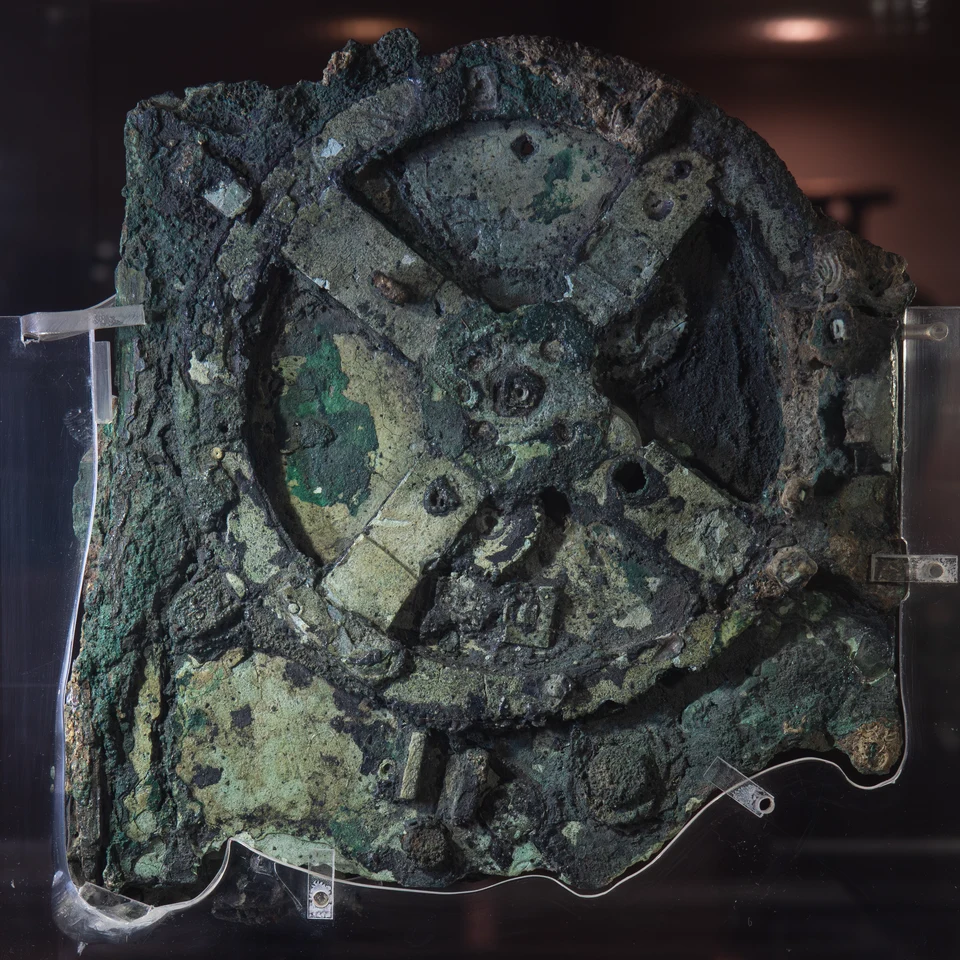

In 1900 sponge divers sheltering off the small Greek island of Antikythera
found the wreck of a Roman cargo ship, forty-odd meters down. The salvage,
over the following year, brought up bronze and marble statues, glass and
coins, and a lump of corroded bronze and wood. It lay unnoticed in the
[National Archaeological Museum](kloom:e/national-archaeological-museum-athens) in Athens until 17 May 1902, when the
archaeologist **Valerios Stais** saw a gear wheel in one of the pieces. It
turned out to be a calculator of the sky, and it is the oldest known
analog computer.

## Dating a machine from a wreck

The ship went down around 70–60 BC, so the mechanism is older than that;
how much older is argued. Proposals for when it was made run from about
205 BC to about 87 BC, and a starting date set on its dials has been read
as 178 BC by one group and 204 BC by others. Its astronomy follows theories
worked out in the second century BC, among them **[Hipparchus](kloom:e/hipparchus)**'s account of
the [Moon](kloom:e/moon)'s uneven speed. Nothing as intricate is known again until the
astronomical clocks of fourteenth-century Europe.

What survives is 82 fragments. Only about a third of the machine is left,
with **30** corroded bronze gears; the largest, the four-spoked wheel in
fragment A, is about thirteen centimeters across. The historian of science
**[Derek de Solla Price](kloom:e/derek-j-de-solla-price)** counted most of the teeth from radiographs and in
1974 published _Gears from the Greeks_, calling it a "calendar computer".
In 2005 the [Antikythera Mechanism](kloom:e/antikythera-mechanism) Research Project scanned the fragments
with microfocus X-ray tomography, which showed gears hidden inside the crust
and let far more of its inscriptions be read. They include what amounts to
a user's manual.

## Arithmetic in bronze

A hand crank turned the main wheel once for each year, and every other
pointer was driven from it through trains of gears. Where two gears mesh,
their periods of turning are in the ratio of their teeth; along a train,
the ratios multiply. So a train is a multiplication by a fraction, and the
fraction is chosen by counting teeth. That is the whole of its arithmetic,
and it is enough.

The plate draws one train, as the scans and Diomidis Spinellis's reading of
them give it. The year wheel's 64 teeth drive a gear of 38. The 38 shares
an arbor with a gear of 53, which drives a gear of 96, and the 96 shares an
arbor with a gear of 15, which drives the last gear, of 53. The product is
5/19. It encodes the **[Metonic cycle](kloom:e/metonic-cycle)**: 19 years hold
almost exactly 235 lunar months, so a calendar of months can be kept in
step with the seasons. The pointer turns five times in those 19 years,
round a five-turn spiral on the back of the case, and the 235 months are
written along the spiral, like a needle following a record's groove.

| Dial or pointer     | What it computed                                | Cycle                  |
| ------------------- | ----------------------------------------------- | ---------------------- |
| Front, Sun and date | the year, the zodiac, a 365-day calendar        | 1 turn a year          |
| Front, Moon         | its place, its uneven speed, and its phase      | 254 turns in 19 years  |
| Back, Metonic       | the months of a luni-solar calendar             | 235 months in 19 years |
| Back, games         | the four-year cycle of the games, as at Olympia | 4 years                |
| Back, Saros         | eclipses                                        | 223 months, in 4 turns |

The Moon was the hard part. It goes round 254 times in the same 19 years,
and not evenly: faster near Earth, slower far away. The train that gives
254/19 ends in a pair of gears mounted face to face on slightly different
centers, one driving the other by a pin in a slot, so that the pin speeds
and slows the follower through each turn. The pair rides on a larger gear
that turns the whole effect slowly round, as the Moon's orbit itself turns
in about nine years. A small ball, half black and half white, turned by
the difference between the Sun's and Moon's motions, showed the phase.

## Read as a program

Spinellis, a computer scientist who built a working emulation of it in
2008, reads the design in the terms of his own trade:

- the Saros dial carries a **lookup table**: glyphs in its 223 cells mark
  which months hold an eclipse, and whether of Sun or Moon;
- the spiral dials are a **pattern** for getting more resolution out of a
  small display;
- one gear feeds two calculations at once, as one signal in a digital
  adder drives two outputs;
- a short train of gears only carries the result to the front, an
  interface from the processing to the display.

His emulator also found bugs, in his own tooth counts, when two dials
drifted apart that should have kept step. A group led by **Tony Freeth**
went further in 2021, proposing lost trains for all five known planets,
with cycles chosen to have small factors so that gears could be shared.
How the makers found such cycles is argued. The inscriptions give Venus as
289 cycles in 462 years, and earlier papers had reached that figure by
_anthyphairesis_, the repeated subtraction of [Euclid's algorithm](kloom:e/euclidean-algorithm). The 2021
group found no such route to Saturn's 427 in 442, and proposed instead a
way of combining older Babylonian cycles, which they name after
Parmenides.

It is an _analog_ computer: its quantities are angles, and a turn of
the crank stands for a span of time. The next great aid to calculation was
not a machine at all but a table of numbers, printed in [Edinburgh](kloom:e/edinburgh) in 1614.
