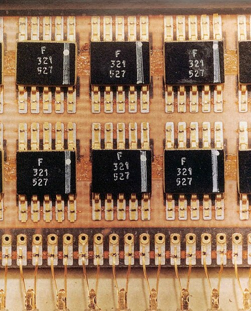
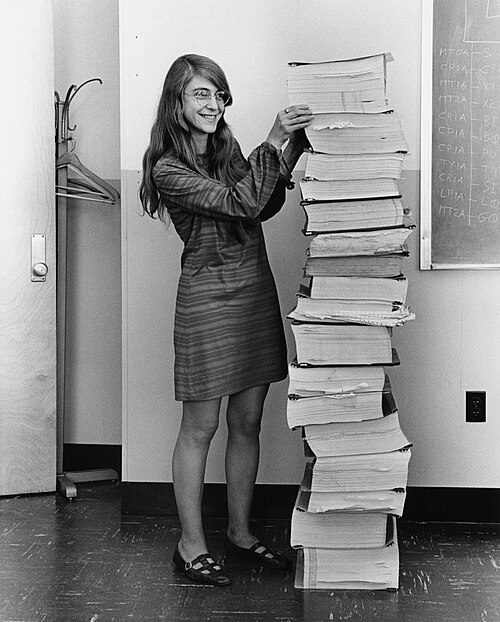

In 1961 NASA gave the **[MIT Instrumentation Laboratory](kloom:e/draper-laboratory)** in Cambridge,
Massachusetts, the job of guiding [Apollo](kloom:e/apollo-program) to the [Moon](kloom:e/moon), and the laboratory
had to build a computer small enough to fly and reliable enough to trust
with three lives. It became one of the first computers made of [integrated
circuits](kloom:e/integrated-circuit), and for a few years the largest buyer of them.

## A computer of one gate

The first design used core-and-transistor logic. In 1962, the laboratory's
hardware group under **Eldon Hall** began to study integrated circuits,
then about three years old and with almost no record of reliability.
According to NASA's history of its computers, written by **James
Tomayko**, the team chose them in the fall of 1962, and chose only one: a
three-input **NOR gate**, three transistors and four resistors, made by
**[Fairchild](kloom:e/fairchild-semiconductor)**. A NOR gate outputs 1 only when all its inputs are 0, and
any logic can be built from NOR gates alone. Using one type throughout
meant more chips but one part to qualify, test and buy.

The counts differ with the source and the model of the computer:

| Source                                | Integrated circuits in one computer                                           |
| ------------------------------------- | ----------------------------------------------------------------------------- |
| Wikipedia, _Apollo Guidance Computer_ | Block I: 4,100 single NOR gates; Block II: about 2,800, mostly dual NOR gates |
| Computer History Museum               | about 4,000 "Type G" NOR gates                                                |
| Tomayko, NASA (1988)                  | "nearly 5,000" of the simple circuits                                         |

The flights carried Block II, whose flat-packs each held two gates. The
purchases were large for so young an industry. Tomayko writes that by the
summer of 1963, 60 per cent of all the microcircuits made in the United
States were going into Apollo prototypes; the museum says the programme
bought about 200,000 at $20 to $30 each and was the largest user of
integrated circuits through 1965, when the Minuteman II missile overtook
it. In April 1965 [Gordon Moore](kloom:e/gordon-moore) cited Apollo as proof that whole circuits
on a chip could be as reliable as the best single transistors.

## Programs woven by hand

The **[Apollo Guidance Computer](kloom:e/apollo-guidance-computer)** had 2,048 words of erasable core memory
and 36,864 words of fixed memory, each word 16 bits including a parity
bit. The fixed memory was **core rope**. In ordinary core memory each
magnetic ring holds one bit. In rope, each ring is a small transformer
with many wires threaded through it or passed around it: a wire through
the core reads a 1 when that core is pulsed, a wire around it reads a 0.
The plate shows four such wires and eight cores. In the flight computer
each core carried 192 sense wires, twelve 16-bit words, and each of six
modules held 512 cores, 6,144 words. (These are Ken Shirriff's figures,
from the hardware; Tomayko's account gives four words to a core.)

The program was the weaving. At Raytheon's plant in Waltham,
Massachusetts, women, many hired from the local textile industry and the
Waltham Watch Company, passed a needle holding the wire through or around
each core, while a machine moved the frame to bring the right core to the
needle. Some programmers called it "LOL memory", for little old ladies. A woven rope could not be changed,
so the software had to be finished months before a flight.

## The 1202 alarms

The software was written at MIT by up to 350 people at its peak, some
1,400 person-years in all. **[Margaret Hamilton](kloom:e/margaret-hamilton-software-engineer)**, who joined in 1965,
became director of the Software Engineering Division, responsible for the
flight software of the command and lunar modules. Its operating system was
**[Hal Laning](kloom:e/j-halcombe-laning)**'s _Executive_: jobs ran by priority, a higher-priority job
suspending a lower one, each given a _core set_ of twelve erasable words
for its state. The lunar module had eight.

On 20 July 1969, during [Apollo 11](kloom:e/apollo-11)'s powered descent, the lunar module's
computer raised program alarm **1202**, then another 1202, a 1201 and two
more 1202s.
The rendezvous radar, left on for an abort, was stealing about 13 per cent
of the computer's time through a fault in its interface; when **[Buzz
Aldrin](kloom:e/buzz-aldrin)** asked for an extra display, the guidance job could not finish
before its next start, copies piled up, and the Executive ran out of core
sets. It restarted the software, kept the guidance and flushed the rest.
In Houston, **Steve Bales**, advised by **Jack Garman**, called "go".

Who designed the rescue is told two ways. **Don Eyles**, who wrote the
landing software, credits Laning's Executive and the _restart protection_
the programmers added about a year before, which let the computer be
switched off and on mid-landing; Hamilton credits her team's error
recovery and the _priority displays_ she designed, which interrupted the
astronauts with the alarm and a go or no-go decision. Both describe one
system, recovering exactly as designed.

A decade later the gates in one Apollo computer would fit on a single chip
many times over. Gordon Moore, whose company sold Apollo its gates, had
already said how fast that would come.
