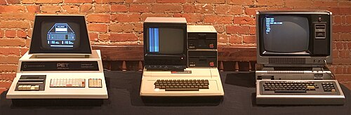

On 10 June 1977 a small company in [Cupertino](kloom:e/cupertino-california), California, began selling a
computer that needed no soldering. The **[Apple II](kloom:e/apple-ii)** came assembled, in a
molded plastic case like a kitchen appliance, with a keyboard, a
programming language in its memory chips and a video output that a monitor,
or a television through a small modulator, could show. It drew in color. Its designer, **[Steve Wozniak](kloom:e/steve-wozniak)**, opened his
description of it in [_Byte_](kloom:e/byte-magazine) that May with his creed: a personal computer
should be small, reliable, convenient to use and inexpensive. The Apple II
kept that promise for sixteen years.

## One clock for everything

Wozniak's design is a study in doing several jobs with one part. A single
crystal oscillator at 14.318 MHz set every rhythm in the machine. Divided by
fourteen, it clocked the [6502](kloom:e/mos-technology-6502) microprocessor at 1.023 MHz. Divided by four,
it gave 3.58 MHz, the frequency at which an American color television
expects its color signal. The plate draws two processor cycles of that
timing.

The 6502 used memory only in one half of each clock cycle. In the other
half, the video circuits "sneak in", as his article puts it, and read the
next piece of the picture. So the screen needed no memory of its
own, and the processor never waited for it. Better still, the machine used
_dynamic_ memory chips, which forget unless each of their rows is read again
and again; the video scan read every row as it went, so the refresh came
free and the usual refresh circuit could be left out.

Color came the same way. A color television reads hue from the timing of
a signal against its 3.58 MHz reference. In the high-resolution mode, 280
dots across by 192 down in 8 KB of memory, the Apple II sent out two dots in
each cycle of that reference, and simply which dots were lit set the hue:
dots in even columns showed violet, dots in odd columns green, and two side
by side white. There was no color circuitry to speak of; the color was in
the arithmetic of the clock. A coarser mode gave a grid of 40 by 48 blocks
in fifteen colors. Wozniak had designed the arcade game _Breakout_ in
hardware for [Atari](kloom:e/atari-inc), and said later that he put paddles, sound and color
into the Apple II so that it could be written in BASIC instead.

## Slots and a disk

The motherboard had eight expansion slots, each decoded for its own card, so
that other companies could build printers, modems, memory and even other
processors onto the machine. The _Red Book_, the reference manual of
January 1978, printed the full schematic and the listing of the machine's
built-in monitor program. In June 1978 came the **[Disk II](kloom:e/disk-ii)**, a five-and-a-
quarter-inch floppy drive whose controller Wozniak designed over the
Christmas holidays with about a tenth of the chips other controllers used,
and which, by a denser way of coding the bits, fitted thirteen sectors on
a track where his first, conventional scheme fitted ten. It sold for $495 to those who ordered early, $595 later. Its operating
system was bought in: Shepardson Microsystems wrote Apple DOS for $13,000.

## A company and a price

**[Steve Jobs](kloom:e/steve-jobs)**, Wozniak's partner, persuaded **Jerry Manock** to design the
case. The money and the business sense came from **[Mike Markkula](kloom:e/mike-markkula)**, a
marketing manager who had retired rich from Fairchild and Intel at 33, and with him Apple was incorporated on
3 January 1977. How much he put in is told two ways: $250,000, in one
account; in another, $80,000 to $92,000 of his own money and a Bank of
America line of credit of $170,000 to $250,000 that he secured. The machine
cost $1,298 with 4 KB of memory, and $2,638 with the full 48 KB.

It was not alone. _Byte_, looking back in 1995, called three machines of
that year the **1977 trinity**:

| Machine        | Maker     | Shown or announced | Processor      | Price at launch         |
| -------------- | --------- | ------------------ | -------------- | ----------------------- |
| PET 2001       | Commodore | January 1977, CES  | 6502           | $795                    |
| Apple II       | Apple     | 16 April 1977      | 6502, 1.02 MHz | $1,298 (4 KB)           |
| TRS-80 Model I | Tandy     | 3 August 1977      | Z80, 1.78 MHz  | $399; $599 with monitor |

The TRS-80 sold through more than 3,000 Radio Shack stores: over 10,000 in
its first six weeks and 55,000 in its first year. The PET, all in one case
with a screen and a cassette deck, was back-ordered for months. The Apple II
was the dearest, and it outlasted both.

## Sixteen years

Apple sold about six million of the line, the IIe the most, before the last
was discontinued in 1993; its peak year was 1983, with a million sold. In the
first quarter of Apple's 1985 financial year, months after the Macintosh
went on sale, the II still reportedly brought in 85 per cent of its
hardware sales. What turned it from a
hobby into an office machine was a program, sold on a disk for under $100,
that no larger computer had, and that businesses bought an Apple II to run.
