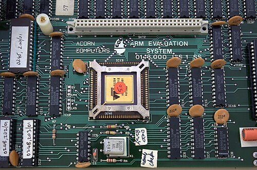

By the late 1970s processors were growing more elaborate with every
generation, on the theory that a richer instruction set made a better
machine. A few architects measured what programs actually did, and bet the
other way: fewer, simpler instructions, each done in one quick step. One of
the chips built on that bet came from a small British company that made
computers for schools, and it drew so little power that it ended up in
the world's phones. As of 28 September 2026, its designers'
successors count more than 350 billion chips shipped.

## Reduced instructions

The idea began at IBM. From 1975 a group under **John Cocke** designed
the _801_, first meant for a telephone exchange. IBM's statistics showed
that compilers used few of the instructions a large computer offered, and
that programs ran short of registers. So the 801 had simple instructions
and many registers, and left the rest to the compiler. It was completed in
1980 and saw little use in that first form, but it was widely known.

In 1980 **David Patterson** of Berkeley and **David Ditzel** of Bell
Laboratories published "The Case for the Reduced Instruction Set Computer",
and gave the idea its name, _RISC_. Their evidence of the opposite trend
was the size of the microcode that interpreted each instruction inside the
processor: in Digital Equipment's machines it had grown from 256 words of 56
bits in the PDP-11/40 to 5,120 words of 96 bits in the [VAX-11/780](kloom:e/vax).
Patterson's students built _RISC I_, working in 1982, with about 44,000
transistors: 44,420 in one Wikipedia article, 44,500 in another, which also
counts 31 instructions to the first's 32. At Stanford from 1981 **John
Hennessy** led a similar project, _MIPS_, and in 1984 founded a company to
sell it. The two shared the Turing Award for 2017; Berkeley's announcement said 99
per cent of the more than 16 billion microprocessors made each year were
RISC.

## Acorn's processor

**Acorn Computers** of Cambridge had sold the BBC Micro since December
1981, built on the 8-bit 6502. For its successor it wanted ten times the
performance at the same price, and no processor on the market would do: the
16-bit ones were dearer and hardly faster, and none could keep up with
cheap memory. Early in 1983, in **Steve Furber**'s telling, Acorn's
**Hermann Hauser** brought him and **Sophie Wilson** papers on the Berkeley
and Stanford work. Wilson, who had written Acorn's BASIC interpreters,
began drafting an instruction set. A visit to the Western Design Center in
Phoenix, where the 6502's successor was being designed in a suburban
bungalow, persuaded them that a small team could do it. The project began
in October 1983, with Wilson's instruction set simulated in BBC BASIC.

VLSI Technology made it. The design was checked at VLSI's offices in
Munich in January 1985, and the first chips came back on 26 April; by the
afternoon they were running BBC BASIC. The **ARM1** had about 25,000
transistors, where Intel's 386 had about 275,000. Its
low power was partly an accident. A cheap plastic package could take about
a watt, the design tools could not predict power closely, so the team left
wide margins, and the chip came in under a tenth of a watt.

The plate draws its data path. Two operands leave a bank of 25 registers
on two buses; one passes through a _barrel shifter_ that can shift it any
number of places on the way, so a shift costs nothing extra; the ALU
combines them and the result goes back to the bank. Under it is a 32-bit
instruction. Its first four bits are a condition, so almost any instruction
can be told to happen only if, say, the last result was zero, which saves
short branches.

## Licences, not chips

The ARM2 went into Acorn's Archimedes in 1987, with 30,000 transistors
against about 68,000 in Motorola's 68000. Then Apple wanted the chip for its
Newton handheld, but not from a competitor. In 1990 Acorn, Apple and VLSI
set up **Advanced RISC Machines** as a separate company. Furber, who had by
then left for Manchester, credits its chief executive, **Robin Saxby**,
with the business model: sell no chips, but license the design to those who
make them, for a payment up front and a royalty on every chip. It suited a
small, frugal core that others could put beside their own circuits.

| Year | What was counted                                   | Number           | Source         |
| ---- | -------------------------------------------------- | ---------------- | -------------- |
| 2005 | Mobile phones sold with at least one ARM processor | about 98%        | Wikipedia      |
| 2010 | ARM-based processors shipped in the year           | 6.1 billion      | Wikipedia      |
| 2026 | ARM-based chips shipped since the start            | over 350 billion | Arm, May 2026  |
| 2026 | Arm's royalty revenue, year to March               | $2.61 billion    | Arm, May 2026  |
| 2026 | Arm-designed Neoverse data-centre cores shipped    | over 1.5 billion | Arm, July 2026 |

By 2005 about 98 per cent of mobile phones sold held at least one ARM
processor; the first iPhone, in 2007, ran on a Samsung-made ARM chip. Since 2011 the architecture has
been 64-bit as well. It reached the top of the supercomputer list in June
2020 with Japan's Fugaku. And in 2026 the company that had sold only
designs for more than three decades announced its first chip of its own, the AGI
CPU, for data centres running AI.

The processor that a school-computer company designed because it could not
buy one is the processor of the smartphone.
