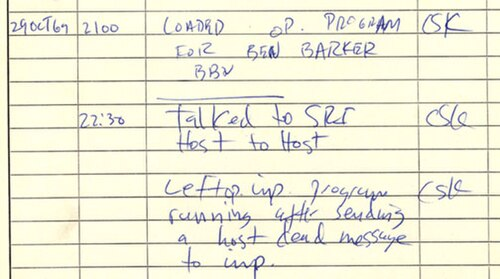

By 1966 **[Bob Taylor](kloom:e/robert-taylor-computer-scientist)**, who ran the computing office of the Pentagon's
[Advanced Research Projects Agency](kloom:e/darpa) (ARPA), had three terminals in his room:
one to the System Development Corporation's Q-32 in Santa Monica, one to
Project Genie at Berkeley, one to Multics at MIT. Each had its own
commands, and to talk to someone on another machine he had to get up and
change terminals. In his telling, the answer was obvious: "there ought to
be one terminal that goes anywhere you want to go."

## The intergalactic network

The idea was older than Taylor's office. **[J. C. R. Licklider](kloom:e/j-c-r-licklider)**, the
psychologist who headed it from October 1962, sent a memorandum on 23 April
1963 to the research groups ARPA funded, addressed to the "Members and
Affiliates of the Intergalactic Computer Network". Most of it is a user's
wish list: to find a curve-fitting program on a disc in Berkeley and run it
on his data in Santa Monica. Its hard question was agreement. If each
center spoke its own language, should they not share "some conventions for
asking such questions as 'What language do you speak?'" It is the
problem a _protocol_ solves.

Taylor persuaded ARPA's director, **Charles Herzfeld**, to fund a network
in February 1966; a million dollars was moved from missile defense. He
recruited **[Larry Roberts](kloom:e/larry-roberts-computer-scientist)** from MIT's Lincoln Laboratory, who arrived in
December 1966 (or January 1967, as the [ARPANET](kloom:e/arpanet)'s own history gives it).
Roberts first meant the big host computers to be joined to one another
directly. The sites objected to giving up their machines to network work,
and **Wesley Clark** suggested a small computer at each site between the
host and the lines. Roberts named it the [_Interface Message Processor_](kloom:e/interface-message-processor),
the IMP. After the Gatlinburg symposium of October 1967 the IMPs would
switch packets, and the planned lines went from 2.4 to 50 kilobits a
second.

## BBN's IMPs

ARPA's request for quotations went out in July 1968; twelve firms bid, and
in the week before Christmas the contract went to **[Bolt Beranek and
Newman](kloom:e/rtx-bbn-technologies)** (BBN) in Cambridge, Massachusetts, whose team under **Frank
Heart** began work on 2 January 1969. An IMP was a ruggedized Honeywell
DDP-516 minicomputer with core memory, special interfaces and about six
thousand words of hand-written assembly code. Senator Edward Kennedy's
telegram of congratulation thanked BBN for its "Interfaith Message
Processor". The first IMP reached UCLA on 30 August 1969, the second the
[Stanford Research Institute](kloom:e/sri-international) (SRI) on 1 October, then Santa Barbara on
1 November and the University of Utah in December.

On 7 April 1969 a UCLA graduate student, **Steve Crocker**, had circulated
the first _Request for Comments_, "Host Software", recording what the
sites' programmers had agreed so far. A host handed its IMP a message of
up to 8,080 bits behind a 16-bit header naming the destination; the IMP
cut it into packets of at most 1,010 bits, sent each with a 24-bit
checksum, and the destination IMP reassembled them. The plate draws that
message and the network of December 1969, its four sites placed by
latitude and longitude. The RFCs went on, informal notes that became the
internet's standards.

## LO

Late on 29 October 1969 **Charley Kline**, a student at UCLA, began to
log in from the university's SDS Sigma 7 to the SDS 940 at
SRI, where **Bill Duvall** was watching. He typed L and O; at the G the SRI
machine crashed. After Duvall had changed some parameters (about an hour
later by one account, a few minutes by another) the login went through.
Kline's entry in the IMP log is timed 22:30. So the first word the network
carried was "lo". A permanent link followed
on 21 November, and the four sites were joined by 5 December.

## Growing up

BBN delivered about an IMP a month. From 1971 a cheaper Honeywell 316
served as a _Terminal IMP_ (TIP), to which dozens of terminals could be
wired directly, with no host at all.

| Map            | Nodes |
| -------------- | ----: |
| December 1969  |     4 |
| June 1970      |     9 |
| December 1970  |    13 |
| September 1971 |    18 |
| March 1972     |    23 |
| August 1972    |    29 |
| September 1973 |    40 |
| June 1974      |    46 |
| July 1975      |    57 |
| July 1976      |    58 |
| July 1977      |    58 |

The network's debut came in October 1972, at the first International
Conference on Computer Communication, in the Washington Hilton. **[Bob
Kahn](kloom:e/robert-kahn-computer-scientist)** of BBN spent a year preparing it; leased lines ran to a TIP in the
hotel, terminal makers plugged in their machines, and visitors used
programs on hosts across the country. BBN's completion report says the
demonstration forced every site to debug its software and gave [packet
switching](kloom:e/packet-switching), which "had been viewed largely with scepticism", international
visibility.

The use nobody planned was mail. In 1971 **Ray Tomlinson** at BBN
joined a program for leaving messages on one machine to one for copying
files between machines, and chose the @ sign to separate a user from a
host. An ARPA study in 1973 found that three quarters of the network's
traffic was email. "The largest single surprise of the ARPANET program",
BBN wrote in 1978, "has been the incredible popularity and success of
network mail."

The ARPANET was one network, and by the mid-1970s ARPA had others, over
radio and satellite, that could not speak to it. Joining them is the story
of [TCP/IP](kloom:e/internet-protocol-suite).
