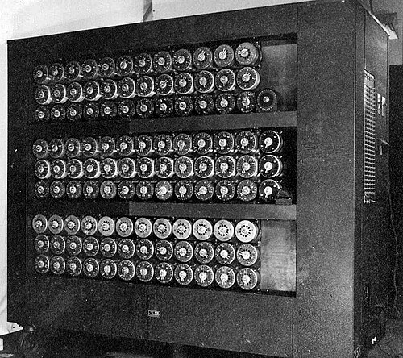

The German armed forces enciphered their radio traffic on the [**Enigma**](kloom:e/enigma-machine), a
rotor machine with a keyboard and a board of lamps. Reading it meant finding,
every day and for every network, how the machine had been set up. By 1940
that search was being done by a machine: a wall of spinning drums that tried
every position of the rotors and threw away the ones that could not be
right.

## A machine of Enigmas

Enigma's three rotors, chosen from a set and put in in some order, gave
26 × 26 × 26 = 17,576 starting positions for each _wheel order_. Before and
after the rotors the current passed through a plugboard, the _Stecker_, which
swapped pairs of letters; with ten leads in place it could be wired in about
151 million million ways. A reflector at the end sent the current back through
the rotors, which made the cipher its own inverse and meant that no letter
could ever be enciphered as itself. That one flaw is the thread the whole
attack pulled on.

The first machine to search the settings was Polish. **[Marian Rejewski](kloom:e/marian-rejewski)** of
the [Polish Cipher Bureau](kloom:e/cipher-bureau-poland) had worked out the wiring of the military rotors
from mathematics and the Germans' habit of sending each message key twice.
Around October 1938 he designed the _bomba_: six were built in Warsaw, each in
effect six Enigmas driven by an electric motor, and by mid-November they found
a day's key in about two hours. The method depended on the doubled key and on
few plugs. In December 1938 the Germans added two rotors, raising the wheel
orders from 6 to 60, and in January 1939 went to ten plug leads. Rejewski
reckoned the new work at ten times the old. On 25 and 26 July 1939 the Poles showed the French and British their replica Enigmas and
their methods.

## Cribs, menus and contradictions

The British machine took a different starting point: not the message keys but
a _crib_, a guess at some plain text and where it sat in the message, found
from long familiarity with German military jargon and operators' habits. Since no letter enciphered to itself, a crib could
be slid along the cipher text and ruled out wherever a letter met itself. The
cryptanalyst then drew the pairings of crib and cipher as a graph, the
_menu_. The plate draws the example Wikipedia gives: ATTACKATDAWN set against
WSNPNLKLSTCS, twelve pairings among ten letters, closing three loops.

Each pairing became an Enigma equivalent, a triplet of drums wired like the
rotors and turned on by as many steps as its place in the crib. The [bombe](kloom:e/bombe)'s
logic was reasoning by contradiction. Suppose A is plugged to Y. At crib
position 10 the drums say what T must then be plugged to; position 8 carries
that on to L, position 6 to K, and position 7 back to A. If A comes back as
anything but Y, the guess was wrong at that rotor position. The machine made
every such deduction at once, as current flowing round cables wired to the
menu, and stopped only at positions where some guess survived. **[Gordon
Welchman](kloom:e/gordon-welchman)** added the _diagonal board_, which used the fact that a plug lead
is two-way: if A goes to Y, Y goes to A. It let each deduction feed others and
cut the false stops sharply. Loops mattered as much as length, as [Alan
Turing](kloom:e/alan-turing)'s own estimates of stops per wheel order showed:

| Loops in the menu | 8 letters | 10 letters | 12 letters | 14 letters |
| ----------------: | --------: | ---------: | ---------: | ---------: |
|                 0 |    40,000 |      7,300 |        820 |         43 |
|                 1 |     1,500 |        280 |         31 |        1.6 |
|                 2 |        58 |         11 |        1.2 |       0.06 |
|                 3 |       2.2 |       0.42 |       0.04 |     < 0.01 |

## Built by the ton, run by the Wrens

**Harold "Doc" Keen** of the [British Tabulating Machine Company](kloom:e/british-tabulating-machine-company) at Letchworth
engineered it. Each bombe stood about 6½ feet high and 7 feet wide, weighed
about a ton, and carried 36 Enigma equivalents, 108 drums. The sources
disagree on when the first ran. Wikipedia has _Victory_, without a diagonal
board, installed in Hut 1 on 18 March 1940 and _Agnus Dei_, with one, on
8 August; the NSA's history says the first operational machines arrived in
August 1940. The drum speed is given both ways too: 50.4 rpm for the top drum
in the NSA's history, which says it really turned at about 100, and 120 rpm
in later models on Wikipedia's account, when a run through 17,576 positions
took about twenty minutes.

Members of the Women's Royal Naval Service, the **[Wrens](kloom:e/womens-royal-naval-service)**, ran them. When a
bombe stopped, the operator noted the drum positions and restarted it;
another Wren tested the stop on a checking machine and passed it to the
cryptanalysts. Changing the wheel order took about ten minutes and setting up
a new menu thirty-five to fifty. The machines went out to outstations at
Adstock, Gayhurst and Wavendon, and later Eastcote and Stanmore, in case
[Bletchley](kloom:e/bletchley-park) was bombed.

| Date          | Three-rotor bombes available |
| ------------- | ---------------------------: |
| December 1941 |                           12 |
| December 1942 |                           40 |
| June 1943     |                           72 |
| December 1943 |                           87 |
| December 1944 |                          152 |
| May 1945      |                          155 |

BTM built about 210 bombes in all by the NSA's count; Wikipedia's table of
types adds up to more than 220. When the German navy moved its U-boats to a
four-rotor Enigma in 1942, the answer came from Dayton, Ohio, where the
National Cash Register Company built 121 faster US Navy bombes, their fast
drums turning at 1,725 rpm.

The bombe searched settings; it never read a word. The next machine at
Bletchley was needed for a cipher that did not use Enigma at all, sent by
teleprinter.
