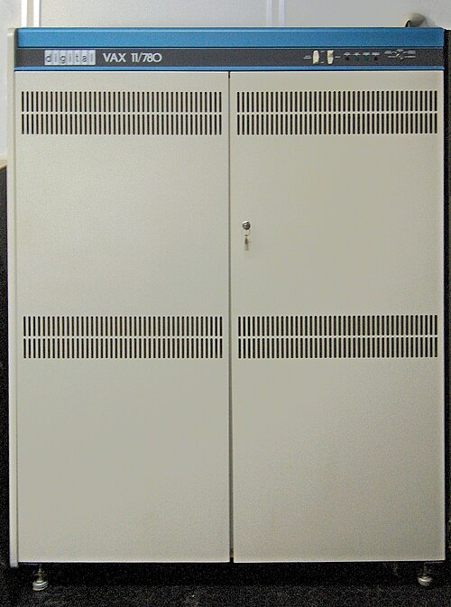

Late in 1973 [Ken Thompson](kloom:e/ken-thompson) and [Dennis Ritchie](kloom:e/dennis-ritchie) gave the first talk on
[Unix](kloom:e/unix), at a symposium at Purdue. **Bob Fabry**, a professor at the
[University of California, Berkeley](kloom:e/university-of-california-berkeley), was in the audience and wanted a copy.
In January 1974 a Fourth Edition tape arrived, and a graduate student put
it on a PDP-11/45 that Computer Science shared with Mathematics and
Statistics, who wanted DEC's own system; Unix got eight hours of every
twenty-four, at a different time each day. When it crashed, Thompson
debugged it from New Jersey down a 300-baud telephone line. For twenty
years after, the university was Unix's second home.

## Joy's tapes

Thompson spent a year at Berkeley from the autumn of 1975, and brought up
the Sixth Edition there. Two new graduate students, **[Bill Joy](kloom:e/bill-joy)** and Chuck
Haley, improved the Pascal system he had started and wrote a line editor,
`ex`. Other universities asked for the Pascal system, and Joy put together
the first **[Berkeley Software Distribution](kloom:e/berkeley-software-distribution)**, an add-on to Unix rather
than a system of its own. Marshall Kirk McKusick, who later ran the
project, dates it to early 1977; Wikipedia gives its release as 9 March 1978. Joy sent out about thirty free copies. With screen terminals arriving,
he wrote `vi`, and to drive the many kinds of terminal, a description file,
_termcap_. The second distribution, with `vi` and the C shell, went out on
about seventy-five tapes.

## Virtual memory on the VAX

In 1978 the department bought one of DEC's new 32-bit VAX-11/780s for
Richard Fateman's algebra system, Macsyma. Bell Labs' port of Unix to it,
32/V, swapped whole programs in and out, so no program could be larger than
the [VAX](kloom:e/vax)'s 1 megabyte of memory. **Özalp Babaoğlu**, a student of Domenico
Ferrari's, wrote a paging system for it, though the VAX lacked the
reference bits that paging usually relies on, and Joy helped him fit it
into the kernel. Over the Christmas break of 1978 users found themselves
logged in to one system or the other. It was working by January 1979, and
in December Joy shipped 3BSD, a whole system, to nearly a hundred sites.

## DARPA's network

[DARPA](kloom:e/darpa) wanted the research sites it funded to share one operating system
across their many kinds of computer, and chose Unix for its portability.
In April 1980 Fabry won an eighteen-month contract, founded the **Computer
Systems Research Group**, and Joy asked to run the software. Its first
release, 4BSD in October 1980, came with the Franz Lisp system. A second
contract, almost five times the first, called for a faster file system and
for networking that would let every machine join the ARPANET. Joy took an
early version of the [TCP/IP](kloom:e/internet-protocol-suite) protocols from Rob Gurwitz of Bolt, Beranek
and Newman, tuned it, and restructured the kernel so that several network
protocols could run at once. Joy left for [Sun Microsystems](kloom:e/sun-microsystems) in 1982, Sam
Leffler finished the work, and **4.2BSD** shipped in August 1983.

Its lasting part was the interface a program uses to talk over a network,
the [_socket_](kloom:e/berkeley-sockets). The plate draws the calls: a server makes a socket, binds it
to an address, listens and accepts; a client makes one and connects. What
each then holds is an ordinary file descriptor, so reading from the network
is like reading a file. The protocol under it, TCP, has its own story.

| Release | Shipped       | Copies, as McKusick gives them        |
| ------- | ------------- | ------------------------------------- |
| 1BSD    | 1977 or 1978  | about 30                              |
| 2BSD    | 1978–79       | nearly 75                             |
| 3BSD    | December 1979 | nearly 100                            |
| 4BSD    | October 1980  | nearly 150, on about 500 machines     |
| 4.1BSD  | June 1981     | about 400                             |
| 4.2BSD  | August 1983   | over 1,000 site licences in 18 months |

4.2BSD sold more copies than every earlier Berkeley release together, and
most Unix vendors shipped it rather than AT&T's System V, which had neither
networking nor the new file system. It carried the internet's protocols
into the universities: in 1989 David Curry could still write that most
university and government computer centres running Unix ran Berkeley's.
When BBN complained that Berkeley was
still running its old prototype of TCP/IP, DARPA had Mike Muuse of the
Ballistic Research Laboratory compare the two; Berkeley's code ran every
test while BBN's crashed under some, and **4.3BSD** kept it in June 1986.

## Freeing the code

Every BSD so far had needed an AT&T source licence. In June 1989 Berkeley
released its networking code alone, with none of AT&T's, free for anyone
to copy for the price of a $1,000 tape. Keith Bostic then had volunteers
rewrite the standard utilities from their published descriptions, and by
June 1991 **Networking Release 2** was a nearly complete system, short of
six kernel files. What followed from that is the next frame's story. The
last release from Berkeley was 4.4BSD-Lite, Release 2, in June 1995, and
the group disbanded.

Its descendants are alive. As of 28 September 2026:

| System  | Began                  | Latest release            |
| ------- | ---------------------- | ------------------------- |
| FreeBSD | 1993, from 386BSD      | 15.1, 16 June 2026        |
| NetBSD  | 1993, from 386BSD      | 11.0, 30 July 2026        |
| OpenBSD | 1995, a fork of NetBSD | 7.9, 19 May 2026          |
| Darwin  | 2000, Apple            | 27.0.0, 14 September 2026 |

Darwin is the core of macOS and iOS, and its kernel takes its process
model, network stack and file-system layer from [FreeBSD](kloom:e/freebsd). And every modern
operating system, in Wikipedia's account, offers some version of
Berkeley's socket interface.
