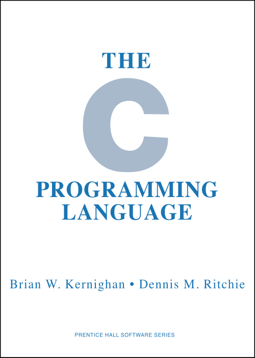

Unix began in assembly language, and its authors did not want to stay
there. The language they built instead grew in three steps: **BCPL**, then
**B**, then **C**. In
**Dennis Ritchie**'s own history, C "came into being in the years
1969–1973", and its most creative year was 1972.

## BCPL and B: one type, the word

**Martin Richards** designed BCPL in the mid-1960s while visiting MIT, and
Bell Labs people carried it onto Multics and GE's mainframes, where it
became the language of choice for the group that would make Unix. BCPL was
typeless: it had one kind of value, the machine word, and memory was a
row of words. A pointer was just a word's index in that row, so if `p`
pointed at one word, `p+1` pointed at the next, and an array was a pointer
to its first word.

**Ken Thompson** squeezed BCPL into the PDP-7, a machine with 8K 18-bit
words, and called the result B. Ritchie called it "BCPL squeezed into 8K
bytes of memory and filtered through Thompson's brain". B compiled to
_threaded code_, a list of addresses of small routines, which was compact
but slow. It gave C the `++` and `--` operators. People often guess that
they copied the PDP-11's auto-increment addressing; Ritchie points out that
this is impossible, since there was no PDP-11 when B was written.

## New B, then C

The PDP-11 arrived at Bell Labs in 1970, and it addressed bytes, not words.
B's one type no longer fitted: characters had to be unpacked from words,
the promised floating point would not fit in a 16-bit word, and every
pointer had to be scaled from words to bytes at run time. In 1971 Ritchie
added a character type and wrote a compiler that produced real PDP-11
instructions. He called the language NB, for "new B".

Structures broke it. Ritchie wanted a structure to describe the actual bits
on a disc, such as a Unix directory entry, an integer and a fourteen-byte
name, and in NB an array needed a hidden pointer that had nowhere to go.
His answer is still C's rule: an array holds only its elements, and its
name, used in an expression, becomes a pointer to the first. Pointer
arithmetic now counts in the size of what is pointed at. The plate draws
two such entries, sixteen bytes each on the PDP-11; `p` points at the
first, and `p+1` at the second, sixteen bytes on.

The second idea was that a declaration reads like a use:

| Declaration                 | Read as                                                                                                              |
| --------------------------- | -------------------------------------------------------------------------------------------------------------------- |
| `int i, *pi, **ppi;`        | an integer, a pointer to one, a pointer to a pointer to one                                                          |
| `int f(), *f(), (*f)();`    | a function returning an integer; one returning a pointer to an integer; a pointer to a function returning an integer |
| `int *api[10], (*pai)[10];` | an array of ten pointers to integers; a pointer to an array of ten integers                                          |

With the new type system, Ritchie decided the language deserved a new name,
and chose C, "leaving open the question whether the name represented a
progression through the alphabet or through the letters in BCPL". The `&&`
and `||` operators and the preprocessor followed in 1972 and 1973.

## The system rewritten

By early 1973 the essentials were done, and that summer the Unix kernel for
the PDP-11 was rewritten in C. Thompson had tried once in 1972, before C
had structures, and given up. The rewrite made the system's structure, in
Ritchie's words, "much more rational", and it made the system portable. In
1977 Ritchie, Thompson and **Steve Johnson** moved Unix to the Interdata
8/32, a quite different machine, using Johnson's portable compiler, and Tom
London and John Reiser then moved it to DEC's VAX.

In 1978 **Brian Kernighan** and Ritchie published _The C Programming
Language_, known by their initials as _K&R_. Kernighan wrote nearly all the
text; Ritchie wrote the reference manual in its appendix and the chapter on
Unix. For more than ten years it was the nearest thing to a standard.

## Standard C and after

In the summer of 1983, at **Doug McIlroy**'s urging, the American National
Standards Institute set up a committee, X3J11, to write one. Its standard
came at the end of 1989, and ISO adopted it in 1990. Ritchie counted one
change as truly important: a function's declaration now named its
arguments' types, so `double sin();` became `double sin(double);`, a form
borrowed from C++. The rest, `const` and `volatile` among it, was smaller:
the standard wrote down the language in use rather than inventing one.

| Name  | Standard                             | Year |
| ----- | ------------------------------------ | ---: |
| K&R C | the book, first edition              | 1978 |
| C89   | ANSI X3.159-1989                     | 1989 |
| C90   | ISO/IEC 9899:1990, the same language | 1990 |
| C99   | ISO/IEC 9899:1999                    | 1999 |
| C11   | ISO/IEC 9899:2011                    | 2011 |
| C17   | ISO/IEC 9899:2018, corrections only  | 2018 |
| C23   | ISO/IEC 9899:2024                    | 2024 |

C's children are many. Ritchie named C++ and Objective-C among its direct
descendants, and noted in 1993 that C also served as a portable assembly
language, the output of compilers for other languages such as Modula-3 and
Eiffel. Wikipedia's list of the languages it influenced runs from AWK and
C# through Go, Java and Python to Rust and Zig. Ritchie was frank about the
costs. The two ideas most characteristic of C, arrays that are really
pointers and declarations that mimic use, were also its most criticised,
and the worst of it, compilers' tolerance of mismatched types, came from a
language grown out of one that had no types at all.

The kernel written in C carried another Bell Labs idea to every machine it
reached: a way to join one program's output to the next one's input.
