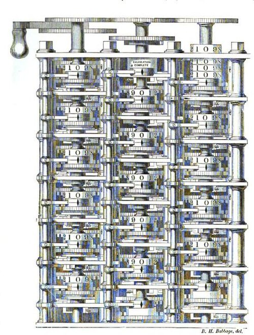

Babbage could design an engine; he could not make one. Its thousands of
figure wheels, sectors, levers and locks had to be cut alike, to fit one
another and to work in step, and in the 1820s parts were still made one at a
time and filed until they fitted. So from 1823 the Difference Engine was built by a man who first had to
make the tools that could build it: **Joseph Clement**, one of the best
draughtsmen and mechanics in London.

## A workshop south of the river

Clement was the son of a Westmorland hand-loom weaver. He learned his trade
at Joseph Bramah's and at Maudslay and Field, and in 1817 set up for
himself in a small workshop in Newington, south of the Thames, as a maker
of precision machinery. His lathe of 1827 won the gold Isis medal of the
Society of Arts for its accuracy, and about 1828 he began cutting screw
threads to a fixed pitch for each diameter, a standard at a time when
every workshop's screws differed.

The engine drove that work. It needed parts made to a repeatable size, and
Clement built special tools and jigs to make them. By the custom of
the trade the tools remained his, and were charged to the job. When Allan
Bromley and Michael Wright of the Science Museum measured surviving parts
in the early 1980s, they found that Clement had made repeated parts to within
about two-thousandths of an inch. Among his journeymen from 1831 to 1833
was **Joseph Whitworth**, who left in 1833 to found his own machine-tool
business in Manchester and in 1841 proposed the screw thread that became a
British standard. In 1869 Babbage recorded what his former workmen said
among themselves:

> Mr. Babbage made Clement.
> Clement made Whitworth.
> Whitworth made the tools.

## The finished portion

Of the full engine, what was ever assembled, by Clement on Babbage's
instruction, was a demonstration piece: three columns of figure wheels, the table and its
first and second differences, which Swade and Wikipedia date to 1832 and
call about a seventh of the whole. Babbage's own accounts differ. A note
in a later edition of his _Economy of Machinery_ calls it "about one ninth
part", and a statement drawn up from his papers, printed in 1864, puts its assembly
"early in the year 1833".

Babbage described it in 1864. Each column has six cages, each holding a
figure wheel; the lowest wheel of the right-hand and middle columns is
shaded off and plays no part, so each column works to five figures. Wikipedia
gives six. The table sits on the right, the second difference on the
left, and each turn of the handle adds the first difference to the table
and the second to the first. Three bells can be set to ring when a column
changes sign. Showing it to a friend, Babbage set the bells to watch a
table the friend had brought: one rang twice, at 28 and at 30, the roots of a
quadratic its maker had not known it held. Lady Byron, who saw it in 1833,
called it "the thinking machine (or so it seems)".
It became a draw at Babbage's Saturday evening soirées.

## The quarrel, and the bill

The fragment was nearly all there was to show. Clement's workshop was
south of the river, and the Treasury built a fire-proof workshop by
Babbage's house to take the engine. Clement wanted compensation for the
move; Babbage, who had been advancing money for Clement's bills, said he
would pay only when the Treasury did. In March 1833 Clement dismissed the
men working on the engine and stopped. Some 12,000 finished parts sat in
his shop, with Babbage's drawings; the tools were his. Parts and drawings
came back in July 1834, and Clement was paid for the last time in August.
(Wikipedia's article on Babbage dates the falling-out to about 1831.)

Nothing more was built. Successive governments put off a decision, and on
4 November 1842 Robert Peel's gave up: completing the machine, the Chancellor
of the Exchequer wrote, would cost far more than they could justify. They
offered Babbage the finished portion, and he declined it. It went to the
museum of King's College, London, in January 1843, and was shown at the
International Exhibition of 1862.

| What                                            | When    |    Cost |
| ----------------------------------------------- | ------- | ------: |
| Difference Engine No. 1, to Clement's last bill | 1823–34 | £17,478 |
| The locomotive _John Bull_                      | 1831    |    £784 |
| A copy of the Scheutz engine, asked             | 1857    |  £1,200 |

Babbage put the government's outlay at "about 17,000 _l._"; Swade
at £17,478 14s 10d, by the last payment in August 1834. For comparison,
Swade notes, a Stephenson locomotive cost under £800. In 1854 Lord Rosse told the Royal
Society that an eminent engineer had assured him the money was more than
repaid by the improvements in machinery it had brought; Swade reads the
claim, which Babbage pressed for years, as a bid for recognition. By then his
mind had moved on: with the drawings back in 1834, he began designing a
machine that could be set to any calculation.
