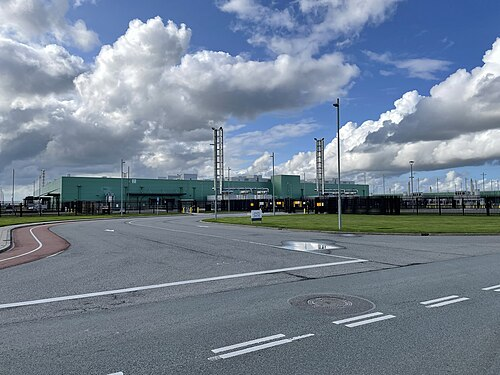

For most of the history of computing, using a computer meant owning one,
or renting time on somebody else's. Since 2006 a program can instead ask,
over the network, for a machine that exists only in software, pay for it
by the hour and give it back. By the end of 2025 about half the world's data-center
capacity sat in some 1,360 very large buildings run for that trade and its
owners' own services. What follows was true as of
28 September 2026.

## One machine, many machines

The idea is older than the word. The pioneers of [time-sharing](kloom:e/time-sharing) imagined
computing sold like electricity or the telephone, as a public utility, and
by the early 1970s companies were selling time on shared mainframes. What
made the modern version possible is the [_virtual machine_](kloom:e/virtual-machine). At [IBM](kloom:e/ibm)'s
Cambridge Scientific Center, **CP-40** went into production use early in
1967, and its successor **CP-67** ran on the [System/360](kloom:e/ibm-system-360) Model 67, released
to customers from 1968. Its _control program_ gave each user what looked
like a whole System/360 of their own, on which they could run any
operating system. The trick is the one the plate draws. The guest system
runs without full privilege; when it tries a privileged instruction, the
hardware traps to the control program, now called a _hypervisor_, which
does the operation on the guest's behalf and returns. By 1972 CP/CMS ran
on 44 systems, could support 60 users on one Model 67, and two commercial
time-sharing firms resold machine time with it; IBM rebuilt it that year
as **VM/370**, whose descendants still run on its mainframes.

The personal computer's processor was harder. Seventeen of the x86's
instructions behaved differently with and without privilege but did not
trap, so the classic method failed. **[VMware](kloom:e/vmware)**, founded in 1998 by the Stanford professor **Mendel
Rosenblum**, **Diane Greene** and three others, ran user code directly
and rewrote the guest's kernel code on the fly (_binary translation_). Its
first product, VMware Workstation, shipped in May 1999. Broadcom bought
VMware for $69 billion in 2023.

## Storage and computers by the hour

[Amazon](kloom:e/amazon-company) had built a large infrastructure for its own shop, and began to sell
it. On **14 March 2006** it launched **[S3](kloom:e/amazon-s3)**, a storage service reached
through a simple web interface, at $0.15 per gigabyte per month and $0.20
per gigabyte transferred. On **25 August 2006** it opened a beta of
**[EC2](kloom:e/amazon-elastic-compute-cloud)**. As Amazon's announcement described it, each "virtual CPU" was the
equivalent of a 1.7 GHz Xeon with 1.75 GB of memory and 160 GB of disk,
at 10 cents an hour, as many as you needed (up to 20 during the beta);
the machines ran [Linux](kloom:e/linux) on the open-source hypervisor Xen. Amazon's pitch
was the developer in a dorm room, who no longer had to buy servers for
the traffic they hoped for.
[Google](kloom:e/google) announced App Engine in April 2008, and [Microsoft](kloom:e/microsoft) what became Azure
that October. In 2011 the US National Institute of Standards and
Technology wrote the definition still used: on-demand self-service, broad
network access, pooled resources, rapid elasticity and measured service.

## Hyperscale

Pooling pays at scale, and the scale is now vast. Synergy Research counted
1,360 _hyperscale_ data centers, the largest operated by the biggest cloud
and internet companies, at the end of 2025, holding 48% of the world's
data-center capacity. In 2018, 56% had been in companies' own buildings;
by 2025 that was 32%. In August 2026 it found that twenty places held 60%
of hyperscale capacity, with Northern Virginia and the Greater Beijing
area alone holding 17%.

Synergy estimates spending on cloud infrastructure services (rented
computing, storage and platforms) for each quarter from the providers'
reports:

| April–June | Spending, $ billion |
| ---------- | ------------------: |
| 2023       |  about 65 (derived) |
| 2024       |                79.1 |
| 2025       |                98.8 |
| 2026       |               143.4 |

The 2023 figure is worked back from Synergy's statement that the 2024
quarter was up $14.1 billion; the others are its estimates. The second
quarter of 2026 was up 43% on a year before, the fastest growth in eight
years, and the trailing year's revenue reached $500 billion. Amazon had
28% of the quarter's market, Microsoft 20% and Google 15%. Synergy puts
the acceleration down mainly to generative AI, whose own cloud services
grew 165%; the buildings full of accelerators that it runs on are a
story of their own.

The utility arrived, but not as the pioneers pictured it: not one public
service like the telephone, but three companies with 63% of the market
between them. What that concentration costs, starting with whether any of
it can be kept secure, is among the questions the story ends on.
