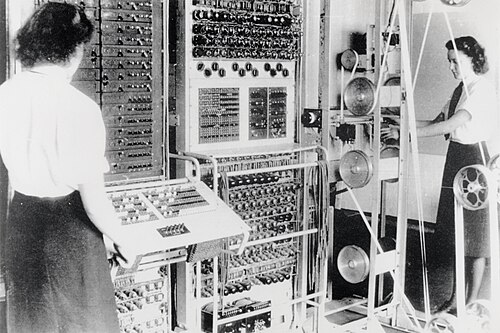
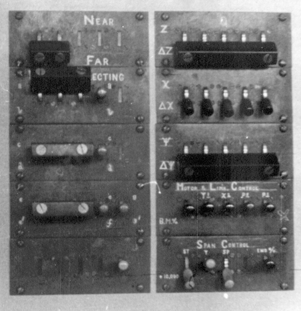

On 18 January 1944 a machine from a telephone laboratory in north London
was delivered to Bletchley Park, and the codebreakers there named it for its
size. Colossus is usually counted the first programmable electronic digital
computer: fifteen or sixteen hundred valves switching in step, reading a
loop of paper tape at 5,000 characters a second. It was built by telephone
engineers, and it worked because one of them knew something about valves
that almost nobody else believed.

## Valves that were never switched off

**Tommy Flowers** was head of the switching group at the **Post Office
Research Station** at Dollis Hill. From 1934 he had been putting valves
into telephone exchanges, and by 1939 equipment of his using three to four
thousand of them was in limited service. Most engineers of the day thought
a valve too fragile to trust in thousands: the most complicated electronic
device yet built used about 150. Flowers had learned otherwise. Valves
failed mostly from the heat stress of being switched on and off; left
running, with their heaters brought up slowly and the valves soldered in
rather than plugged, they almost never did.

That knowledge was what **Max Newman**'s section at Bletchley needed in 1943. Its counting machine compared two loops of paper tape and could not
keep them in step; Flowers proposed to generate one of them electronically,
which meant a thousand or two valves working together, and he built it at
Dollis Hill against the codebreakers' doubts, with a team of about fifty
and some of his own money.

The first Colossus ran at Dollis Hill in late 1943, was taken apart,
shipped to Bletchley and reassembled, and broke its first message on 5
February 1944. The sources do not agree on its details: the
Wikipedia article on Colossus says it had 1,600 valves and first ran on 8
December, its article on Flowers says 1,500 valves and November, and **Tony
Sale**, who led the rebuilding of the machine at Bletchley, also gave 1,500.

## Reading at 5,000 characters a second

Colossus stored nothing internally. The message came in on teleprinter tape,
five holes a character, joined into a loop so that it could be read over and
over. The reader, designed by **Arnold Lynch** and Erie Speight, shone light
through the moving tape onto photocells, and the machine took its clock
from the tape's own sprocket holes, so that whatever the tape's speed the
electronics stayed in step with it. In tests the tape ran at 9,700
characters a second before it disintegrated; 5,000 a second, about 12
metres of tape every second, was settled on for service.

Inside, the wheels of the German machine were imitated by **rings of
thyratrons**, gas-filled valves that each held one bit: a pulse struck the
next thyratron in the ring and put out the one before, so the ring stepped
round in time with the tape. Plugs on a panel set which stages gave a
pulse, copying the pattern of cams on the real wheel, and a stepping switch
chose where the ring started.

| Part of a Colossus       | What it did                                                       |
| ------------------------ | ----------------------------------------------------------------- |
| Tape reader ("bedstead") | Ran the looped message past photocells, 5,000 characters a second |
| Thyratron rings          | Imitated the cipher machine's wheels, stepping with the tape      |
| Delta circuits           | Combined each character with the one before it                    |
| Plugboard and switches   | Set the Boolean function to be tested                             |
| Counters                 | Counted how often the function came out true or false             |
| Set-total switches       | Held the threshold a count had to pass                            |
| Typewriter               | Printed the start positions and counts that passed                |

## What it counted

Colossus did not decipher anything. It counted. The cipher, called _Tunny_
at Bletchley, added a stream of key characters to the message bit by bit,
and the codebreakers had found that the key's regularities showed through
when each character was combined with the one after it (the _delta_, Δ).
**Bill Tutte** turned that into a statistical test. For a
trial pair of start positions of the first two χ wheels, Colossus ran the
whole tape past the rings and counted how often ΔZ₁ ⊕ ΔZ₂ ⊕ Δχ₁ ⊕ Δχ₂ came
out as zero, where Z is the cipher text. A count well above chance, over a
threshold set on switches, was printed on an electric typewriter, and the
rings moved on to the next pair. The two wheels had 41 and 31 positions, so
there were 1,271 pairs to try; the plate draws the tape, the two rings and
the path to the counter.

## Switches and plugs, not a stored program

The comparison to make was set up by the operators on panels of switches
and a plugboard of telephone jacks, which between them allowed some five
billion combinations. That made Colossus programmable, for its own kind of
problem: counting the results of Boolean functions over a tape. It was not
a general-purpose machine, and it could not hold its program in a memory.
Each run was chosen by a cryptanalyst, who read the printed scores and set
up the next. By the war's end the section that ran the machines had 272
Wrens and 27 men.

How Tunny was broken without a captured machine, and what Colossus went on
to do, is the trail that starts here: it begins with the machine
Bletchley built against the other German cipher, Enigma.
