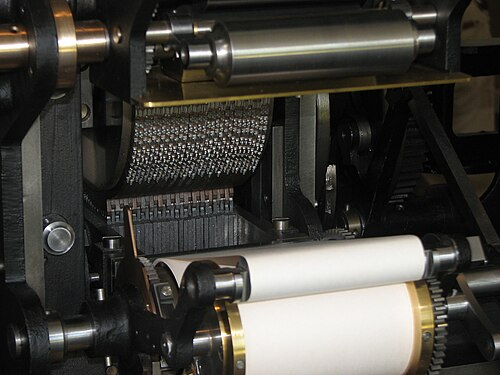

For a century and a half the standard verdict on Babbage was that he had
asked too much of Victorian engineering: his engines failed because they
could not have been made. In 1985 the Science Museum in London set out to
test that by building one, from his own drawings, to the precision his
own workshop could reach.

## A better engine on paper

Between 1846 and 1849 (Swade's article says 1848), with the main work on
the Analytical Engine done, Babbage designed **Difference Engine No. 2**. It used what the larger
machine had taught him, and needed about 8,000 parts where the first
engine's design had needed 25,000 for similar work. Eight columns of 31
figure wheels hold a table value and seven orders of differences, so it
tabulates any polynomial of the seventh degree to 31 figures. Instead of
adding the differences one after another, it adds the odd columns into the
even ones in one half of each cycle and the even into the odd in the
other, so the cycle takes the same time however many differences are in
use; Swade calls it pipelining. Its output apparatus prints each result to
30 figures on paper and presses it at the same time into soft material,
as a mould for printing plates, so that no compositor could ever set a
wrong figure. Babbage offered the design to the government in 1852. It was
declined, and the 20 main drawings stayed on paper.

## Reading the drawings

The proposal came in May 1985 from **Allan Bromley**, the Australian
computer scientist who had spent years decoding Babbage's papers, to
**Doron Swade**, the museum's new curator of computing. The drawings show
every part's shape and nominal size, but nothing of materials, finish,
precision or the order of assembly, and they are not free of error:

| What the drawings got wrong                                       | What the builders did                                             |
| ----------------------------------------------------------------- | ----------------------------------------------------------------- |
| Carriage of tens: as drawn, adding jams the carry warning         | Mirrored the carry mechanism on alternate columns (Bromley's fix) |
| Same parts drawn at different sizes in different views            | Resolved part by part, in 100 new working drawings                |
| No drive for the inking rollers, none to advance stereotype trays | Designed in Babbage's manner, as reversible additions             |
| Setting up odd and even columns deranges the first setting        | Temporary locks, slid in during setup                             |

The carry fault was the serious one. A small trial piece, adding a
two-figure number to a three-figure one, was built to test the mirrored
mechanism, and worked in February 1989. Some have suggested the errors
were planted to protect the design from theft; Swade treats them as the
gap between a design and a working machine, the gap Babbage would have
closed had he built it.

## To Babbage's tolerances

The rule was to be able to answer the charge, as Swade put it, "Yes, you
built the engine, but Babbage could not have." Bromley and Michael Wright had measured parts of the first engine
and found Clement's repeated parts made to within two-thousandths of an
inch, so no repeated part was made more precisely than that. Imperial
College analysed the gunmetal of Babbage's surviving loose parts, and a
close modern bronze was found. The engineer **Reg Crick** turned the 20
views into 100 working drawings of 4,000 parts, by hand; **Barrie
Holloway** managed the ordering. Forty-six firms made the parts in six
months. The cost rose from £201,000 to £246,000, and when the design firm
went bankrupt the museum hired Crick and Holloway itself.

Assembly began in September 1990, in public view. The first turn of the
handle, in January 1991, jammed on a cam too steep to climb; a
counterbalancing spring, a device Babbage used elsewhere, cured it. About
one in ten of the 210 bronze carry levers had to be bent to fit by hand.
On **29 November 1991**, 27 days before the two hundredth anniversary of
Babbage's birth, the engine made its first full, automatic, error-free
tabulation, of the function _x_⁷. It came to produce a result every six
seconds.

## The printer, and a second engine

There had been no money for the output apparatus. In 1995 Bill Gates
turned the engine's handle at a press launch, and through his staff Swade
reached **Nathan Myhrvold**, then at Microsoft, who in 1997 offered to pay
for the printer and for a complete second engine for himself. The printing
and stereotyping apparatus, another 4,000 parts and about two and a half
tonnes, took more than twice the year allowed. It needed a clutch so that
it could be run apart from the calculating section, and a stronger lock
to line up the punches. All its functions worked for the first time in
March 2002, just under seventeen years after Bromley's proposal. The
finished machine is eleven feet long, seven feet high and weighs five
tonnes. Myhrvold's copy was shown at the Computer History Museum in
Mountain View from 2008 to 2016, and then went to Seattle.

Swade drew the conclusion carefully: none of the faults touched the
design's logic, and had Babbage built the machine, it would have worked.
The failure of the 1830s had lain elsewhere: in money, in the quarrel with
Clement, and in a government that wanted tables, not a machine. The idea
was sound, and it is the one this trail began with and the first
difference engine was built to run: a table, its differences, and a
machine that makes one from the other by adding.
