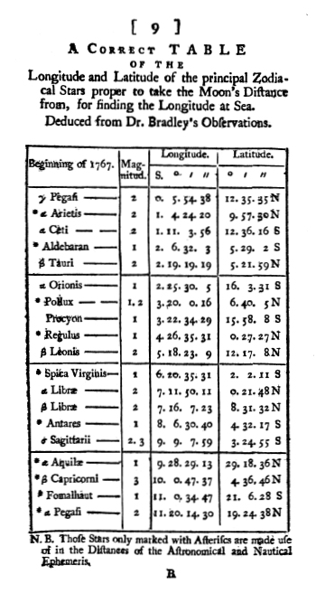

By 1820 a navy, an observatory or an insurance office ran on printed
tables: [logarithms](kloom:e/logarithm), sines, the [Moon](kloom:e/moon)'s place night by night, interest and
mortality. Every figure in them had been worked out by hand, copied out,
set in type by a compositor and printed, and a mistake could come in at any
of the four. A [London](kloom:e/london) mathematician, **[Charles Babbage](kloom:e/charles-babbage)**, proposed to take
people out of all four: a machine that would compute a table and set it in
type itself.

## "A correct table"

How bad the tables were was put to the public in 1834 by **[Dionysius
Lardner](kloom:e/dionysius-lardner)**, in a long article in the _Edinburgh Review_ written with
Babbage's help. His examples came from the tables a British navigator
used:

| Table                                                          | Errors found  |
| -------------------------------------------------------------- | ------------- |
| Hutton's multiplication table, one page recomputed             | about 40      |
| the solar and lunar tables behind the _Nautical Almanac_       | more than 500 |
| _Tables Requisite_, first edition, checked by one reader       | over 1,000    |
| the Board of Longitude's lunar-distance tables, printed errata | over 1,100    |

The errata themselves had errors. Worse, errors were copied. A check made
for the survey of Ireland found six errors shared by thirteen tables of
logarithms printed in London between 1633 and 1822, and by tables from
Paris, Gouda, Avignon, Berlin and Florence, and by a Chinese edition: all
descended from **[Adriaan Vlacq](kloom:e/adriaan-vlacq)**'s logarithms of 1628. Nor did computing
everything twice catch them all, since two computers working apart could
make the same slip.

Babbage told the story of his idea two ways. In his memoirs of 1864 he
dates the first thought to 1812 or 1813, dozing at Cambridge over an open
table of logarithms and saying he was "thinking that all these Tables
might be calculated by machinery", though he had the anecdote from a
friend's memory, not his own. His other telling, as Wikipedia gives it,
starts with the Astronomical Society's wish to improve the [_Nautical
Almanac_](kloom:e/the-nautical-almanac): in 1821 or 1822 he and **[John Herschel](kloom:e/john-herschel)** oversaw a trial
recomputation of some of its tables, and the results disagreed.

## Tables by addition

A table of a polynomial can be made without multiplying at all. Take the
differences between each value and the next, then the differences of those,
and for a polynomial of degree _n_ the _n_-th differences are constant.
Turn that round: start from one line and its differences, and every new
line of the table is a few additions.
Babbage explained it with a boy's marbles laid out in triangles, 1, 3, 6,
10, 15, whose second difference is always 1. Here is an example of our
own, _n_² + _n_ + 41, whose second difference is 2:

| _n_ | Table: _n_² + _n_ + 41 | 1st difference | 2nd difference |
| --: | ---------------------: | -------------: | -------------: |
|   0 |                     41 |              2 |              2 |
|   1 |                     43 |              4 |              2 |
|   2 |                     47 |              6 |              2 |
|   3 |                     53 |              8 |              2 |
|   4 |                     61 |             10 |              2 |
|   5 |                     71 |             12 |              2 |
|   6 |                     83 |             14 |              2 |

Set the first row, 41, 2 and 2, on three columns of figure wheels, and the
rest follows: add each column into the one before it, and read the next
line. The plate shows the columns at _n_ = 4 and one turn of the handle.
Logarithms and sines are not polynomials, but over a short stretch a
polynomial matches them closely, so a table could be made in stretches,
each started from values worked out by hand. Babbage pointed out another
virtue: compute the last line of a stretch directly, and if it agrees, every
line before it is right. The machine had to add, carry tens reliably, and,
because compositors made errors too, print. He designed type that a wire
through notches would check, and moulds for stereotype plates.

## A model, and a grant

Babbage built a small model between 1820 and June 1822, working to six
figures with two orders of differences, and announced it to the
Astronomical Society on 14 June 1822. In a letter to Sir **[Humphry Davy](kloom:e/humphry-davy)**,
president of the [Royal Society](kloom:e/royal-society), published on 3 July, he said a larger
engine would depend on "the nature of the encouragement I may receive".
The Treasury asked the Royal Society, which reported on 1 May 1823 that he was "highly
deserving of public encouragement". The first grant was £1,500 in the
account Babbage later printed, £1,700 in Wikipedia's. The engine was to
work to six orders of differences and about twenty figures; by 1830 the
design had about 25,000 parts and would have weighed four tons.

It was never finished. The building of it, the quarrel with its engineer,
**[Joseph Clement](kloom:e/joseph-clement)**, and the government's withdrawal in 1842 are the trail
_Babbage's engines_, which begins with the French tables that showed him
arithmetic done as manufacture.
