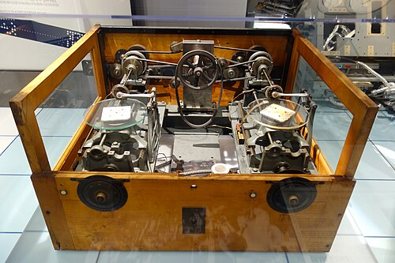
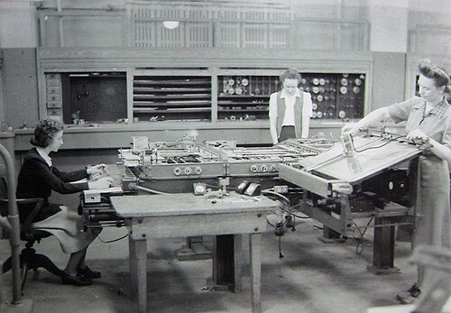

Much of physics and engineering is written in differential equations: how a
shell falls through the air, how current surges down a power line, how a
bridge sways. Most of them have no solution in a formula, and solving them
step by step by hand took weeks. In 1931 **[Vannevar Bush](kloom:e/vannevar-bush)** described a
machine at [MIT](kloom:e/massachusetts-institute-of-technology) that solved them by turning shafts, and called it the
[_differential analyzer_](kloom:e/differential-analyser).

## Integration by wheel and disc

The analyzer was built at MIT between 1928 and 1931 by **Harold Hazen** and
Bush, with six integrators; from 1936 one of the research assistants who ran
it was [Claude Shannon](kloom:e/claude-shannon). The integrator is an old idea: James Thomson
described one in 1876, and his brother, [Lord Kelvin](kloom:e/lord-kelvin), showed the same year
that integrators coupled together could solve differential equations. Bush wrote in his
autobiography that he did not know of Kelvin's work until the first analyzer
was running.

The plate draws one integrator. A flat disc turns with the independent
variable, _x_. A thin wheel stands on it, and a lead screw sets the wheel's
distance from the disc's center to the value of a second variable, _y_. The
wheel turns in proportion to _y_ times the turning of the disc, so, as
_x_ runs on, the total turning of the wheel is the integral of _y_ with
respect to _x_. It is exact in principle and limited only by slip and the
finish of the parts.

The catch is that a wheel light enough to roll without slipping can drive
almost nothing. The answer was the _torque amplifier_, patented by an engineer
named Nieman for controlling heavy machinery, which Hazen saw could be used
here. It
works like a capstan: the wheel's shaft pulls one end of a band wrapped round
a drum that is always turning, and the band's friction drags the output
shaft round in step, with, Bush wrote in 1936, multiplying factors as high as
10,000.

## Setting up a problem

A problem was set up by connecting shafts, and Bush gave the procedure in 1936. Solve the equation for its highest derivative, and give
that a shaft. Connect an integrator to get the next derivative down, give
that a shaft, and so on to the variable itself, until "every term in the
equation becomes represented by the revolutions of a shaft." Then join the
shafts through differential gears so that their turns sum to zero, as the
equation says. Set the integrators' starting positions for the initial
conditions, turn the _x_ shaft, and the machine can move only one way: the
way the equation allows. Pens on output tables draw the answers.

The simplest case is on the plate. Feed an integrator's output back to the
screw that sets its own wheel, and _y_ is forced to equal its own integral,
_dy_/_dx_ = _y_: the pen draws an exponential. A function no equation
generated was fed in by hand at an input table, where an operator turned a
crank to keep a pointer on a plotted curve. The machine did not care, Bush
wrote, how complicated a coefficient was, so long as it could be plotted.

## Meccano in Manchester

The physicist **[Douglas Hartree](kloom:e/douglas-hartree)** visited Bush in 1933, and at Manchester
built a model analyzer with his student **Arthur Porter** in 1934, largely of
Meccano, the children's construction set. It proved accurate enough for real
work, and in March 1935 the university acquired a full-size machine built by
Metropolitan-Vickers: four integrators at first, and eight, by the outbreak
of war. Its first job, Hartree being a railway enthusiast, was timetables
for the London, Midland and Scottish Railway. By
one estimate some fifteen Meccano analyzers were built for serious work
around the world.

| Machine                              | Built   | Of note                                        |
| ------------------------------------ | ------- | ---------------------------------------------- |
| MIT, Bush and Hazen                  | 1928–31 | six integrators                                |
| Manchester model, Hartree and Porter | 1934    | built largely of Meccano                       |
| Manchester, by Metropolitan-Vickers  | 1935    | four integrators, later eight                  |
| Aberdeen Proving Ground              | 1935    | a Depression relief project                    |
| Oslo                                 | 1938    | twelve integrators, the largest for four years |
| UCLA, by General Electric            | 1947    | cost $125,000                                  |

## Firing tables

Its biggest customer was the US Army. Every gun and shell needed a _firing
table_: the elevation that sends a given shell a given range, with
corrections for wind, air density and temperature, and every entry was a
trajectory to compute. The
Army's ballisticians at Aberdeen, Maryland, looked at Bush's machine in
1932 and had one built there in 1935, as a Depression relief project. In
June 1942 the Army also took over the somewhat faster analyzer in the
basement of the University of Pennsylvania's [Moore School](kloom:e/moore-school-of-electrical-engineering), with Lieutenant
**[Herman Goldstine](kloom:e/herman-goldstine)** supervising its computing and training there.

| Method                                  | One 60-second trajectory |
| --------------------------------------- | -----------------------: |
| A skilled person with a desk calculator |           about 20 hours |
| The Bush differential analyzer          |               15 minutes |
| ENIAC, from 1946                        |               30 seconds |

It was not enough. Even with both analyzers and nearly a hundred women
graduates trained to compute by hand, the laboratory could not keep up with
requests coming in at about six tables a day, by the Army historian's count.
At the Moore School, in the autumn of 1942, [John Mauchly](kloom:e/john-mauchly) wrote a memorandum,
worked out with [Presper Eckert](kloom:e/j-presper-eckert), sketching an electronic machine that could
do the same work far faster. Their machine would be named, like
Bush's, for what it did: an _integrator_.

It was analog, a machine of quantities rather than digits. In Berlin, a
civil engineer was building a machine that did the opposite, digit by digit,
with telephone relays.
