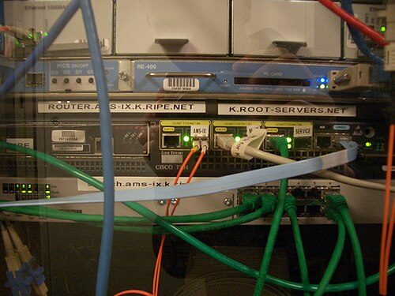

Routers need numbers; people remember names. Something has to turn one
into the other, billions of times a day, for names that change by the
minute and are owned by millions of different people. For the ARPANET's
first dozen years that something was one text file, kept by hand. Its
replacement, the Domain Name System, is a distributed database with no
single copy of the whole, and it still runs every lookup on the Internet.
This frame gives its root servers as they stood at the end of September 2026.

## One file for the whole network

In 1971 **Peggy Karp** of MITRE proposed a standard list of short names for
the network's hosts, RFC 226, and the list grew into a file, `HOSTS.TXT`,
kept at the Network Information Center at the Stanford Research Institute.
The NIC was directed by **Elizabeth "Jake" Feinler**, whose team ran the
host registry from 1972 to 1989. A new host was registered by telephone,
during business hours, and every site fetched the file and copied it into
its own tables. Names were flat:
`USC-ISIF` was one host, and its address was 10.2.0.52.

By 1983 this was failing. **Paul Mockapetris**'s first specification, RFC
882, uses that very pair as its example and puts the problem in a sentence:
"The size of this table, and especially the frequency of updates to the
table are near the limit of manageability." Mail was worse, since a mail
address needs to be resolvable anywhere without a central register of
everyone.

## A tree of zones

Jon Postel had asked Mockapetris, at the Information Sciences Institute, to
settle between five competing proposals. He designed a new one instead,
published in November 1983 as RFCs 882 and 883 and revised in November
1987 as RFCs 1034 and 1035, which still define it. Names became paths in a
tree, read from right to left: `www.example.org` is the `www` node under
`example`, under `org`, under an unnamed root. The tree is cut into
_zones_, and whoever runs a zone can hand any branch below it to someone
else's servers. That delegation is what let the database spread: nobody
holds all of it, and nobody needs to.

To find an answer, a _resolver_ walks down the tree. RFC 1034 allows two
ways, a server that chases the question on the client's behalf
(_recursive_) or one that simply refers the client onward (_iterative_),
and requires every server to support the second. The plate walks an
iterative lookup; the name is one reserved for examples.

| Step | The resolver asks       | The answer                                 |
| ---: | ----------------------- | ------------------------------------------ |
|  1–2 | a root server           | "not mine: here are the servers for `org`" |
|  3–4 | an `org` server         | "here are the servers for `example.org`"   |
|  5–6 | an `example.org` server | "`www.example.org` is at this address"     |

Every answer carries a _time to live_, and resolvers keep answers that
long, so the upper levels are seldom asked. The first Unix name server, the Berkeley Internet
Name Domain (_BIND_), was written in 1984 by four Berkeley students,
Douglas Terry, Mark Painter, David Riggle and Songnian Zhou; the Internet
Systems Consortium has looked after it since 1994.

## The root

At the top are the root servers, which answer only one kind of question:
who serves each top-level domain. There are thirteen of them by name,
`a.root-servers.net` to `m.root-servers.net`, a number set by the original
limit of 512 bytes on a DNS reply carried in one UDP datagram, which the
list of servers had to fit. They are run by twelve independent
organisations: Verisign, which runs two, and Cogent; the University of
Maryland and USC's Information Sciences Institute; NASA and two arms of the
US military; the Internet Systems Consortium; ICANN; Europe's RIPE NCC and
Sweden's Netnod; and Japan's WIDE Project.

Behind each name, though, are many machines. With _anycast_, the same
address is announced from many places at once, and routing carries each
query to the nearest copy. At the end of September 2026
root-servers.org counted 2,045 operational instances; Wikipedia's article,
current to December 2025, gives 1,954.

| Letter | Operator                              | Operational sites |
| ------ | ------------------------------------- | ----------------: |
| A      | Verisign                              |                56 |
| B      | USC Information Sciences Institute    |                 6 |
| C      | Cogent Communications                 |                13 |
| D      | University of Maryland                |               231 |
| E      | NASA                                  |               328 |
| F      | Internet Systems Consortium           |               386 |
| G      | US Defense Information Systems Agency |                 6 |
| H      | US Army Research Lab                  |                12 |
| I      | Netnod                                |                92 |
| J      | Verisign                              |               147 |
| K      | RIPE NCC                              |               143 |
| L      | ICANN                                 |               122 |
| M      | WIDE Project                          |                30 |

Caching keeps the load down, and much of what arrives is mistakes: a 2003
survey found only 2 per cent of the queries reaching the roots legitimate.
A name, though, only leads to an address. Nothing in DNS or IP as first
built proves that the machine answering is the one meant, or keeps anyone
along the way from reading the conversation. That is TLS.
