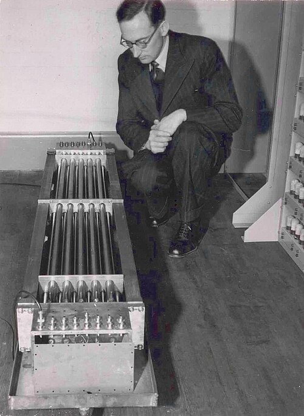

Manchester built a computer to prove a memory. Cambridge built one to be
used. On 6 May 1949 the University Mathematical Laboratory's **EDSAC**, the
_Electronic Delay Storage Automatic Calculator_, printed a table of the
squares of 0 to 99 in 2 minutes 35 seconds, and soon research students
from across the university were running their own problems on it. The
laboratory's history calls it the first fully operational stored-program
computer in regular service; Wikipedia's article puts it second, after the
Manchester Mark 1, open to other departments from April 1949.

## Sound in mercury

**Maurice Wilkes**, the laboratory's director, attended the last weeks of
the Moore School lectures in Philadelphia in August 1946 and, in his
telling, began sketching EDSAC on the _Queen Mary_ on the way home. His
rules were modest: simple, serial, modelled on the EDVAC design, and built
from tried parts, so that programming could start early. He ran it at
500 kHz where others aimed at a megahertz. For the store he took the
_mercury delay line_, which he later said was Eckert's suggestion and "the
only sort of memory that offered itself".

A delay line stores a number by keeping it moving. A quartz crystal at one
end of a tube of mercury turns each electrical pulse into a pulse of
ultrasound. The sound crawls to the far end, where a second crystal turns
it back into electricity; the signal is amplified, reshaped, retimed
against the machine's clock and sent in again. A tank holds as many pulses
as fit in flight. EDSAC's tanks were each about five feet long and held 32
numbers of 17 binary digits; 16 of them, 512 numbers, made up the store at
first, and a second battery of 16 was added in 1952. The drawback is the
wait. A number can be read only as it comes past, and the speed of sound in
mercury changes with temperature, so the tanks were kept at a steady heat.

The arithmetic of one tank, worked from the laboratory's own figures (the
last line uses the speed of sound in mercury, about 1,450 metres a second):

| Quantity                               | Working              |          Value |
| -------------------------------------- | -------------------- | -------------: |
| Digit period                           | 1 ÷ 500 kHz          |           2 µs |
| One number in the line                 | 17 digits + 1 space  |     18 periods |
| One lap of a tank                      | 32 × 18 × 2 µs       |       1.152 ms |
| Fastest run of successive instructions | 500,000 ÷ (33 × 18)  | 841 per second |
| Mercury needed for one lap             | 1,450 m/s × 1.152 ms |    about 1.7 m |

In practice an order took about 1.5 milliseconds on average, about 650 a
second. David Hartley, speaking at the fiftieth anniversary, gave its
working speed as 300 instructions a second; the two figures may count
different mixes of work. The machine had some 3,000 valves and drew about
12 kilowatts (the Wikipedia article says 11).

## Orders, subroutines and a book

What made EDSAC easy to use was a few words of wiring. Its **initial
orders**, 31 instructions set on telephone uniselector switches and loaded
into the store at the press of the start button, read a program punched in
letters and decimal numbers from paper tape and assembled it into binary.
A second version of August 1949 filled 41 words and could place a piece of
code wherever it landed in the store.

That made a **library** possible. **David Wheeler**, a research student,
devised the _closed subroutine_: the calling program put its own address
in the accumulator and jumped to the routine, whose first orders used that
address to plant a return jump at its own end. The trick is still called
the _Wheeler jump_. A user copied the routines they needed from master
tapes onto the end of their own. By 1951 the library held 87, for
floating-point arithmetic, quadrature, differential equations,
trigonometric functions, printing and layout, and more. That year Wilkes, Wheeler and **Stanley
Gill** published _The Preparation of Programs for an Electronic Digital
Computer_, the first book on programming.

## A service

Users did their own programming, and the laboratory made no attempt at
selling: students learnt it from each other. Tapes waited their turn on a
line strung beside the reader, a job queue before the name, and a loudspeaker on
the accumulator let operators hear a program stuck in a loop. For Ronald
Fisher, Wheeler solved a differential equation in gene frequencies by April
1950; X-ray crystallography, radio astronomy and theoretical chemistry
followed. In 1953 the laboratory used EDSAC for the first university
course in computing, a one-year diploma. The machine was switched off on
11 July 1958, succeeded by EDSAC 2.

## LEO

In 1947 the catering and food firm **J. Lyons and Co.** gave the laboratory a grant with no conditions attached: £3,000
in the laboratory's own history, £2,500 in the Wikipedia article on LEO.
Once EDSAC worked, Lyons built its own machine on the design, led by John
Pinkerton, with four times the store and buffered input and output for
clerical work. **LEO I**, the _Lyons Electronic Office_, ran the first
routine business job on any computer, _Bakery Valuations_, costing the
ingredients of its bread and cakes, first on 5 September 1951.

Business computing on the other side of the Atlantic began with a machine
built for a census: UNIVAC.
