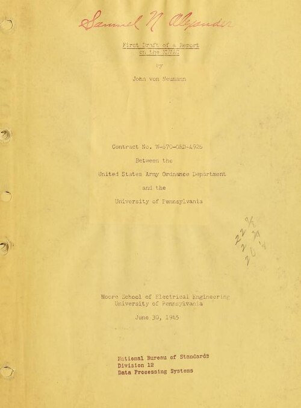
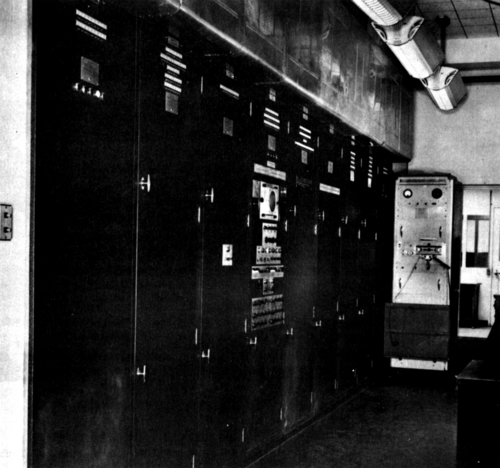

[ENIAC](kloom:e/eniac) was not finished before the people building it knew how the next
machine should work. Its program lived in cables and switches, and it had
room for only twenty numbers. The answer they arrived at was to keep the
program in the machine's memory, beside the numbers it worked on. It was
written down for the first time in a typescript of 101 pages dated 30 June
1945, the [_First Draft of a Report on the EDVAC_](kloom:e/first-draft-of-a-report-on-the-edvac), and it carried one name:
**[John von Neumann](kloom:e/john-von-neumann)**'s.

## The organs of a computer

Von Neumann, a mathematician at the [Institute for Advanced Study](kloom:e/institute-for-advanced-study) in
Princeton and a consultant to [Los Alamos](kloom:e/los-alamos-national-laboratory), met Herman Goldstine on the
platform at Aberdeen station in August 1944 and was soon a regular visitor
at the Moore School, where the ENIAC team was already planning a successor.
The Army funded it in October 1944 as the [EDVAC](kloom:e/edvac). Von Neumann wrote the
report by hand, reportedly on trains to Los Alamos, and mailed it to
Philadelphia to be typed.

He divided a "very high speed automatic digital computing system" into
parts he called _organs_: a central arithmetic part, **CA**; a central
control, **CC**; a memory, **M**; input, **I**, and output, **O**; and the
outside recording medium, **R**, such as punched cards or tape. He
described them in the language of neurons, citing [McCulloch](kloom:e/warren-sturgis-mcculloch) and [Pitts](kloom:e/walter-pitts), and
built his circuits from idealised _E-elements_ that fire or do not. The
decisive sentence is in section 2.5: it is "tempting to treat the entire
memory as one organ". Numbers and orders would share it, and the control
would take its orders "from the same place where the numerical material is
stored".

## Slow, simple, and binary

The report argued from speed. A valve could switch in about a microsecond;
a telegraph relay took ten milliseconds or more. At valve speed there was
no need for the tricks relay machines used to do several steps at once.
Numbers would be **binary**, and worked one digit after another: a 27-digit
multiplication, by the report's count some 1,000 to 1,500 steps, would take
1 to 1.5 milliseconds, against 10 seconds on a fast desk machine and 6 on
an IBM multiplier.

| Machine or estimate             | One multiplication |
| ------------------------------- | -----------------: |
| Fast desk machine (First Draft) |               10 s |
| IBM multiplier (First Draft)    |                6 s |
| Harvard Mark I                  |                6 s |
| ENIAC, ten digits by ten        |             2.8 ms |
| First Draft's estimate          |        1 to 1.5 ms |
| EDVAC as built                  |             2.9 ms |

The difficulty, he wrote, was "at the memory". His problems wanted about a
quarter of a million binary digits. A number took 32 of them, thirty digits,
a sign and a mark saying whether it was a number or an order, and he called
that unit a _minor cycle_. He chose a **delay line**: a signal sent into a
long medium and caught at the far end, amplified, reshaped and sent round
again, so that the line held whatever was passing through it. He planned
256 lines of 1,024 digits each, 8,192 minor cycles in all, and a wait of up
to a millisecond for any word to come round. The plate draws the organs and
one line. (A worked figure, not the report's: at one digit a microsecond, a
1,024-digit line must delay a pulse about a millisecond, and sound in
mercury, about 1,450 metres a second, covers about 1.5 metres in that
time.) Eckert had proposed a mercury delay line for program and data in
January 1944.

| The EDVAC   | First Draft, 1945     | As built, 1949               |
| ----------- | --------------------- | ---------------------------- |
| Word        | 32 binary digits      | 44 binary digits             |
| Memory      | 8,192 words           | 1,024 words                  |
| Delay lines | 256, of 32 words each | 128 mercury lines of 8 words |
| Valves      | 2,000 to 3,000 (est.) | 5,937                        |

## Whose idea

The typescript went to 24 people on 25 June, and Goldstine sent copies far
beyond them. **[J. Presper Eckert](kloom:e/j-presper-eckert)** and **[John Mauchly](kloom:e/john-mauchly)** were angry to find
their names nowhere in it: they had been designing a stored-program machine
before von Neumann arrived, and saw the report as their work put into his
logical language. Historians still argue over the shares. What is not in
doubt is that its wide circulation made the design public: anyone could
build from it, and in 1973 a federal court held that it had counted as
publication, one of its reasons for voiding the ENIAC patent. Eckert and Mauchly left the Moore School in
March 1946, and the EDVAC reached the Army's laboratory only in 1949.

In London the same idea was being drawn up at the [National Physical
Laboratory](kloom:e/national-physical-laboratory-united-kingdom) by **[Alan Turing](kloom:e/alan-turing)**, whose 1936 paper had already imagined one
machine reading another's table from its tape. He began work there on 1
October 1945, and his _Proposed Electronic Calculator_, for an [_Automatic
Computing Engine_](kloom:e/automatic-computing-engine), went to the laboratory's executive committee on 19
February 1946: a more complete design, with detailed circuit diagrams, a
cost of £11,200 and subroutines. The smaller Pilot ACE built from it in 1950
kept its words in mercury delay lines. He could
not say that Colossus had shown such machines could work, because Colossus
was secret.

Neither the EDVAC nor the ACE was the first to run a program from its own
memory. That was a small machine in Manchester, in 1948.
