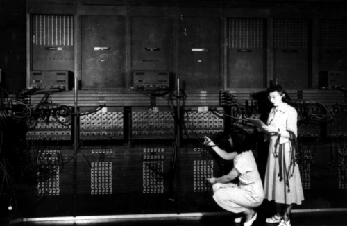

The US Army's gunners needed firing tables, and every table was hundreds
of artillery trajectories worked out by hand. For the Army's Ballistic
Research Laboratory, a skilled person with a desk calculator took about
twenty hours over a single sixty-second trajectory. The machine
built to do it instead, at the University of Pennsylvania's **[Moore School
of Electrical Engineering](kloom:e/moore-school-of-electrical-engineering)**, took thirty seconds, less than the shell's own
flight. It is usually counted the first electronic computer that could be set up
for any calculation, and it was the first the public saw.

## Project PX

**[John Mauchly](kloom:e/john-mauchly)**, a physicist, wrote a memorandum in 1942 sketching an
electronic calculator, worked out with **[J. Presper Eckert](kloom:e/j-presper-eckert)**, a young
engineer at the school. Lieutenant **[Herman Goldstine](kloom:e/herman-goldstine)**, the Army's
mathematician at the Moore School, took the idea to the Ordnance
Department, and on 5 June
1943 the Army Ordnance Department signed a contract for six months'
research on an "electronic numerical integrator and computer": $61,700 at
first, $486,804.22 by the end. Eckert was chief engineer, Mauchly principal
consultant, and **Arthur Burks**, **Kite Sharpless** and **Robert Shaw**
designed much of it. Its first units worked in June 1944; the whole machine
was assembled in the autumn of 1945 and first put to real work on 10
December, on a problem from [Los Alamos](kloom:e/los-alamos-national-laboratory).

[ENIAC](kloom:e/eniac) was some forty panels round three walls of a room, with three function
tables on wheels. Twenty **accumulators** each held a ten-digit decimal
number, one **decade ring counter** of ten valve flip-flops to a digit, and
added by counting pulses: a digit arrived as that many pulses, and a ring
passing from 9 to 0 sent a carry to the next. The plate draws one decade
adding 7 to 5. Pulses came every ten microseconds, and twenty of them made
one addition time of 200 microseconds, so the machine did 5,000 additions a
second, and a ten-digit multiplication in under three milliseconds.

The numbers given for its size do not agree, partly because the machine
changed: a 1961 Army history says later modifications removed about 3,000
valves.

| Source                                      | Valves | Power         |
| ------------------------------------------- | -----: | ------------- |
| Wikipedia, _Colossus computer_ (a note)     | 17,468 |               |
| Wikipedia, _ENIAC_ (as of its retirement)   | 18,000 | 150 kW        |
| Moye, Army Research Laboratory, 1996        | 18,000 |               |
| Weik, Ballistic Research Laboratories, 1961 | 19,000 | almost 200 kW |
| Kempf, Ordnance Corps history, 1961         | 19,000 | about 174 kW  |

| Machine                  | Year | Valves |
| ------------------------ | ---: | -----: |
| Atanasoff–Berry Computer | 1942 |   ~300 |
| Colossus Mark 1          | 1944 |  1,600 |
| Colossus Mark 2          | 1944 |  2,400 |
| ENIAC                    | 1945 | 17,468 |
| EDVAC                    | 1949 |  5,937 |

Valves failed most often as they warmed up and cooled down, and the
engineers learned to keep it running; in Eckert's recollection of 1989 a
valve failed about every two days and could be found within fifteen
minutes.

## Programmed with cables

ENIAC had no program in a memory. A problem was set up by plugging cables
between units along trays of connectors and setting thousands of switches,
and a new problem took days to set up and weeks to plan and check. The
first people to do it were six women chosen from the school's human
computers: **[Kay McNulty](kloom:e/kathleen-antonelli)**, **[Betty Jennings](kloom:e/jean-bartik)**, **[Betty Snyder](kloom:e/betty-holberton)**, **[Marlyn
Wescoff](kloom:e/marlyn-meltzer)**, **[Fran Bilas](kloom:e/frances-spence)** and **[Ruth Lichterman](kloom:e/ruth-teitelbaum)**. Rated
"subprofessionals", though most were college graduates, they learned the
machine from its blueprints and wiring diagrams, and could trace a wrong
answer to a single failed valve.

The Army unveiled ENIAC to the press on 1 February 1946, adding 5,000
numbers in a second, and to the public on the evening of 14 February. The
trajectory it computed for the demonstration was programmed by Snyder and
Jennings; none of the six was invited to the dedication dinner the next
day. The press called the machine a "Giant Brain".

In 1947 ENIAC moved to Aberdeen, Maryland. There, at **[John von Neumann](kloom:e/john-von-neumann)**'s
suggestion, it was rewired once and for all so that a program was set on
the switches of its function tables as a list of numbered orders, sixty of
them in **Richard Clippinger**'s 1948 report. Clippinger's list of the
people who worked it out includes **Adele Goldstine** and four of the
original six. The machine ran six times slower, but a problem could
be changed in an hour instead of a day. It ran until 11:45 p.m. on 2
October 1955.

## Whose invention

Eckert and Mauchly applied for a patent in 1947, and it was granted in 1964. In 1973, in _Honeywell v. Sperry Rand_, Judge **Earl R. Larson**
declared it invalid. One ground was that the invention had been derived
from **[John Atanasoff](kloom:e/john-vincent-atanasoff)**, whose small valve machine at Iowa State College,
built with **Clifford Berry** from 1939, solved systems of linear equations
and was not programmable; Mauchly had visited him and seen it in June 1941.
Mauchly denied it had influenced him, and historians still disagree about
how much it did. Another ground was that a report on ENIAC's successor had
been circulated in 1945, which the court counted as publication: that
report is the next frame's story.
