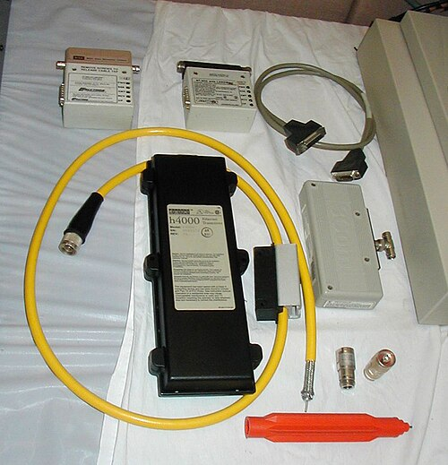

The bottom of the stack is a wire, and the question of who may talk on it.
Ethernet's answer, worked out at Xerox's Palo Alto Research Center in 1973,
was to have no one in charge: every station listens, speaks when the line is
quiet, and backs off at random when two speak at once. Fifty years on, the
name covers links more than a quarter of a million times faster, and the collisions
it was built to survive no longer happen.

## From Hawaii to Palo Alto

The idea came from radio. At the University of Hawaii, **Norman Abramson**
and **Franklin Kuo** built _ALOHAnet_, in operation from June 1971, which
linked terminals on several islands to one computer over a shared radio
channel. A terminal simply sent its packet; if no acknowledgement came, it
waited a random time and sent again. The cost was waste: when traffic is
heavy, pure ALOHA delivers at best 18.4 per cent of the channel, and the
slotted version 36.8 per cent. (Wikipedia's articles disagree on ALOHAnet's
speed, 4,800 or 9,600 bit/s; the article on ALOHAnet itself says 9,600.)

**Robert Metcalfe**, a Harvard graduate student whose thesis on the ARPANET
had been rejected, read about ALOHA, fixed what he saw as flaws in its
analysis and added them to the thesis, which Harvard then accepted. At PARC he
was asked to connect the new Alto workstations to each other and to a laser
printer. On 22 May 1973 he circulated a memo called "Alto Ethernet", named
for the luminiferous ether once thought to carry light. With **David
Boggs** he had it running on 11 November 1973, at 2.94 Mbit/s; Boggs
counted that day, not the memo's, as Ethernet's birth.

Their 1976 paper in _Communications of the ACM_ describes a network of 100
stations along a kilometre of coaxial cable. It rounds the rate to three
megabits a second, chosen as a comfortable speed for the minicomputers on
it. An address took one byte, so an Ethernet could hold 256 stations.

## Listen, then talk

Ethernet's improvements on ALOHA are its middle letters. With **carrier
sense** a station first listens, and waits while anyone is sending. With
**collision detection** it keeps listening while it sends, and stops the
moment it hears someone else. The plate draws the case that remains: A
starts; B, whose line is still silent because A's signal has not reached it
yet, starts too. The two signals cross on the cable, each station hears the
other within one round trip, both send a short _jam_ so that everyone knows,
and both stop.

Then comes the part that makes it work under load. Each colliding station
waits a random number of _slots_, a slot being one round trip on the cable,
and after each further collision it doubles the range it picks from. The
paper called this **binary exponential backoff**: the busier the cable, the
further apart the retries spread. Metcalfe and Boggs calculated that for
packets over about 4,000 bits the cable carried good data well over 95 per
cent of the time; only for packets as short as a slot did efficiency fall
towards slotted ALOHA's 1/_e_.

## A standard, then a switch

Metcalfe, with Gordon Bell and David Liddle, persuaded Digital, Intel and
Xerox to publish a 10 Mbit/s Ethernet as an open specification, the "Blue
Book" of 30 September 1980; by then he had left Xerox to found 3Com. The IEEE's 802.3 committee followed it, with
Token Ring and token bus standardised in rival groups. When 802.3 counts as
approved depends on the source: the IEEE 802.3 article gives June 1983 and
publication in 1985; the Ethernet article has the committee approving it in
December 1982. Xerox gave its patents to the IEEE, so anyone could build it.

Cheaper wiring made it universal: thin coaxial cable in 1984 and twisted
telephone pairs (10BASE-T) in 1990. Then the shared cable went away. A
_switch_ gives each station its own link and forwards frames only where
they are addressed. Kalpana's EtherSwitch was among the first, with full
duplex from 1993, and a station that can send and receive at once on its own wire never
collides. The IEEE deprecated repeaters, the last home of shared segments,
in 2011.

## Faster

| Year | Standard          | Top rate    |
| ---- | ----------------- | ----------- |
| 1973 | PARC experimental | 2.94 Mbit/s |
| 1983 | 802.3 (10BASE5)   | 10 Mbit/s   |
| 1995 | 802.3u Fast       | 100 Mbit/s  |
| 1998 | 802.3z Gigabit    | 1 Gbit/s    |
| 2002 | 802.3ae           | 10 Gbit/s   |
| 2010 | 802.3ba           | 100 Gbit/s  |
| 2017 | 802.3bs           | 400 Gbit/s  |
| 2024 | 802.3df           | 800 Gbit/s  |

Ethernet's 48-bit station addresses were adopted across the IEEE's other
network standards, Wi-Fi among them. In 2023 Metcalfe received the Turing Award for 2022. A 1.6 Tbit/s
standard, 802.3dj, was scheduled for the autumn of 2026. Each link is fast,
but it ends where its cable ends; to go further a packet needs an address
that means something on every network, which is the Internet Protocol's
job.
