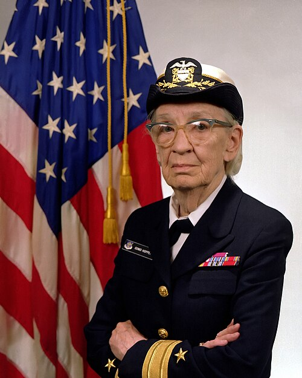
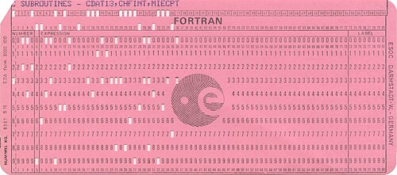

In the early 1950s a computer was programmed in its own numbers: an
operation code and an address for every step, loops and addresses worked
out by hand. **[John Backus](kloom:e/john-backus)** of [IBM](kloom:e/ibm) reckoned that by 1954 a computer
centre spent at least as much on its programmers as on its machine, and
that a quarter to a half of the machine's time went on debugging, so that
programming cost up to three-quarters of the bill. The machines were
getting cheaper; the programmers were not.

## Hopper's compilers

At [Remington Rand](kloom:e/remington-rand), which built the [UNIVAC I](kloom:e/univac-i), **[Grace Hopper](kloom:e/grace-hopper)** attacked the
problem first. Her **A-0** system, written in 1951 and 1952, took a program
written as a list of numbered subroutines and their arguments and produced
the machine code that joined them. Today it would be called a linker or a
loader more than a compiler, although Hopper called it one, and she
published her first paper on compilers in 1952. In
her own later telling, nobody believed it: she had a running compiler and
"nobody would touch it", because computers could only do arithmetic. Its
successor, A-2, went to customers in 1953 with its source code, and they
were invited to send their improvements back.

Who wrote the first compiler depends on what counts. Backus gave the title
of the first working algebraic compiler to **[J. Halcombe Laning](kloom:e/j-halcombe-laning)** and
Zierler's system for MIT's [Whirlwind](kloom:e/whirlwind-i), which took equations as they were
written; [Donald Knuth](kloom:e/donald-knuth) and Luis Trabb Pardo gave it to Alick Glennie's
Autocode, and Backus could not see how
Glennie's sample program was "algebraic" at all. What nobody had done was
translate formulas into code as fast as a good programmer's.

## FORTRAN

That was the bet Backus made. He proposed the project to his manager,
Cuthbert Hurd, in a letter of late 1953 whose exact date he later could not
find. The target was IBM's new **[704](kloom:e/ibm-704)**, which had floating-point arithmetic
and index registers built in. Earlier automatic systems had slowed a
machine five or ten times, but the time they lost had hidden inside slow
floating-point subroutines; the 704, Backus wrote, left "inefficiencies
nowhere to hide". His team believed that if their compiler's programs ran
even half as fast as hand-coded ones, nobody would use it. So they treated
the language as the easy part and the translator as the real work.

The team (Backus, Richard Goldberg, Sheldon Best, Harlan Herrick, Peter
Sheridan, Roy Nutt, Robert Nelson, Irving Ziller, Lois Haibt, David Sayre
and others) spent two and a half years and eighteen man-years on it, and
kept promising it in six months. In April 1957 it went out to the 704
installations: on magnetic tape, after an attempt to punch copies as
binary decks of about 2,000 cards failed. The optimising
section by Nelson and Ziller moved work out of loops and exploited the
order in which arrays were scanned; Backus said later that its code
startled the programmers who studied it, and that nothing matched it until
the mid-1960s. Their 1957 paper's first example is the plate: a root of a
quadratic in one statement, compiled so that _B_/2.0 is worked out once and
squared by multiplying it by itself. Another program there took four hours
and 47 statements to write, compiled in six minutes into about 1,000
instructions, and would, its author thought, have taken three days by
hand.

A statement went on a card, one line to a card: columns 1 to 5 for its
number, 6 to mark a continuation, 7 to 72 for the statement. Columns 73 to
80 were ignored, because the 704's card reader read only 72 columns, into
twenty-four 36-bit words. A survey in April 1958 found that over half of
twenty-six 704 installations used [FORTRAN](kloom:e/fortran) for more than half of their
problems. By 1963 more than forty FORTRAN compilers existed, for other
makers' machines too.

## For business, and for everyone

Business data wanted words, not formulas. Hopper had proposed English
commands in 1953; her team's **FLOW-MATIC** became public early in 1958,
and it kept the description of the data apart from the operations on it.
In May 1959 the Pentagon hosted 41 people from makers, users and
government who wanted one business language for every machine: the
Defense Department alone ran 225 computers and had 175 more on order. The
committees, soon called **CODASYL**, drew mostly on FLOW-MATIC, IBM's
COMTRAN and AIMACO, and produced **[COBOL](kloom:e/cobol)**. Hopper advised them. How much
COBOL owes her is argued: she said in 1980 that COBOL 60 was "95%
FLOW-MATIC"; Jean Sammet, one of its designers, said Hopper was not its
mother, creator or developer.

**ALGOL 60**, drafted by thirteen Europeans and Americans in Paris in
January 1960 and described in what became Backus–Naur form, found little
use in business but became the notation in which algorithms were published, and
the ancestor of Pascal and C.

| Language   | First working | Machine          | Made by                  | Written in                    |
| ---------- | ------------- | ---------------- | ------------------------ | ----------------------------- |
| A-0        | 1951–52       | UNIVAC I         | Hopper, Remington Rand   | numbered subroutine calls     |
| FORTRAN    | April 1957    | IBM 704          | Backus's team, IBM       | algebraic formulas            |
| FLOW-MATIC | public 1958   | UNIVAC I         | Hopper's team            | English verbs, data separate  |
| COBOL      | 1960          | any maker's      | CODASYL committees       | English, for business records |
| ALGOL 60   | 1960 report   | none in the spec | an international meeting | block-structured algebra      |

A compiler made a program cheaper to write. It did not make it quicker to
fix: the deck still went into a queue, and the answer came back hours
later. The next change was to the queue.
