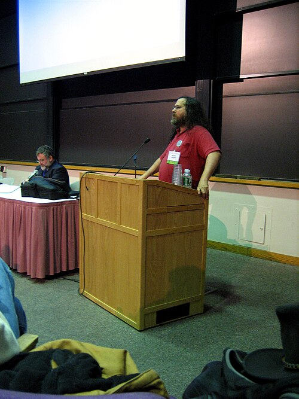

Unix had spread because its source code came with it. By the early 1980s
that was ending: software had become a product, and a program came as a
binary with a licence that forbade sharing it. One programmer at [MIT](kloom:e/massachusetts-institute-of-technology)
decided to write a whole Unix-compatible system that anyone could share,
and then wrote a licence to keep it that way.

## A printer and a promise

**[Richard Stallman](kloom:e/richard-stallman)** joined the MIT Artificial Intelligence Lab in 1971,
and worked on _ITS_, the lab's own time-sharing system for the PDP-10. In
his telling, sharing programs there was as ordinary as sharing recipes: if
you saw an interesting program you could ask for its source, read it and
change it. In 1980 the lab got a new Xerox 9700 laser printer, and was
refused the source code of its control program, so Stallman could not add
the features he had given the old printer, such as telling a user their
job was done. It was, he wrote later, being on the receiving end of a
nondisclosure agreement, and it made him unwilling to impose one. The lab's community then
broke up: in 1981 a spin-off company, [Symbolics](kloom:e/symbolics), hired most of its
hackers, Digital discontinued the PDP-10, and in 1982 the lab chose
Digital's nonfree system over ITS.

On **27 September 1983** Stallman posted "Free Unix!": starting that
Thanksgiving he would write "a complete Unix-compatible software system
called [GNU](kloom:e/gnu) (for Gnu's Not Unix), and give it away free". It would start
with a kernel and the tools to write and run C programs (an editor, a
shell, a C compiler, a linker, an assembler) and go on to everything a
Unix system came with. Unix compatibility was a strategy: programs and
users could move over piece by piece. The work actually began in January
1984, when he left his MIT job so that MIT could not claim the code.

## Free as in freedom

_Free_ meant freedom, not price: in the FSF's phrase, free as in "free
speech", not "free beer". The first GNU program people wanted was **[GNU
Emacs](kloom:e/gnu-emacs)**, an editor, usable in early 1985; Stallman sold it on tape for
$150, which he called a free-software distribution business. The _GNU Manifesto_
appeared in _Dr. Dobb's Journal_ that March, and on 4 October 1985 he
founded the **[Free Software Foundation](kloom:e/free-software-foundation)** to pay for the work.

The definition grew by stages. The FSF's _GNU's Bulletin_ of February 1986
named two freedoms, to copy and redistribute a program, and to change it,
with its source code. The FSF says that around 1990 there were three,
numbered 1 to 3; one history dates the three to the website of 1996. Then
the freedom to run the program was added and, rather than renumber, called
freedom 0. So the four freedoms today are to run the program for any
purpose (0), to study and change it (1), to redistribute copies (2), and to
distribute changed versions (3). The first and third require the source.

## Copyleft

A licence that grants those freedoms and nothing more lets someone take the
code, change it and ship the result closed. Stallman's example was the X
Window System, released by MIT under a permissive licence and soon
shipped by computer companies in binary form under nondisclosure, so that
most of its users had no freedom at all. His answer was [_copyleft_](kloom:e/copyleft): use
copyright to give everyone permission to run, copy, change and
redistribute the program, but not to add restrictions of their own. Any
distributed version, and anything combined with it, must carry the same
terms and its source. The plate draws the difference: under a permissive
licence one descendant closes its code and every version made from it
stays closed; under copyleft the source and the licence travel with every
copy.

Emacs, the GNU debugger and the GNU C compiler each had a licence of this
kind, all similar and mutually incompatible. On 25 February 1989 the FSF
merged them into one, the **[GNU General Public License](kloom:e/gnu-general-public-license)**. Version 2
followed in June 1991 and version 3 on 29 June 2007, after a public
drafting process opened at MIT in January 2006.

| Piece of GNU  | Replaces       | Begun or first released              |
| ------------- | -------------- | ------------------------------------ |
| GNU Emacs     | the editor     | 1984; usable early 1985              |
| GDB           | the debugger   | 1986                                 |
| GCC           | the C compiler | 22 March 1987                        |
| GNU C library | the C library  | 1987, by Roland McGrath              |
| Bash          | the shell      | 1989, by Brian Fox                   |
| GNU Hurd      | the kernel     | begun 1990; still not production use |

By the early 1990s GNU had nearly everything a Unix system needed except
the one piece its announcement listed first. Its kernel, the _Hurd_, begun in
1990 on the Mach microkernel, was slow in coming and has never reached
production use.
The kernel that filled the gap came from a student in Helsinki, and was
built with GNU's compiler.
