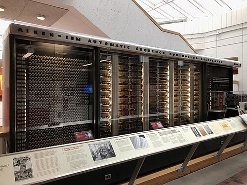

In the same months that Colossus was counting at [Bletchley](kloom:e/bletchley-park), a much slower
machine went to work at Harvard, and was announced to the world. It had
no valves at all. It was built from IBM's relays, counter wheels and cams,
turned by one long shaft, and it did whatever a strip of paper
tape told it to, one line at a time. Its operators called it _Bessy_, the
Bessel engine, after the functions it tabulated.

## A switchboard of calculating machines

**Howard Aiken**, a graduate student in physics at Harvard in the late
1930s, kept meeting differential equations that could only be solved by
long numerical labour. In 1937 he pictured the cure as "a switchboard on
which are mounted various pieces of calculating machine apparatus". After two
rejections by possible builders, he was shown a set of calculating
wheels that Charles Babbage's son had given Harvard some seventy years
before, read Babbage, and wrote the Analytical Engine into his proposal.
IBM took it up: **Thomas J. Watson** approved the project in February 1939,
and **Clair D. Lake**, **Frank E. Hamilton** and **Benjamin M. Durfee**
built it at IBM's Endicott plant, while Aiken was away on naval service
from 1941. IBM called it the _Automatic Sequence Controlled Calculator_.

It reached Harvard in February 1944, began work for the US Navy's Bureau of
Ships in May, and was presented to the university on 7 August. The 1946
manual describes a stainless steel and glass case fifty-one feet long and
eight feet high, weighing about five tons. Behind it a motor (four
horsepower in the manual, five in later accounts) drove the shaft that
turned every counter and timed every step. There were seventy-two storage
counters of twenty-three decimal digits and a sign, and sixty rows of
twenty-four dial switches for constants, "corresponding to the mill and
store" of Babbage's engine, the manual says.

## Orders on tape

The machine read its program from a **punched paper tape** twenty-four
holes wide, divided into three groups of eight. Each line was, in the
manual's words, a single spoken command: "Take the number out of unit A;
deliver it to unit B; start operation C." The first group named the unit
to read out onto the bus, the second the unit to read in, the third the
operation. A hole in position 7 of the third group meant _go on to the
next line_; a line without one stopped the machine. The plate draws the
tape with the manual's first example: counter 3 added into counter 71
(21 · 7321 · 7), and then subtracted (21 · 7321 · 732), the 32 sending the
number through the invert relay, which gives its complement.

The tape only went forward. A loop was made by gluing a tape's end to its
beginning, and at first any choice between two courses was made by an
operator; automatic branching came with modifications in 1946.

| Operation                           | Time on the Mark I |
| ----------------------------------- | -----------------: |
| Addition or subtraction             |        about 0.3 s |
| Multiplication                      |                6 s |
| Division                            |             15.3 s |
| Logarithm or trigonometric function |      over a minute |

## Hopper and the manual

**Grace Murray Hopper**, a mathematics professor at Vassar, joined the Navy
reserve in 1943 and was posted to the Mark I in 1944 as a lieutenant
(junior grade). With **Richard Bloch** and **Robert Campbell** she was among
its first programmers. The _Manual of Operation for the Automatic Sequence
Controlled Calculator_ (1946), over five hundred pages of coding, plugging
instructions and worked examples, carries the name of the laboratory's
staff; Aiken's preface says Hopper wrote much of it and edited the whole,
and that she, more than any other person, was responsible for finishing it.

The machine's first users included the Manhattan Project. In March 1944
John von Neumann proposed running implosion problems on it, and a program
for the atomic bomb's implosion was started on 29 March. Los Alamos's own
punched-card machines finished sooner, but the Mark I carried eighteen
decimal places to their six, on a finer mesh.

## Two inventors, and a moth

For the dedication Aiken issued a press release that named himself as the
machine's sole inventor. It mentioned only one IBM man, **James W. Bryce**, and
not Lake, Hamilton or Durfee. Watson was enraged; IBM went on to build its
own large calculator, the SSEC, and Aiken built the Mark II, III and IV
without IBM. Two years later, in the preface to the manual, Aiken thanked
Watson and called Lake, Hamilton and Durfee his co-inventors.

In the Mark II's log for 9 September 1947 an operator taped in a moth
found in relay 70 of panel F, with the note "First actual case of bug being
found." The joke only works because _bug_ was already engineers' slang for a
fault: Edison used it in 1878. Hopper told the story for decades, but the
Smithsonian, which holds the log book, says it was probably not hers.

The Mark I was taken apart in 1959. Before it had been at work two years, a
machine of valves about a thousand times faster was unveiled in
Philadelphia.
