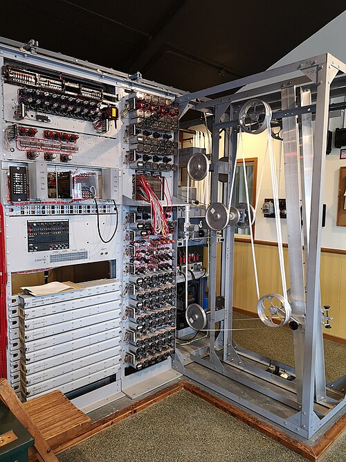

Once the Germans stopped sending wheel settings in clear, in October 1942,
Tunny could only be read by finding each message's settings some other way.
Bill Tutte found one in statistics, and it needed so much counting that only
a machine could do it. In December 1942 the mathematician **Max Newman** was
given the job of building machine methods, and his section, the
**Newmanry**, got its first machine in 1943. It worked, often badly, and its
failures showed exactly what its successor had to do.

## Tutte's statistical method

The idea, in Tutte's own account, starts from the two first impulses of the
cipher. Difference each stream, adding every character to the next, and add
the two impulses together. The psi part of the key then nearly vanishes:
Tutte reckoned that ΔΨ₁ ⊕ ΔΨ₂ would be a dot about 70% of the time, because
the psi wheels often stood still. The same sum over German plain text was a
dot 60% of the time or a little more, because telegraphists doubled letters
and shift signs. So the differenced cipher, ΔZ₁ ⊕ ΔZ₂, should agree with the
differenced chi stream, Δχ₁ ⊕ Δχ₂, more often than chance, perhaps 55% of
the time when the two were lined up correctly. The chi pair repeats every
41 × 31 = 1,271 letters, so there are 1,271 ways to line it up. Try them all,
count the dots at each, and the right setting should stand out.

| Stream (differenced, impulses 1 + 2) | Dots, in Tutte's estimate |
| ------------------------------------ | ------------------------: |
| psi key, ΔΨ₁ ⊕ ΔΨ₂                   |                 about 70% |
| German plain text, ΔP₁ ⊕ ΔP₂         |      60% or a little more |
| cipher against the right chi setting |                 up to 55% |
| cipher against a wrong setting       |                       50% |

A message of a few thousand letters, run against 1,271 positions, is millions
of comparisons for one message. Tutte explained the method to Morgan and
Newman in November 1942; Newman wrote the specification of a machine to do
it.

## Two tapes and a bedstead

The engineering was done at the Post Office Research Station at Dollis Hill,
in north London, by **Frank Morrell**, with **Tommy Flowers** designing the
_combining unit_ that did the logic, and with electronic counters by
**C. E. Wynn-Williams** of the Telecommunications Research Establishment at
Malvern. Construction began in January 1943. Wikipedia has the prototype
delivered to [Bletchley](kloom:e/bletchley-park) in June; the _General Report on Tunny_, written by
the section itself, says the first machines, "pilot models of somewhat
uncertain behaviour", arrived in April. The Wrens who ran it named it
**Heath Robinson**, after the cartoonist of absurd contraptions.

The message and the chi pattern were both punched on paper tape, and both
tapes were joined into loops and run round pulleys on a tall frame the staff
called the _bedstead_, past photoelectric cells, at up to 2,000 characters a
second; long tapes had to run at nearer 1,000. The key loop was one letter
longer than the message loop, so that each time round the two slipped one
place against each other and a new setting was tried. The two sprocket wheels
sat on one shaft to keep the tapes in step. The plate draws that bedstead:
two loops, one gate, one shaft, and the combining unit feeding a counter.

## What went wrong

The _General Report_ lists what it calls, looking back, "intolerable
handicaps". At first there was no printer: two operators wrote down scores as
they flashed up. The gate where the tape was read was six inches from the
sprocket that drove it, so a tape stretching by a little put the two out of
alignment. The position counter recorded revolutions, not the relative
position of the tapes, which had to be worked out, with room for error. The
machine would not tolerate long runs of dots or crosses; texts under 2,000
letters had to be padded; the counters were only partly electronic, and the
tapes, made at first without a proper system of checks, were often simply
wrong. Tapes stretched and broke at speed. "Old Robinson", which followed, had
a special printer that caused, the report says, endless trouble.

| Date           | Staff | Of whom Wrens |
| -------------- | ----: | ------------: |
| April 1943     |    18 |            16 |
| September 1943 |    28 |            16 |
| April 1944     |    93 |            28 |
| September 1944 |   225 |           180 |
| April 1945     |   325 |           273 |

Still, it worked. After three months the section was setting two or three
messages a week, and the Robinsons were never wholly replaced: improved ones,
nicknamed _Peter Robinson_ and _Robinson and Cleaver_ after London shops, and
a four-tape _Super Robinson_, were still needed for crib runs, where two
tapes really did have to be compared at every offset.

## One tape, not two

Flowers had doubted the two tapes from the start. His answer, put to Newman
in February 1943, was to keep only the message on tape and generate the wheel
patterns electronically, in rings of valves, with the tape's own sprocket
holes as the clock. It meant a machine of one to two thousand valves, when
the most complicated electronic device yet built had used about 150, and
Bletchley doubted that so many could work together. A letter tracking the
work, one of the documents GCHQ released in January 2024, notes only that "Flowers of the P.O. has produced a
suggestion for an entirely different machine". More Robinsons were ordered.
Flowers, backed by his director at Dollis Hill, **Gordon Radley**, and partly
with his own money, built it anyway: the machine of the Colossus frame, at
Bletchley by January 1944.
