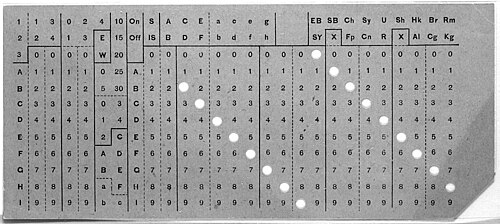
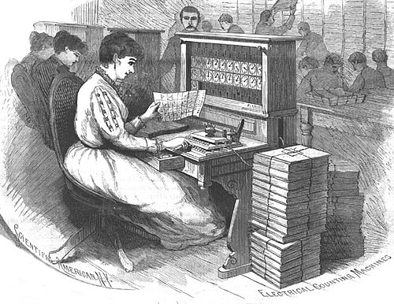

The United States counts its people every ten years, because the
Constitution divides seats in Congress by population. By 1880 the counting
had outgrown the clerks. The tenth census found about 50 million people, and
its tables were made the old way, by making tally marks in small squares and
adding up the marks. Charles Seaton's tallying device helped, but the final
tabulations were not finished until 1887, seven years on, with the next
census three years away.

## A record a machine could read

**[Herman Hollerith](kloom:e/herman-hollerith)**, a [Columbia](kloom:e/columbia-university) mining engineer born in Buffalo in 1860,
worked on the 1880 census as a young statistician under his professor, and
decided the job needed a machine. Where the idea came from is told two ways.
In one telling he took it from railway conductors, who punched a rough
description of each passenger into a ticket; the [Census Bureau](kloom:e/united-states-census-bureau)'s own
history says his mentor **[John Shaw Billings](kloom:e/john-shaw-billings)** suggested something like the
[Jacquard loom](kloom:e/jacquard-machine)'s punched cards.

Hollerith described his system in 1889 in _An Electric Tabulating System_,
the paper that became his Columbia doctorate. Written records would not do,
he argued: one line per person half an inch apart would fill a strip of
paper over 500 miles long, and a stack of written cards would stand over ten
miles high. Instead each person became a card, divided into quarter-inch
squares, with a hole punched in the square for each fact. Sex took two
squares, M and F; age took two rows of ten, one for the tens and one for the
units, so that twenty-one was a 2 and a 1. The cards used in 1890 had round
holes in twelve rows and twenty-four columns.

## Pins, mercury and dials

The plate draws the reading station, which the paper calls the press. The
clerk laid a card on a bed plate of hard rubber in which, under each square,
there was a small cup partly filled with mercury, wired through a nail in
its bottom to a binding post. Over the card hung a box of spring-loaded
pins, one for each square. Brought down by a handle, like a waffle iron,
every pin was pushed back by the card except those that met a hole. Those
went through into the mercury and closed a circuit.

Each circuit ran to a counter, a dial three inches square divided into a
hundred parts, with one hand for units and one for hundreds, so each could
count to 10,000. The 1890 machines had forty of them. Small relays let a
counter register a combination, such as native white males, rather than a
single hole. The same circuits could open one lid of a _sorting box_ beside
the press: the clerk dropped the card in with the right hand while laying
the next card with the left. A bell rang for each card read.

## The trial and the count

In 1888 the Census Office held a contest to choose a method for 1890, on
1880 returns from four districts of St. Louis. Hollerith won on both halves
of the work, and by far the most on the second.

| Method    | Capturing the data | Preparing it for tabulation |
| --------- | -----------------: | --------------------------: |
| Rival     |        144.5 hours |          44.5 or 55.5 hours |
| Rival     |        100.5 hours |          44.5 or 55.5 hours |
| Hollerith |         72.5 hours |                   5.5 hours |

(The Bureau's page gives the rivals' two tabulating times without saying
which was whose.)

The 1890 census began on 2 June and found 62,979,766 people. Clerks
punched some 100 million cards; with a pantograph punch, the Bureau says,
one clerk could prepare about 500 a day. How much faster it all went is
told two ways. The Census Bureau says the count "finished months ahead of
schedule and far under budget." Measured to the end of the work, the gain
was smaller: in 1895 the commissioner in charge, Carroll Wright, reported
that the eleventh census would be finished at least two years earlier than
the tenth, and the whole job is usually put at six years against eight. A
rough count, made without the cards, was announced after six weeks, to
public disbelief: many had expected at least 75 million.

## From census to business

Hollerith's machines went to the censuses of Canada, Norway and Austria in
1891, and to railways. He founded the **Tabulating Machine Company** in
1896, and raised his rents so far for
1900 that the new, permanent Census Bureau had its own machines built for
1910; its engineer James Powers patented them and left in 1911 to found a
rival company. That year the financier **Charles Flint** merged Hollerith's
firm with makers of time clocks, scales and meat slicers into the
**[Computing-Tabulating-Recording Company](kloom:e/computing-tabulating-recording-company)**. [Thomas J. Watson](kloom:e/thomas-j-watson) became its
president (in 1914, the Census Bureau says; 1915, in other accounts), and in
1924 renamed it [International Business Machines](kloom:e/ibm).

In 1928 IBM gave the card the form it kept: rectangular holes in 80 columns,
on a card 7⅜ by 3¼ inches, with two more rows added in 1930 that later
carried letters. The IBM card held payrolls, bills and inventories for half
a century, and its eighty columns became the width of a line on many
terminals. At [Los Alamos](kloom:e/los-alamos-national-laboratory) in 1944 the same kind of machines, multipliers and
tabulators, were set to simulating the implosion bomb. A card could count,
sort and add; it could not solve an equation. For that, in 1931, an
engineer at MIT built a machine of shafts and discs.
