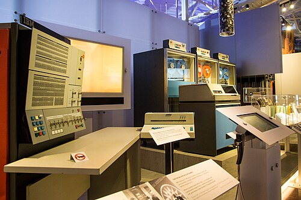
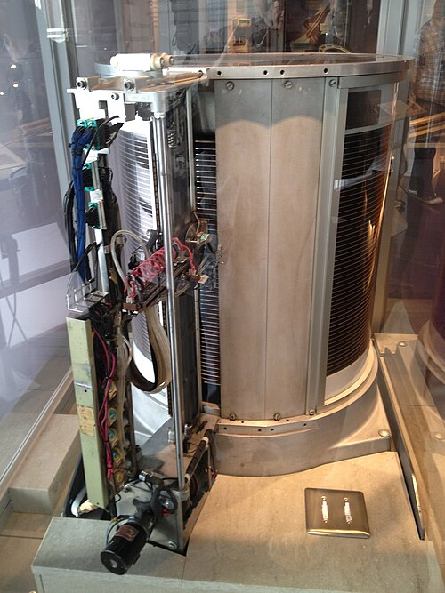

By the early 1960s [IBM](kloom:e/ibm) sold five lines of computers, each with its own
instructions, and none would run another's programs. A customer who
outgrew an accounting machine such as the 1401 and wanted a scientific one
such as the 7040 had to rewrite everything, and might as well buy from
someone else. In 1961 a task force called SPREAD, meeting at a motel in
Greenwich, Connecticut, proposed replacing them all with one design. IBM
announced it on **7 April 1964** as **[System/360](kloom:e/ibm-system-360)**, named for the full
circle of users it meant to serve: six processor models spanning a
fiftyfold range of performance, all able to run the same programs.

## Architecture

The design's three authors were **[Gene Amdahl](kloom:e/gene-amdahl)**, its chief architect,
**[Gerrit Blaauw](kloom:e/gerrit-blaauw)** and **[Fred Brooks](kloom:e/fred-brooks)**, who managed the project. Their
paper in the _IBM Journal_ that April used a word that stuck. They defined
_architecture_ as "the attributes of a system as seen by the programmer,
i.e., the conceptual structure and functional behavior, as distinct from
the organization of the data flow and controls, the logical design, and
the physical implementation." Compatibility was promised strictly: a valid
program that ran on one model would run on any other with enough memory
and devices, up or down the line.

Underneath, the models were different machines. The plate draws what the
paper's first figure gives: every model shows the programmer the same
sixteen 32-bit general registers and four 64-bit floating-point registers,
while the paths that actually move data are 8 bits wide in the smallest
and 64 in the largest.

| Model | Main storage, bytes | Storage width, bits | Data path, bits | Control             |
| ----: | ------------------: | ------------------: | --------------: | ------------------- |
|    30 |              8–64 K |                   8 |               8 | read-only store     |
|    40 |            16–256 K |                  16 |               8 | read-only store     |
|    50 |            32–256 K |                  32 |              32 | read-only store     |
|    60 |           128–512 K |                  64 |              64 | read-only store     |
|    62 |           256–512 K |                  64 |              64 | read-only store     |
|    70 |           256–512 K |                  64 |              64 | conventional wiring |

What made that affordable was **microcode**, [Maurice Wilkes](kloom:e/maurice-wilkes)'s idea of
1951: each machine instruction is carried out by a little program of
simpler steps, held in a read-only store. A Model 30 adds two 32-bit
numbers a byte at a time over several cycles; a larger model does it at
once; the instruction is the same. Microcode also let several models
imitate IBM's older machines, so a customer's 1401 or 7090 programs could
keep running.

## The byte

The largest single choice was the size of a character. Decimal digits need
four bits, letters six. IBM's business machines used six-bit characters;
the paper chose eight, because numbers in business records outnumber
letters more than two to one, and an eight-bit byte holds two decimal
digits. Blaauw is credited with winning that argument. The word _byte_
was older, coined by **Werner Buchholz** in 1956 for IBM's Stretch, but
the System/360 made the eight-bit byte the world's.

## The bet, and the software

IBM put the cost at **$5 billion** over four years and called it
bet-the-business: the new line would replace every computer IBM made.
Orders, in IBM's account, passed a thousand in the first month. The
machines shipped from mid-1965. The software was later. Brooks also ran
the operating system, **[OS/360](kloom:e/os-360-and-successors)**, whose first version came out on 31 March
1966, and he drew the lesson in [_The Mythical Man-Month_](kloom:e/the-mythical-man-month) (1975): adding
people to a late software project makes it later, because they must be
taught and every pair must talk. Fifty programmers have 1,225 pairs.

## Storage on disks

The machines' files had moved from cards and tape to disks. IBM announced
the first disk drive, the **350**, on 14 September 1956, for the RAMAC 305
accounting system: fifty-two disks 24 inches across, turning at 1,200
rpm, holding five million six-bit characters, about 3.75 megabytes. The
whole system leased for $3,200 a month; at the purchase price that
Wikipedia takes from a 1961 Army survey, the disk cost about $9,200 per
megabyte. For the System/360 IBM made the **2311**, 7.25 megabytes on a
removable pack of six platters, and in 1965 the **2314**, 29 million
characters on eleven. Because the 2311 plugged into every model through
one standard interface, other firms could sell drives to fit, and an
industry grew from it.

| Year | Cheapest disk, 2020 US$ per gigabyte |
| ---: | -----------------------------------: |
| 1956 |                           87,539,016 |
| 1966 |                            8,365,507 |
| 1975 |                              889,964 |
| 1984 |                               93,411 |
| 1990 |                                6,474 |
| 1995 |                                  363 |
| 2000 |                                 6.12 |
| 2005 |                                 0.54 |
| 2010 |                                0.053 |
| 2015 |                                0.031 |
| 2023 |                                0.011 |

The figures are John C. McCallum's collected disk prices, the lowest
recorded up to each year, adjusted for inflation by Our World in Data;
2023 is the latest year it gives. Over 67 years the price of a gigabyte fell
about eight billion times.

The System/360 was big iron for big organisations. Beside it, a company
founded by two engineers from MIT was selling computers small enough for a
single laboratory.
