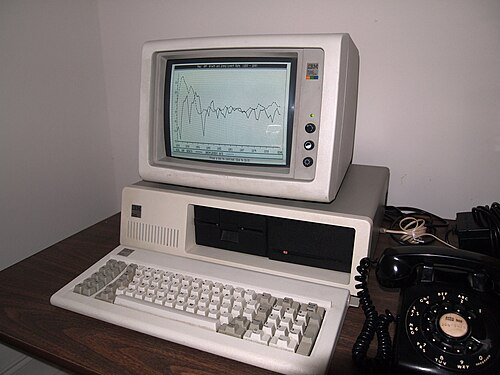

On 12 August 1981, at the Waldorf Hotel in New York, the company that sold
the world its mainframes announced a personal computer. The **[IBM Personal
Computer](kloom:e/ibm-personal-computer)**, model 5150, started at $1,565. An analyst had said that [IBM](kloom:e/ibm)
making a personal computer would be like teaching an elephant to tap dance.
It did, in a year, by breaking almost every rule it had.

## A skunkworks in Boca Raton

IBM had watched the small machines with unease. A plan by **Ron Mion** in
1979, to build one from bought-in parts and sell it through shops, was
turned down that autumn, then looked at again when Tandy reported that it
had shipped more than 100,000 TRS-80s. In 1980 **William Lowe**, who ran
IBM's laboratory at Boca Raton, Florida, proposed the machine to the top of
the company. IBM's own history says that the chief executive, **Frank
Cary**, gave him a month for a prototype and a year for a product; another
account has the president, John Opel, setting up the unit. The project,
code-named _Chess_, passed to **[Don Estridge](kloom:e/philip-don-estridge)**, who was allowed to run it
outside IBM's normal procedures, with up to 150 people.

A new IBM product usually took four or five years. The team designed the
motherboard in 40 days, had a working prototype in four months, and handed
the design to manufacturing in April 1981. About half the machine, the
expansion bus, the keyboard and more, came from IBM's System/23 Datamaster.
Nearly everything else was bought:

| Part             | From                            |
| ---------------- | ------------------------------- |
| Processor        | Intel, the 8088 at 4.77 MHz     |
| Operating system | Microsoft, as PC DOS            |
| BASIC            | Microsoft, in ROM               |
| Printer          | Epson                           |
| Monitor          | an existing design of IBM Japan |
| BIOS             | IBM, in one 8 KB ROM            |

## The 8088 and the megabyte

The team weighed Motorola's 68000, the best chip but not yet in production,
and a Texas Instruments part that could address only 64 KB. It chose
[Intel](kloom:e/intel)'s **[8088](kloom:e/intel-8088)**, which computes internally in 16 bits but talks to memory
over 8 bits, because Intel offered it more cheaply and in quantity, and the
narrower bus made the rest of the machine cheaper. Its 4.77 MHz is a
14.318 MHz crystal, the [Apple II](kloom:e/apple-ii)'s frequency, divided by three.

The 8088 had 20 address lines, enough for a megabyte, but registers of 16
bits. It makes an address, as the plate draws, by taking a _segment_
register, shifting it four bits left (multiplying by 16) and adding a 16-bit
_offset_. At power-on the processor starts at segment FFFF, offset 0000,
which is address FFFF0, sixteen bytes below the top of the megabyte; the PC
put its **BIOS** there, the ROM code that tests the machine, drives the
screen, keyboard and disks, and loads the operating system. IBM kept the
lowest 640 KB for memory and the rest for video and ROM, a line that
software lived with for years.

## The operating system

IBM went first to Digital Research, whose [CP/M](kloom:e/cp-m) ran most business
microcomputers. What happened there has been retold and argued over ever
since; in the usual account the talks stalled, first over IBM's
non-disclosure agreement and then over IBM's offer of $250,000 outright
where Digital Research wanted royalties.
[Microsoft](kloom:e/microsoft), already supplying BASIC, knew of **86-DOS**, a CP/M-like system
that **Tim Paterson** had written at Seattle Computer Products, known
inside as QDOS. Microsoft licensed it in December 1980 for $25,000, hired
Paterson to adapt it to the PC, and bought it outright in July 1981 for
$50,000. It shipped as PC DOS 1.0, and Microsoft kept the right to sell it
to other makers. When [Gary Kildall](kloom:e/gary-kildall) found that it copied CP/M's programming
interface, he persuaded IBM to offer CP/M-86 for the PC as well.

## The clones

IBM published a technical reference with the circuit diagrams and the BIOS
listing, so that others could build cards and software. The BIOS was the
one part it owned. **Columbia Data Products** sold the first compatible
machine in June 1982. **[Compaq](kloom:e/compaq)**, founded that February by three managers
from Texas Instruments, announced a portable in November 1982 and shipped it
in March 1983, at $2,995. Its engineers had rebuilt the BIOS by _clean-room_
design, one team describing what IBM's code did and another, which had
never seen it, writing new code to match, at a cost of about $1 million.
Compaq sold 53,000 in its first year, for $111 million. From 1984 Phoenix
Technologies licensed such a BIOS to anyone.

Sales ran up to 800 per cent over IBM's forecasts, at times 40,000 machines a
month, and 753 software packages were on sale within a year. On 3 January
1983 _Time_ gave its cover not to a person of the year but to a **Machine of
the Year**. IBM's history says the PC was named; _Time_'s choice was the
computer in general. By 1984 IBM's personal computer revenue was $4 billion.
Estridge died in an air crash in 1985, when his division had sold more than a
million PCs. Apple's answer to it came in January 1984, and it was
advertised during the Super Bowl.
