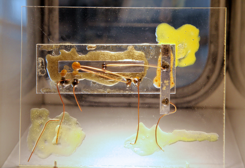

By the late 1950s a computer could have tens of thousands of transistors,
and each had to be soldered to resistors, capacitors and the others by
hand. Engineers called it the _tyranny of numbers_: more parts meant more
joints, more joints meant more failures, and the wiring, not the
transistors, set the limit. Two engineers, working independently a few
months apart, put a whole circuit on one piece of semiconductor.

## Kilby's bar

The idea was older than either. In 1952 **Geoffrey Dummer** of Britain's
Telecommunications Research Establishment foresaw, in words the Computer
History Museum quotes, electronic equipment "in a solid block with no
connecting wires". Several laboratories built pieces of it; none made a
general method.

**[Jack Kilby](kloom:e/jack-kilby)** was a new engineer at **[Texas Instruments](kloom:e/texas-instruments)** in Dallas in
the summer of 1958, too new to take the company's summer holiday. He spent
it on the tyranny of numbers and concluded that every component, resistors
and capacitors included, could be made of the same semiconductor as the
transistors, so that a whole circuit could come from one crystal. On 12 September 1958 he showed a phase-shift
oscillator on a sliver of [germanium](kloom:e/germanium) about 10 by 1.6 millimeters, cut from a
standard wafer of mesa transistors: a transistor, a capacitor and
resistors, all germanium, joined by fine gold wires bonded between them in
the air. A week later he showed an amplifier. TI announced the _solid
circuit_ in March 1959 and filed Kilby's patent, _Miniaturized Electronic
Circuits_, on 6 February 1959.

Kilby had proved the principle but not a way to make it. His "flying
wires" had to be bonded one at a time, like any other discrete circuit's,
and TI shipped only a few dozen of its first product, the Type 502
flip-flop at $450 each, for customers to evaluate.

## Noyce's layer of metal

At [Fairchild](kloom:e/fairchild-semiconductor), **[Jean Hoerni](kloom:e/jean-hoerni)**'s [planar process](kloom:e/planar-process) had just left transistors
sealed under a flat layer of silicon oxide. Pressed by the company's
patent attorney to think of other uses for it, **[Robert Noyce](kloom:e/robert-noyce)** wrote down
his idea in January 1959: make every component in one chip of silicon by
diffusing it through windows in the oxide, then lay aluminum over
the oxide and let it drop through small openings to the contacts. The oxide
insulates the wiring from the silicon beneath, and the wiring is made in
one printing step with the rest. The plate sets the two side by side.

Noyce filed his patent, _Semiconductor Device-and-Lead Structure_, on 30
July 1959. Components on one chip also had to be kept from shorting through
the silicon between them, and **[Kurt Lehovec](kloom:e/kurt-lehovec)** of Sprague Electric had
patented the answer, reverse-biased p-n junctions, in April 1959. At
Fairchild a team under **Jay Last** had the first working chips on 26 May
1960, isolated by etched channels filled with epoxy, and chips with
Lehovec's junction isolation on 27 September. Fairchild sold them as
_Micrologic_ from March 1961. TI adopted the planar method for its own
Series 51 that October.

|                      | Kilby, Texas Instruments                                | Noyce, Fairchild                           |
| -------------------- | ------------------------------------------------------- | ------------------------------------------ |
| Shown or conceived   | shown 12 September 1958                                 | conceived January 1959; working chips 1960 |
| Material             | germanium                                               | silicon                                    |
| Components           | mesa transistor; resistors and capacitors from the bulk | all diffused through the oxide             |
| Wiring               | gold wires bonded in the air                            | aluminum laid on the oxide                 |
| Patent filed, issued | 6 February 1959, 23 June 1964                           | 30 July 1959, 25 April 1961                |

## The dispute

The patents overlapped, and the companies fought over them for years. TI
also contested Lehovec's isolation patent and lost that fight in April 1966. The museum says the courts eventually ruled for Noyce, but by then
the companies had already settled on a cross-license with a net payment to
Fairchild; Wikipedia dates the cross-licensing agreement to the summer of 1966. Japan, where TI had fought for years to manufacture, recognized
Kilby's patent only in 1989, and royalties followed in the 1990s.

Credit was settled more generously than the patents. Both men received
the National Medal of Science and are usually named co-inventors: Kilby
for the first circuit made wholly of semiconductor, Noyce for the metal
over oxide that made it manufacturable. Some historians would add Lehovec
and Hoerni. Kilby shared the [Nobel Prize in Physics](kloom:e/nobel-prize-in-physics) in 2000; Noyce had died
in 1990.

## Why planar won

Planar was a photographic process. The whole wiring pattern of a chip was
exposed at once, for every chip on a wafer at once, so adding connections did not add
hand work, and making the features smaller put more circuits on each
wafer. Kilby's bonded wires could not
scale that way. Every [integrated circuit](kloom:e/integrated-circuit) since has been a planar chip. Its
first large customer needed thousands of identical logic gates for a
computer that would fly to the [Moon](kloom:e/moon).
