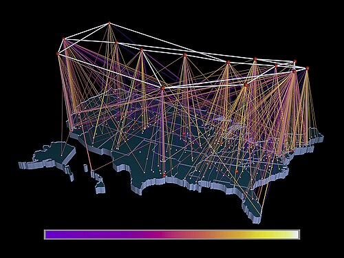

By the mid-1970s [ARPA](kloom:e/darpa) was paying for three kinds of packet network. The
[ARPANET](kloom:e/arpanet) ran over leased telephone lines; a packet radio network sent its
packets through the air; a satellite network reached across the Atlantic
to Norway and London. Each worked, and none
could speak to another: they differed in how they addressed a machine, how
big a packet they carried, how fast they were and how they failed. Making
them one network was called _internetworking_, and the answer is the
[_internet_](kloom:e/internet).

## Gateways

**[Bob Kahn](kloom:e/robert-kahn-computer-scientist)**, who had moved from BBN to ARPA, and **[Vint Cerf](kloom:e/vint-cerf)**, then on the faculty at Stanford and chair of an
international working group on the problem, published their design in May 1974 as "A Protocol
for Packet Network Intercommunication". Its central device is a _gateway_,
a computer with a foot in two networks. A host wraps every piece of its
data in an _internetwork header_, with the source and destination
addresses, a sequence number and a byte count, and adds a checksum at the
end. Each network may put its own local header round that to carry it; the
gateway strips it off, reads the internet header to choose the next
gateway, and wraps the packet for the next network. It never alters the
text or recomputes the checksum. If a packet is too big for the next
network, the gateway splits it into fragments, and only the destination
host puts them back together. The plate draws the three networks, the two
gateways, and one packet crossing them.

Their address had 8 bits for the network and 16 for the host's TCP.
Two hundred and fifty-six networks, they wrote, "seems sufficient for the
foreseeable future." The paper thanked, among others, **[Donald Davies](kloom:e/donald-davies)**
and **[Louis Pouzin](kloom:e/louis-pouzin)**, whose French network CYCLADES had already made its
hosts, not the network, responsible for delivering data reliably. Cerf,
Yogen Dalal and Carl Sunshine wrote the first full specification of the
[_Transmission Control Program_](kloom:e/transmission-control-protocol) as RFC 675 in December 1974. Stanford, BBN
and University College London ran it against each other from 1975, and in
1977 the radio, ARPANET and satellite networks were joined in one
demonstration. In 1978 the single program was split in two layers: [IP](kloom:e/internet-protocol),
which carries packets between networks and promises nothing, and TCP,
which runs on top in the hosts and makes a reliable stream of them.

## End to end

Where to put the work was the real decision. In 1981 **Jerome Saltzer**,
**David Reed** and **David Clark** of MIT named it the [_end-to-end
argument_](kloom:e/end-to-end-principle): a function such as reliable delivery "can completely and
correctly be implemented only with the knowledge and help of the
application standing at the end points". A network that tries to do it
too only duplicates the work, except as a help to performance. So the
internet's core stayed simple and did one thing, move packets, and
everything else lived in the hosts at its edges, where a new use could be
built without changing the network at all.

## The switch-over

In November 1981 **[Jon Postel](kloom:e/jon-postel)** published RFC 801, the _NCP/TCP Transition
Plan_: every ARPANET host was to implement IP and TCP, and the goal was "a complete switch over" from the old Network Control
Program by 1 January 1983. It happened on the day. Every host had to
convert at once or be left with makeshift relays: a _flag day_. In 1984 the military sites left for a network of their own, MILNET,
taking 68 of the ARPANET's 113 nodes.

The academic internet grew on the National Science Foundation's
**[NSFNET](kloom:e/national-science-foundation-network)**. It began in 1986 as six sites joined at 56 kilobits a second,
became thirteen nodes at 1.5 megabits by July 1988 and a 45-megabit
backbone in 1991, while its traffic doubled about every seven months. Its
rules allowed only research and education. The ARPANET was switched off in
1990; Congress allowed the NSF to connect with commercial networks in 1992;
and on 30 April 1995 the NSFNET backbone was retired, leaving the internet
to commercial carriers.

## Counting

| Date          |         Hosts | Counted by             |
| ------------- | ------------: | ---------------------- |
| August 1981   |           213 | SRI host table         |
| August 1983   |           562 | SRI host table         |
| February 1986 |         2,308 | SRI host table         |
| January 1989  |        80,000 | ZONE (DNS)             |
| January 1992  |       727,000 | ZONE (DNS)             |
| January 1995  |     4,852,000 | ISC survey, old method |
| January 2000  |    72,398,092 | ISC survey             |
| January 2005  |   317,646,084 | ISC survey             |
| January 2010  |   732,740,444 | ISC survey             |
| January 2019  | 1,012,695,272 | ISC survey             |

Every count is a floor. Mark Lottor, who made the early ones, warned that
sites hiding their hosts made the true number higher. The Internet
Systems Consortium's survey changed its method in 1998 and ended in 2019,
because it saw only the old 32-bit addresses and had become "increasingly
misleading". Counting people instead, the International Telecommunication
Union estimates that 6 billion were online in 2025, 74 per cent of the
world.

The idea is a stack of layers, each doing one job for the layer above: a
local network, IP between networks, TCP for a reliable stream, names in
place of numbers, and encryption over the top. The trail begins at the
bottom, with Ethernet.
