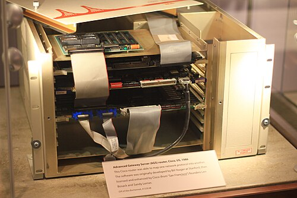

One layer up, the question is no longer who may talk on a wire but how a
packet crosses thousands of networks that know nothing of each other. The
[Internet Protocol](kloom:e/internet-protocol)'s answer is deliberately small: give every host an
address, put the address on every packet, and let each router along the
way make one decision, where to send it next. This frame describes the
protocol, and where its two versions stood on 28 September 2026.

## A datagram and an address

The internetworking design this trail hangs from was split in two in its
fourth version, in 1978, and the lower half became IP. Its specification, **RFC 791**,
edited by **[Jon Postel](kloom:e/jon-postel)** at the University of Southern California's
[Information Sciences Institute](kloom:e/usc-information-sciences-institute) and published in September 1981, describes
the carrying of "blocks of data called datagrams" between hosts identified
by fixed-length addresses. It is equally clear about what IP leaves out:
"There are no mechanisms to augment end-to-end data reliability, flow
control, sequencing, or other services commonly found in host-to-host
protocols." Packets may be lost, duplicated or delivered out of order, and
IP does not notice. This is _best-effort_ delivery, and it is the point:
anything more is left to the hosts at the two ends.

The plate lays out the header every [IPv4](kloom:e/ipv4) packet carries, five 32-bit words
before any data, filled in for an invented example (the two addresses are
from the blocks reserved for documentation).

| Field               | Bits | What it is for                                         |
| ------------------- | ---: | ------------------------------------------------------ |
| Version             |    4 | 4, for IPv4                                            |
| IHL                 |    4 | the header's length in 32-bit words, 5 without options |
| Type of service     |    8 | a hint about priority                                  |
| Total length        |   16 | header and data, in bytes, up to 65,535                |
| Identification      |   16 | ties together the fragments of one datagram            |
| Flags, offset       |   16 | whether and where a datagram was cut into fragments    |
| Time to live        |    8 | lowered at every router; at zero the packet is dropped |
| Protocol            |    8 | what the data is: 6 is TCP, 17 is UDP                  |
| Header checksum     |   16 | catches damage to the header, not to the data          |
| Source, destination |   64 | two 32-bit addresses, written 192.0.2.10               |

## Forwarding by prefix

A router does not know where every host is. It knows _prefixes_: the
leading bits of an address, which name a network. Since 1993 a prefix can
be any length, written after a slash, under **[classless inter-domain
routing](kloom:e/classless-inter-domain-routing)** (CIDR), which replaced fixed classes of network. A router's rule,
as the 1995 requirements for IPv4 routers put it, is the **longest match**.
Their example: for a packet to 10.144.2.5, with routes to 10.0.0.0/8,
10.144.0.0/16 and 10.144.2.0/24, the router uses the /24, the most specific
route that fits. It then lowers the time to live, and passes the packet on.

Inside one organisation, routers learn their prefixes from each other.
Between organisations, the tables are built by the **[Border Gateway
Protocol](kloom:e/border-gateway-protocol)**. In January 1989, at an IETF meeting in Austin, **Yakov
Rekhter**, **Kirk Lougheed** and **[Len Bosack](kloom:e/leonard-bosack)** sketched it on two napkins;
it was published that year as RFC 1105. Each independently run network, an
_autonomous system_, tells its neighbours which prefixes it can reach and
through which chain of networks, and each neighbour chooses by its own
policy. BGP-4, with support for CIDR, followed in 1994. On 28 September
2026 the global table held 1,079,014 IPv4 prefixes, announced by about
79,500 autonomous systems, according to the CIDR Report. Its growth is a
hazard in itself: on 12 August 2014 the table passed 512,000 routes, the
default limit of many routers' fast memory, and outages followed.

## Running out

Thirty-two bits allow 4,294,967,296 addresses, and large blocks of them
are reserved. Classless routing and _network address
translation_, which hides a whole private network behind one public
address, delayed the reckoning. On 3 February 2011 the Internet Assigned
Numbers Authority handed its last five blocks of 16.8 million addresses to
the five regional registries, one each; the Asia-Pacific registry ran down
to its final block on 15 April 2011, and the other four followed over the
next decade.

The successor was ready long before. **[IPv6](kloom:e/ipv6)**, first specified in December
1995 and made a full Internet Standard as RFC 8200 in July 2017, has
128-bit addresses, about 3.4 × 10³⁸ of them. It cannot talk to IPv4
directly, so the two run side by side. Google counts the share of its
users arriving over IPv6.

| September | 2010 | 2012 | 2014 | 2016 | 2018 | 2020 | 2022 | 2024 | 2026 |
| --------- | ---: | ---: | ---: | ---: | ---: | ---: | ---: | ---: | ---: |
| IPv6, %   |  0.2 |  0.8 |  3.9 | 11.8 | 21.7 | 30.8 | 38.3 | 43.4 | 47.7 |

The figures are averages of Google's daily series over the first 27 days of
each September. Weekends run higher, when people are on home and mobile
networks: 50.99 per cent on Saturday 26 September 2026, 45.87 on Monday
the 14th. Fifteen years after the addresses ran out, about half of
Google's users still reach it over the old protocol. What IP delivers is packets, some of them lost; a
reliable conversation is built on top of it, by [TCP](kloom:e/transmission-control-protocol).
