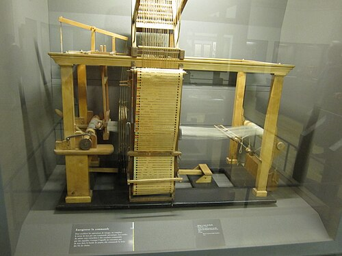
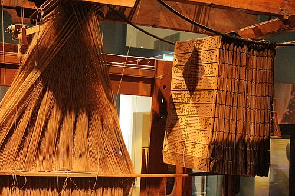

A calculator does what its operator dials, one figure at a time. A loom
weaving a patterned silk has to do something harder: for every pass of the
shuttle, raise exactly the right warp threads and no others, then a
different set for the next pass, thousands of passes over. In eighteenth-century Lyon, the capital of
French silk, that choice was taken out of human hands and written on cards. The loom became a
machine that ran a program, and a new pattern was a new set of cards.

## From the draw boy to the paper roll

On a _drawloom_, the pattern lived in bundles of cords, and a second
worker, the _draw boy_, pulled the right bundle for each pass while the
weaver threw the shuttle. It was slow, and a wrong pull spoiled the pattern.
Four Frenchmen, over eighty years, replaced him piece by piece.

| Year              | Who                   | What it added                                                                                               |
| ----------------- | --------------------- | ----------------------------------------------------------------------------------------------------------- |
| 1725              | Basile Bouchon        | a roll of paper, punched by hand, pressed against a row of needles: a hole left its thread down             |
| 1728 (or by 1737) | Jean-Baptiste Falcon  | separate cards with several rows of holes, laced into a loop, held on a square prism                        |
| 1745 (or 1747–50) | Jacques de Vaucanson  | the selection mounted above the loom; needles with eyes through which hooks passed; a ratchet to advance it |
| 1804–05           | Joseph Marie Jacquard | Falcon's chain of cards on Vaucanson's arrangement, with eight rows of needles and a card for every pass    |

**Basile Bouchon**, the son of an organ maker, still needed an assistant
to work his roll; so did **Falcon**, Bouchon's assistant, whose looms
handled more threads and sold modestly, about forty by 1762. The sources
date Falcon's cards to 1728 or to 1737. **Jacques de Vaucanson**, the maker
of famous automata, was made inspector of silk manufacture in 1741 and built
a loom that selected its own threads, in 1745 by one account and between
1747 and 1750 by another. It could not handle enough threads to pay for
itself, and weavers are said to have pelted him with stones in the street.
By 1804 his loom was kept at the Conservatoire des arts et métiers in
Paris.

## Jacquard's head

**Joseph Marie Jacquard**, born in Lyon in 1752, the son of a master
weaver, was a latecomer to invention. The dates of his loom are given
three ways. The Computer History Museum says he demonstrated it in 1801.
Wikipedia's article on the machine says he patented it in 1804. His
biography there lists a treadle loom of 1800 and a bronze medal at the
Paris industrial exhibition of 1801, then dates the card loom from 1804,
when he studied Vaucanson's at the Conservatoire, to 1805, when he went
back from Vaucanson's paper to Falcon's chain of cards; Napoleon saw it at
Lyon on 12 April 1805, and three days later granted the patent to the
city. Jacquard received a pension of 3,000 francs a year, and 50 francs
for each loom bought and used until 1811.

The plate draws the head in section, with one card. The cards, laced into
a chain, pass over a square prism, the _cylinder_, which swings in against
a bank of horizontal needles. Each needle has an eye, and through each eye
passes an upright wire hook. Where the card has a hole, the needle slips
into it and stays put, its hook stands upright, and the rising _griffe_, a
frame of blades, catches the hook and lifts it, with the cords, heddles
and warp threads hung from it. Where the card is solid, the needle is
pushed back against its spring, the hook is pushed off its blade, and its
threads stay down. The weaver throws the shuttle through the gap, the
cylinder turns a quarter and brings the next card. One card is one pass.
A head of 400 hooks, each tied to four threads, controls 1,600 warp ends,
repeating its pattern four times across the cloth.

## The trade that punched the cards

The machine did not take over at once. Weavers who feared for their living
opposed it fiercely, and in 1840 Lyon raised a statue to Jacquard on the
spot where a loom of his had been destroyed. The often-repeated figure of
11,000 Jacquard looms in France by 1812 is challenged: few sold until
**Jean Antoine Breton** cured faults in the card mechanism after 1815.

By 1831, Lyon's silk was woven by some 8,000 master weavers, the _canuts_,
each owning two to six looms, and the cards had made a trade of their own:
the _metteur en carte_ turned the customer's drawing into a coded chart of
the weave, and the _liseur_ punched it into cards. That was writing a program, and copying
it onto its medium, as separate jobs. The canuts' risings of 1831 and 1834
were about pay and prices, and in 1834 politics as well.

The Jacquard head is still made, now with a computer in place of the cards
and many thousands of hooks. Its cards ran a long way from silk. Charles
Babbage planned them for his Analytical Engine, which, Ada Lovelace wrote,
would weave algebra as the loom wove flowers. In 1881 Jules Carpentier
recorded harmonium music on punched cards "in the language of Jacquard".
But the cards did not calculate. The first machine in this story that did
was designed in London in 1822, to print tables without a single error.
