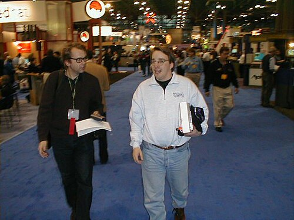

By 1991 the [GNU](kloom:e/gnu) system had a compiler, a shell, an editor and a library,
and no kernel. A student in Helsinki who wanted a [Unix](kloom:e/unix) for his new PC wrote
one, gave it away, soon under GNU's licence, and let anyone on the Internet send
him changes. Thirty-five years later it runs every one of the world's
fastest supercomputers and most of its phones. What follows was true as of
28 September 2026.

## A hobby on comp.os.minix

**[Linus Torvalds](kloom:e/linus-torvalds)**, a computer-science student at the [University of
Helsinki](kloom:e/university-of-helsinki), had bought a PC with an Intel 80386 processor. The Unix-like
system students used was **[MINIX](kloom:e/minix)**, which **[Andrew Tanenbaum](kloom:e/andrew-s-tanenbaum)** of the
Vrije Universiteit in Amsterdam had written in 1987 to go with his
operating-systems textbook: its source came with the book, but it could
not be freely changed and redistributed, and it was a 16-bit system that
did not use the 386's features. Torvalds developed his own kernel on MINIX,
with [GCC](kloom:e/gnu-compiler-collection). On **25 August 1991** he told the comp.os.minix newsgroup that he
was writing a free operating system, "just a hobby, won't be big and
professional like gnu", and that he had already ported Bash and GCC to it.
Version 0.01 went up on a Finnish university FTP server on 17 September.
Torvalds had meant to call it _Freax_; the server's administrator, Ari
Lemmke, named the directory [_Linux_](kloom:e/linux), and the name stuck.

The first licence forbade selling it, "not even 'handling' costs". The
release notes of version 0.12 changed that: people had asked for it to be
compatible with the GNU copyleft, and he agreed, so that the [GPL](kloom:e/gnu-general-public-license) took
effect on 1 February 1992. Version 0.95, in March, was the first published
under it. Linux and GNU together made a complete free system, which the
FSF and some distributions call GNU/Linux.

## "LINUX is obsolete"

On 29 January 1992 Tanenbaum posted a critique under that title. A
_monolithic_ kernel, one large program running with full privilege, was in
his words "a giant step back into the 1970s"; the future was the
_microkernel_, a small kernel passing messages between file, memory and
driver servers that run as ordinary processes. And a kernel tied to the
386, which he called a weird architecture, would not outlast it. Torvalds
answered the next day. He granted that microkernels were nicer "from a
theoretical and aesthetical" point of view, but argued that MINIX had real
design flaws and that his system call interface was the portable part.
Tanenbaum replied that MINIX had to run on the students' cheap 8088
machines, some without a hard disk.

The plate shows the two designs. In Linux, a program's system call traps
once into one privileged program that holds the scheduler, memory, files
and drivers together. In MINIX, the request goes as messages through a
small kernel to separate servers, each running as a process of its own.

The Intel line did not fade, and Linux has since been ported to all the
major processor architectures, so its tie to the 386 did not last. When a 2004 book
claimed Linux had been copied from MINIX, Tanenbaum answered that, as far
as he knew, Torvalds wrote the kernel himself.

## Distributions and the size of it

A kernel is not a system people can install, so _distributions_ bundled
it with GNU and other software. Slackware (July 1993) and [Debian](kloom:e/debian) (founded
16 August 1993) are the oldest still active; Red Hat made a business of
selling support, and IBM agreed to buy it for $34 billion in 2018. Linux
1.0, in March 1994, was about 176,250 lines of code; the source passed 40
million in January 2025. Version 7.0 came out on 12 April 2026, and on 28
September 2026 the current stable release was 7.2.

Where it runs is easier to measure than who uses it:

| TOP500 list   | Systems running Linux |
| ------------- | --------------------: |
| June 1998     |                     1 |
| June 2000     |                    28 |
| June 2002     |                    67 |
| June 2003     |                   139 |
| June 2005     |                   318 |
| June 2008     |                   427 |
| June 2013     |                   476 |
| June 2017     |                   498 |
| November 2017 |                   500 |
| June 2026     |                   500 |

Every system on every list since November 2017 has run Linux. Beyond
supercomputers the numbers are estimates, each with its own method.
[**Android**](kloom:e/android-operating-system), built on the Linux kernel, had 67.45% of mobile page views
worldwide in August 2026 by StatCounter's count, and Linux 8.76% of
desktop ones. W3Techs identified Linux on 62.6% of websites whose server
operating system it could tell, and a Unix-like system on 92.1%. By 2015
more than 80% of kernel developers were paid by companies to work on it:
a way of building software that had been given a name of its own in 1998.
