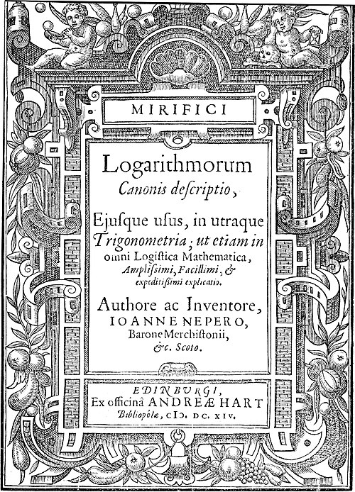
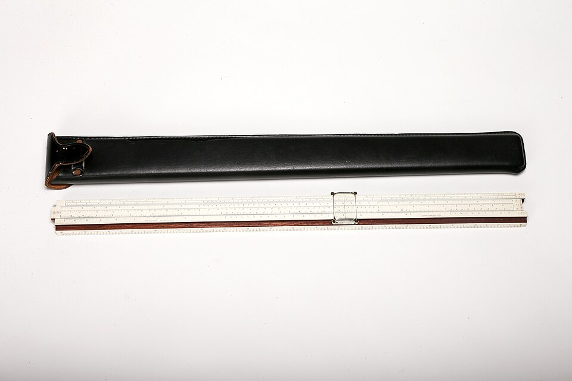

By 1600 the hardest work in astronomy and navigation was not observing but
multiplying. Finding a planet or a ship's position meant products and
quotients of sines to many figures, by hand, and every step was a chance
to go wrong. A Scottish landowner spent twenty years building a way round
it, and published it in 1614: a table that turned every multiplication
into an addition.

## The wonderful canon

**John Napier**, the eighth Laird of Merchiston, outside Edinburgh,
published the _Mirifici Logarithmorum Canonis Descriptio_, the
"Description of the Wonderful Canon of Logarithms", in 1614: fifty-seven
pages of explanation and ninety of tables. Napier wrote of the tedium of long multiplications and divisions, and of their "slippery
errors". His remedy was to pair two sequences of numbers, one growing by
equal steps and one shrinking by an equal ratio, so that multiplying
numbers in one corresponds to adding their partners in the other. The
partners he called _logarithms_.

His tables are of sines, because astronomers needed sines. Napier's
logarithms are not the base-10 or natural logarithms of today; a sine was a
whole number on a radius of 10,000,000, and in modern terms his logarithm
of a sine _s_ is very nearly 10⁷ · ln(10⁷ ÷ _s_). His page for 19°:

| Angle | Napier's sine | Napier's logarithm | 10⁷ · ln(10⁷ ÷ sine), computed today |
| ----: | ------------: | -----------------: | -----------------------------------: |
|   19° |     3,255,682 |         11,221,830 |                           11,221,833 |

The printed value and the modern one agree to seven figures. In the
_Constructio_, the account of how he built it, published by his son in
1619, two years after his death, Napier also used a full stop to separate
whole numbers from fractions. A Swiss clockmaker, **Jost Bürgi**, had
reached the same device independently, perhaps around 1600, but did not
publish until 1620, at Kepler's urging. Kepler's verdict was that Bürgi
had deserted his child "at birth".

## Briggs's tens

**Henry Briggs**, professor of geometry at Gresham College in London, read
the _Descriptio_ and went to Edinburgh, in 1616 and again in 1617, to argue
for a change: let the logarithm of 1 be 0 and that of 10 be 1. Napier
agreed. Briggs published the logarithms of 1 to 1,000 to fourteen figures
in 1617, and in 1624 his _Arithmetica Logarithmica_ gave thirty thousand
numbers, 1 to 20,000 and 90,001 to 100,000, to fourteen decimal places.
Adriaan Vlacq filled the gap. Briggs was among the first to fill in tables
by the _method of differences_, which later ran a famous engine. In 1627
Kepler's _Rudolphine Tables_ of the planets came with tables of
logarithms.

With base 10, the working is easy to show:

| Step                | Number | Logarithm (base 10) |
| ------------------- | -----: | ------------------: |
| look up             |      2 |             0.30103 |
| look up             |      3 |             0.47712 |
| add                 |        |             0.77815 |
| look up the antilog |      6 |                     |

## Logarithms you can slide

A logarithm is also a length. In 1620 **Edmund Gunter** laid logarithms out
along a ruler, and multiplied by stepping off lengths on it with measuring
tools. **William Oughtred** put two such scales side by side, so
that one could slide along the other and the lengths add by
themselves. When is disputed: the account most often given dates his rule to
about 1622, but it was described in print only in 1632, by his pupil
William Forster, after a bitter quarrel over priority with another pupil,
Richard Delamain. The plate sets a rule to multiply 2 by 3: the slide's 1
over the stock's 2, and the cursor, at the slide's 3, reads 6.

The slide rule lasted three and a half centuries. Amédée Mannheim, a French
artillery officer, gave it the layout and the cursor it kept from 1859.
Engineers carried ten-inch rules in belt holsters into the mid-1970s, and
aluminium Pickett rules went to the Moon on Apollo. They gave about three
significant figures, and made the user track the decimal point in their
head. Handheld electronic calculators ended them within a few years: by
1976 a Texas Instruments scientific calculator cost less than $25.

Logarithms made multiplication an addition. The next step was a machine
that could do the adding itself, and it came from France in 1642.
