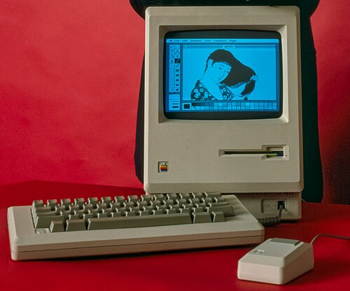

On 22 January 1984, in the third quarter of the Super Bowl, American
television showed a minute of grey drones in a hall, a giant face on a
screen, and a woman in red shorts who ran in and threw a hammer through it.
Then a line of text: on 24 January [Apple](kloom:e/apple-inc) would introduce [Macintosh](kloom:e/macintosh-128k), "And
you'll see why 1984 won't be like '1984'." The advertisement, directed by
**Ridley Scott**, ran nationally once. Two days later the **Macintosh** went
on sale for $2,495: the graphical interface of the laboratories, sold to
anyone with a credit card.

## From Lisa to Macintosh

Apple's first try was the **[Lisa](kloom:e/apple-lisa)**, redirected towards windows and a mouse
after the 1979 visits to Xerox and unveiled on 19 January 1983 at $9,995.
It was admired and little bought. The Macintosh began in 1979 as **[Jef
Raskin](kloom:e/jef-raskin)**'s plan for an appliance under $1,000 with a text screen. **Burrell
Smith** redesigned its board around the Lisa's **Motorola 68000**, a chip
with 32-bit registers, while using less memory than the Lisa, and in 1981
**[Steve Jobs](kloom:e/steve-jobs)** took the project over.

The machine that shipped was one beige box: a 9-inch screen of 512 by 342
dots at 72 to the inch, a 3½-inch floppy drive of 400 KB, 128 KB of memory
and a 64 KB ROM holding much of the system, including **QuickDraw**, its
graphics routines. The mouse had one button. There were no expansion slots,
at Jobs's insistence, though the design team quietly added the two address
lines that later let it take 512 KB. At one bit a dot, the screen took 21,888
bytes, a sixth of the memory where the [Alto](kloom:e/xerox-alto)'s had taken nearly half, and the
processor and the display took turns at that memory, which cost the 68000
up to a third of its speed.

It came with two programs, **MacWrite** and **MacPaint**, and a manner
that, in Gladwell's account, its makers had worked out beyond Xerox's: a
menu bar across the top, menus pulled down from it, windows dragged and
resized by hand, and a wastebasket for deleting. Apple had sold 50,000 by April. The 128 KB soon
proved cramped, and a 512 KB model followed that September.

| Machine    | Launched |   Price | Screen, dots | Memory |
| ---------- | -------- | ------: | ------------ | ------ |
| Xerox Star | 1981     | $16,595 | 1,024 × 808  | 384 KB |
| Apple Lisa | 1983     |  $9,995 | 720 × 364    | 1 MB   |
| Macintosh  | 1984     |  $2,495 | 512 × 342    | 128 KB |

## The page as a program

The Mac's lasting trade was print. **John Warnock** and **Charles Geschke**
had left [Xerox PARC](kloom:e/parc-company) in 1982 to found **[Adobe](kloom:e/adobe-inc)**, and there wrote, with
colleagues, a simpler language in the manner of PARC's _Interpress_:
**[PostScript](kloom:e/postscript)**, released in 1984. A PostScript page
is a program. It describes every shape, letters included, as straight lines
and cubic Bézier curves, and an interpreter in the printer turns them into
dots at whatever resolution the printer has. The plate shows one outline
filled at the screen's 72 dots to the inch and at the printer's 300. Jobs
pushed Adobe to make type look good at 300, which meant making the strokes
of letters scale evenly when they fell between the dots.

Apple licensed PostScript in December 1983 and announced the **LaserWriter**
on 23 January 1985, shipping it that March at $6,995. Inside, a Canon engine
printed 300 dots to the inch, and a 12 MHz 68000 ran the interpreter: the
printer out-computed the Mac. It carried 1.5 MB of memory, a megabyte of it
for the page: a letter-sized sheet at 300 dots to the inch is 2,550 by
3,300 dots, about 8.4 million bits, a megabyte at one bit a dot. Up to sixteen Macs could
share one over AppleTalk. That July **Paul Brainerd**'s Aldus released
**[PageMaker](kloom:e/aldus-pagemaker)**, and a Mac, a LaserWriter and PageMaker together became
[_desktop publishing_](kloom:e/desktop-publishing): newsletters, forms and books set in an office rather
than by a typesetter.

Microsoft shipped **Windows 1.0** for the IBM PC on 20 November 1985, for
$99, with tiled windows only; it sold half a million copies by 1987 and was
reckoned a flop. The "1984" advertisement is told two ways, too: as
Apple against IBM, which Jobs had said in a 1983 keynote "wants it
all", and, by its creators, as the few against the many. Even its cost is
given two ways: under $250,000 to make, by Scott's account, and $1.5
million in the Macintosh's history. Either way, nine years after the Altair kit, the personal computer
was setting type.
