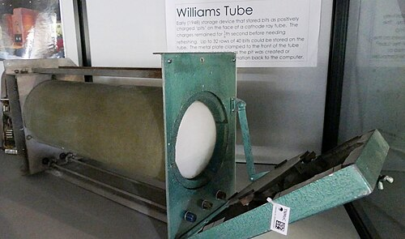
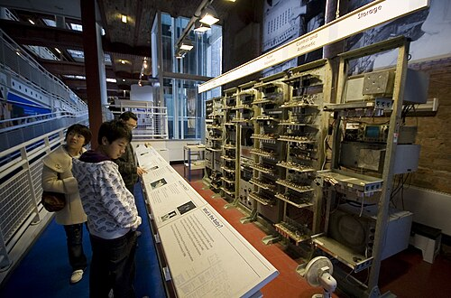

By 1947 the stored-program computer was fully described on paper and
built nowhere. The design wanted a memory that could hold instructions and
numbers alike and hand any of them back at electronic speed, and nobody
had one. The first that worked came out of wartime radar, in a Manchester
laboratory, and the machine built to test it became the first to run a
program from its own memory.

## A bit on a screen

**Frederic C. Williams**, a radar engineer at the Telecommunications
Research Establishment (TRE) at Malvern, began trying to store information
on a cathode-ray tube after a visit to the United States in June 1946. By
the autumn he could hold a single bit, and he filed a provisional patent in
December, the month he moved to a chair at Manchester. **Tom Kilburn**,
from his TRE group, was seconded to Manchester to carry on, and by
December 1947 the pair were holding 2,048 bits for hours on one standard
six-inch tube.

The principle, in the "dot-dash" form the early machines used: an electron
beam striking the screen knocks out more electrons than it brings, so a
spot it has lit is left slightly positive. A 0 was written as a dot. For a
1, the beam stayed on a moment longer and drew a dash, and the electrons
knocked out along the dash fell back into the dot's position and filled
it. On the next scan the beam lit every position again. Where a 0 had been
nothing changed; where a 1 had been the spot had to charge up afresh, and
that change was felt through the glass by a metal **pick-up plate** as a
pulse. So reading was writing, and since the charge leaked away within
tenths of a second the whole store was read and rewritten continuously.
Because the beam could be sent anywhere at once, any word was as quick to
reach as any other: random access. The tube had to live in a metal box,
screened from passing trams and motorcycles.

The Americans called it the _Williams tube_. Manchester's own history
prefers _Williams–Kilburn_: every patent after the first bore both names,
and Kilburn did most of the 1947 work.

## The Baby

A store is only proved inside a computer, and the pair could change bits
by hand at about one a second. So in the first half of 1948 Kilburn and
**Geoff Tootill** built the smallest computer they could around one tube:
the _Small-Scale Experimental Machine_, soon called the **Baby**. Its store
was 32 words of 32 binary digits. A second tube held the accumulator, a
third the current instruction and its address, and a fourth displayed any
of them. It had about 550 valves, and its only arithmetic was subtraction
and negation.

| Code | Written then | Action                                              |
| ---: | ------------ | --------------------------------------------------- |
|  000 | S, Cl        | jump to the address held in word S                  |
|  100 | Add S, Cl    | jump forward by the number held in word S           |
|  010 | −S, C        | load the negative of word S into the accumulator    |
|  110 | c, S         | store the accumulator in word S                     |
|  001 | SUB S        | subtract word S from the accumulator                |
|  011 | Test         | skip the next instruction if the accumulator is < 0 |
|  111 | Stop         | halt                                                |

Seven instructions, their codes written least significant digit first,
entered bit by bit on a row of switches. Adding took four of them, as
−(−*x* − _y_). The plate shows the tube at work: three
words written as dots and dashes, least significant digit on the left, as
Manchester wrote numbers, and the pulse that tells a dash from a dot.

## 21 June 1948

Kilburn's first program, seventeen instructions, found the highest proper
factor of a number by trying every smaller one in turn, dividing by
repeated subtraction. It was chosen because it used all seven instructions
and "everybody understood it". Williams and Kilburn's letter to _Nature_ in
September 1948 reported the long run: the highest factor of 2¹⁸, found in
52 minutes, with about 130,000 numbers tried and some 3.5 million
operations.

When that run happened is told two ways. The usual account, Wikipedia's
among them, puts the 52-minute run on 21 June itself. The University of
Manchester's history says the first success used a small number and 2¹⁸
followed within days. Fifty years on, Tootill and Kilburn reconstructed the
program from Tootill's notebook and the operating notes. They concluded
that the runs of 21 June were on small numbers, and that the 52-minute run
came a day or more later, probably, in Tootill's conjecture, after
maintenance had changed the clock. They
also judged the letter's 3.5 million "operations" (store accesses) too low:
their reconstruction needs about 3.8 to 4.1 million.

|  Number tried | Highest factor | Time taken   | When                |
| ------------: | -------------: | ------------ | ------------------- |
|          4537 |            349 | 2 min 25 sec | 21 June 1948        |
|          3141 |           1047 | about 1 min  | 21 June 1948        |
| 2¹⁸ = 262,144 |        131,072 | 52 min       | a day or more later |

Either way the store held, and the program in it ran.

## From Baby to Ferranti

The Baby grew into the **Manchester Mark 1**: 40-bit words, a magnetic drum
behind the tubes, and the first _index registers_, called B-lines. It ran a
search for Mersenne primes without error for nine hours on the night of
16–17 June 1949. In October 1948 the government's chief scientist had
already given the Manchester firm **Ferranti** a contract to build it to
Williams's design. The first **Ferranti Mark 1** reached
the university in February 1951, the first general-purpose computer sold
as a product. Its store was eight tubes of 64 twenty-bit lines, with a
512-page drum behind them, and Ferranti sold nine of the Mark 1 and its
successor between 1951 and 1957. (Alan Turing had written the Baby's
third program, a long division, which Tootill
tested in July 1948.) IBM licensed the tube for its 701.

The Baby proved a memory. Less than a year later, in Cambridge, a machine
built to serve its users rather than to test a store ran its first
program.
