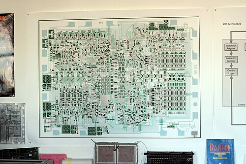
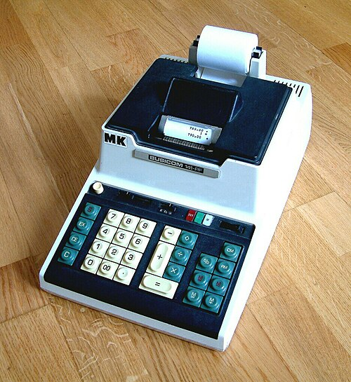

In 1969 a Japanese calculator maker asked a young memory company in
California to make the chips for a new range of machines. What it got back,
two years later, was a computer's processor on one sliver of silicon,
twelve square millimeters, and on 15 November 1971 [Intel](kloom:e/intel) began selling it
to anyone who wanted one. The processor had become a component, bought by
the tray, like a resistor.

## A calculator's chips

**[Busicom](kloom:e/busicom)** wanted one set of chips for desktop calculators and also, it
kept quiet, for billing machines, cash registers and teller machines it
was building with NCR Japan. A provisional agreement with Intel was signed
on 28 April 1969. On 20 June three Busicom engineers arrived with their
design: the project manager, Masuda, the senior engineer, Takayama, and the
youngest, **[Masatoshi Shima](kloom:e/masatoshi-shima)**. How many chips it called for is told two
ways: seven in Wikipedia's account, while Shima remembered planning nine,
then eight.

Intel gave the job of liaison to **[Ted Hoff](kloom:e/marcian-hoff)**, its twelfth employee. He
thought the design too complex for a company that had few people able to
lay out such chips, and too costly in pins and packages to meet Busicom's
price. [Robert Noyce](kloom:e/robert-noyce) told him to pursue any idea that simplified it. Hoff's
ideas, worked out in July and August 1969, were to keep numbers in Intel's
new dynamic memory, three transistors to a bit instead of the six of a
shift register, and to give the processor a small, primitive instruction
set and build the calculator out of subroutines. **[Stan Mazor](kloom:e/stanley-mazor)** joined him in
September. In October Busicom's management heard both proposals and chose
Intel's: four chips, a processor, a ROM for the program, a RAM for the
numbers and a shift register for input and output. Shima then reworked the
instruction set with them so that a calculator program would fit.

## Faggin's silicon

Nobody had yet designed the circuits. In April 1970 Intel hired **[Federico
Faggin](kloom:e/federico-faggin)** from Fairchild, where in 1968 he had developed the _silicon-gate_
process: transistor gates of polysilicon rather than aluminum, which
halved the area a circuit needed and made it faster. He found the project
stalled, and Shima, just back from Japan to check the logic, dismayed. Both
worked long nights. Faggin added two inventions without which, the account
goes, the design could not have fitted on one chip: _buried contacts_,
joining the silicon gates directly to the transistors, and _bootstrap
loads_ made in silicon gate. The first 4004s, at the end of December 1970,
did not work at all: a processing step, the buried contact, had been left
out. The January 1971 run worked, and Busicom's printing calculator, the
141-PF, ran by April. Faggin etched his initials, F.F., into a corner of the
chip.

How many transistors it holds depends on who counts. **Intel** says 2,300.
Shima, describing his logic design in 2007, gave his own count, unit by
unit, as 2,238, against an Intel target of about 2,000. It was built in
lines ten micrometers wide and clocked at 740 kilohertz.

The plate draws its data path and the price of its package. A 12-bit
address, an 8-bit instruction and 4-bit data all had to pass through
sixteen pins, so a single 4-bit bus did everything, in turn. Each
instruction took eight clock periods, 10.8 microseconds: three to send the
address out in three pieces, two to bring the instruction back, three to
carry it out.

## A computer sold as a part

Busicom owned the design. When it ran into money trouble and asked for a
lower price, Faggin persuaded Noyce to trade the price for the right to
sell the chips to others. In May 1971 Busicom agreed, keeping calculators
for itself, and Intel repaid its $60,000 of development costs. The set was
renamed MCS-4, "Micro Computer System", and advertised in _Electronic
News_ on 15 November 1971 as "a new era of integrated electronics".

Whether it was the first [microprocessor](kloom:e/microprocessor) depends on the definition. Four-Phase
Systems had put a processor's registers and arithmetic on one chip, the
AL1, in 1969, with its control elsewhere. Garrett AiResearch built a chip
set for the F-14 fighter's air-data computer by 1970, kept secret until 1998. Texas Instruments announced a calculator on a chip in September 1971,
but its program was fixed in the factory. The [4004](kloom:e/intel-4004) is usually called the
first processor on one chip sold for anyone to program.

| Chip | Sold from  | Word  | Transistors                          | Clock       | Price |
| ---- | ---------- | ----- | ------------------------------------ | ----------- | ----- |
| 4004 | Nov. 1971  | 4-bit | 2,300 (Intel); 2,238 (Shima's count) | 740 kHz     | $60   |
| 8008 | April 1972 | 8-bit | 3,500 (Wikipedia); 3,098 (Shirriff)  | 0.5–0.8 MHz | $120  |
| 8080 | April 1974 | 8-bit | about 4,500                          | 2 MHz       | $360  |

The 8-bit [**8008**](kloom:e/intel-8008) began as a processor for a terminal, the Datapoint 2200,
whose maker let Intel keep the design; Faggin led it to completion in April 1972. The [**8080**](kloom:e/intel-8080), proposed by Faggin in 1972 and designed in detail by
Shima, came out in April 1974 at $360 for one. The two chips split the
work between them: the 4004's kind went into microwave ovens and traffic
lights, the 8008's into terminals and small computers. It was the 8080
that a struggling kit maker in Albuquerque bought, for $75
each, and put in a blue box.
