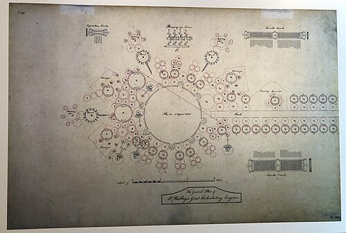
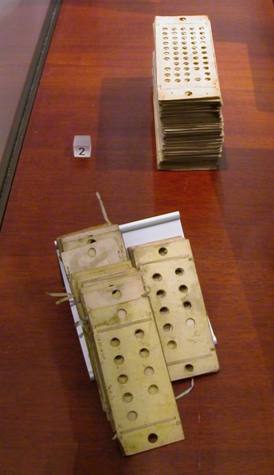

In 1834, cut off from his drawings by the quarrel with [Clement](kloom:e/joseph-clement), [Babbage](kloom:e/charles-babbage)
went back to the fragment of the [Difference Engine](kloom:e/difference-engine) and asked what else it
could do. Arranging its columns round a ring of large central wheels, so
that results could be fed back in, he saw "the whole of arithmetic" come
within reach of mechanism. By 1836 he had a workable design for a machine
that did not tabulate one kind of function but carried out any sequence of
operations it was given: the **[Analytical Engine](kloom:e/analytical-engine)**. It was never built.
This is the machine itself; [Ada Lovelace](kloom:e/ada-lovelace)'s notes of 1843 on it are
another story.

## Store and mill

Babbage took his names from the textile trade. The _store_ held numbers,
each on a column of figure wheels, one wheel to a digit. The _mill_ did
the arithmetic, and every quantity to be worked on was brought to it and
the result sent back. [Allan Bromley](kloom:e/allan-g-bromley), who decoded the drawings from 1979, found that the carry
mechanism, the most complex in the machine, was what first led Babbage to
separate memory from processor and keep the arithmetic in one place.

His sizes changed from plan to plan, and the sources differ:

| Source                                        | Digits in a number | Speed                                                 |
| --------------------------------------------- | -----------------: | ----------------------------------------------------- |
| Bromley, on the design of 1838                |                 40 | —                                                     |
| Wikipedia (store of 1,000 numbers)            |                 40 | —                                                     |
| Menabrea's account of 1842, from Babbage      |                 20 | multiplying two such numbers in 3 minutes             |
| Babbage, _Passages_, 1864                     |                 50 | 60 additions a minute; a 50 by 50 product in 1 minute |
| Plan 28, 1840s (Bromley, reproduced by Rojas) |                 30 | —                                                     |

In the 1838 design, Bromley estimated, a column of forty wheels stood
about ten feet high and the engine about fifteen, with a mill six feet
across and a store running ten or twenty feet to one side: the size of a
small railway locomotive.

## Foreseeing the carry

Addition was fast: every digit could be added to its partner at once.
Carries were slow, since a carry into a nine makes another, and in the
worst case they ran up the whole column one after another. In October
1834, Babbage wrote, it occurred to him "to teach mechanism" to foresee.
In Bromley's reading of the mechanism, each figure wheel carries a loose
slug of metal, a "movable wire", that drops into line between two fixed
wires only when the wheel stands at nine. A carry from below lifts the
fixed wire, and through every nine above it the lift passes straight on,
so all the carries in a column are made in one movement. Each nine completes
the chain, Bromley notes, like a logical AND, and the closest modern kin
are the relay contacts that carried carries in the [Harvard Mark I](kloom:e/harvard-mark-i) and the
pass transistors of a VLSI adder. Babbage reckoned an addition of any
length at nine units of time for the digits and one for all the carries.
The plate draws it adding 5 to 4,997.

## Studs on barrels

The mill's own steps were sequenced by _barrels_, drums to which studs were
screwed, as on a barrel organ. At each cycle the barrel moved sideways and
one row of studs along it, a _vertical_, pressed against a row of control
levers; each lever put some part of the mechanism into gear with the main
drive. A barrel might work fifty to a hundred levers and carry as many
verticals. Sectors with one, two and four teeth moved it on by up to seven
verticals, forward or back, and a carry out of the top of a column, which
signals a change of sign, could lengthen the jump: a conditional branch
inside the machine. Bromley describes the barrels as microprogram stores
and a vertical as a microprogram word. [Doron Swade](kloom:e/doron-swade) warns that the
vocabulary is ours, not Babbage's, and fraught with the hazard of reading
the present into the past.

Above the barrels sat the user's program. Around 1836 Babbage replaced a
top-level barrel with the punched cards of the [Jacquard loom](kloom:e/jacquard-machine): _operation
cards_ naming what the mill should do, and _variable cards_ naming which
columns of the store to use. Every set of cards could be kept and run again, so the engine would
have, he wrote, "a library of its own".

## Drawn in signs

To keep track of motions no memory could hold, Babbage extended the
_Mechanical Notation_ he had published in 1826, a written language of
signs for which part drives which, and when. "By the aid of the Mechanical
Notation," he wrote, "the Analytical Engine became a reality: for it became
susceptible of demonstration." The numbered general plans run to 28 and 28a: Plan 25 of 1840 is the engraved one he
took to Turin, and Plan 28, from the mid-1840s, simplified the machine at
some cost in speed.

## Plan 28 today

In 2010 [John Graham-Cumming](kloom:e/john-graham-cumming) began a campaign, named after
that plan, to study the drawings and then build an engine, and hoped to
finish by 2021, the 150th anniversary of Babbage's death. As of 28 September
2026 no engine had been built. The project's latest published report,
written by Swade and dated February 2025, says that Tim Robinson's analysis
of the drawings runs to over 150,000 words and is nearly ready to publish;
that he has laid out the gearing of Plan 27's mill in wood laminate and
simulated its division through what amounts to five years of cranking;
that Len Shustek has built the anticipating carriage in 3D-printed parts
with stepper motors for its timing; and that the analysis now informs the
choice of which version, of a design that evolved over four decades, to
build. Meanwhile a Swedish printer, reading about the first engine in a review,
had built one of his own.
