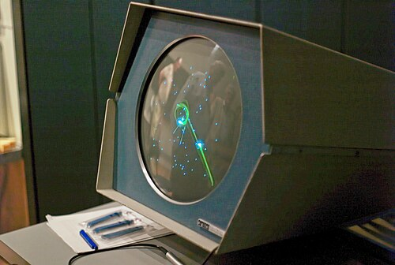
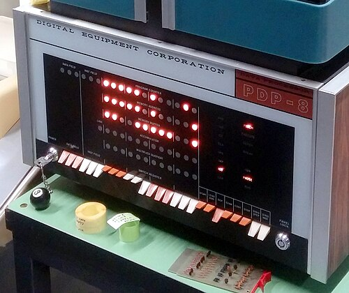

At MIT's Lincoln Laboratory in the 1950s, **Ken Olsen** and **Harlan
Anderson** built transistor computers, the TX-0 and then the TX-2, as
successors to Whirlwind. They noticed something odd: students queued for
hours to use the small, stripped-down TX-0, which they could sit at and
drive, and ignored a faster IBM machine nearby. The two decided there was a
market for a small, interactive computer that cost far less than a
mainframe.

## Not a computer company

Investors in 1957 did not want a computer company; small ones kept failing.
The one offer came from **Georges Doriot**'s American Research and
Development Corporation, which put in $70,000 for 70 per cent and asked
them to leave "computer" out of the name. **Digital Equipment
Corporation** set up in a former wool mill in Maynard, Massachusetts, and
sold circuit modules first: $94,000 worth in 1958, at a profit.

Its first computer was still not called one. **Ben Gurley** began the
**PDP-1**, the "Programmed Data Processor", in August 1959, and it was
shown at the Eastern Joint Computer Conference in Boston that December.
Bolt Beranek and Newman took the first in November 1960. It had 4,096
eighteen-bit words of core and did about 100,000 operations a second,
cost $120,000, and was built 53 times in all. At BBN it was one of the
first machines to be time-shared. DEC gave one to MIT's electrical
engineering department in September 1961, next door to the TX-0.

## Spacewar!

There, early in 1962, **Steve Russell**, with Martin Graetz, Wayne
Wiitanen and others, wrote _Spacewar!_ for the PDP-1's round Type 30
display: two ships, the needle and the wedge, fight in the gravity well of
a star (Dan Edwards's addition), with limited fuel and torpedoes and a
hyperspace jump for emergencies. Bob Saunders soon built control boxes to replace the console
switches. The program was passed around freely and ran at many of the few
dozen PDP-1 installations, the first video game played at more than one.
It showed what a computer someone could sit at was for.

## The PDP-8

Lincoln Laboratory's **LINC** of 1962, a small 12-bit machine built from
DEC modules for laboratory work, led DEC to the PDP-5 in 1963 ("for what a
core memory alone used to cost: $27,000", said an advertisement) and on 22
March 1965 to the **PDP-8**, designed by Edson de Castro. It was about the
size of a small refrigerator, with 4,096 twelve-bit words of core and a
Teletype Model 33 for its keyboard, printer and paper tape. DEC's
histories give its price as $18,000 and the PDP-8's own as $18,500; either
way it was the first computer sold for under $20,000. About 1,450 of the
first model were built, and more than 50,000 of the whole family. A
serial version, the PDP-8/S of 1966, went under $10,000.

The price came from leaving things out, and the plate shows how. An
instruction is one 12-bit word. Three bits choose the operation, so there
are only eight, and no subtract: a program adds the negative instead.
Seven bits give an address, enough for 128 words, so memory is cut into
32 pages of 128, and one bit says whether the address is in page 0 or in
the page the instruction sits in; another says whether to take the word
found there as the address of the real operand. Programmers fitted their
routines to pages to save words.

Which machine was the first minicomputer is argued. DEC called the PDP-5
the world's first commercially produced one; others name the LINC or the
CDC 160; most histories say the PDP-8, for its size, its general purpose
and its price.

| Machine | Year | Maker           | Word    | Price              |
| ------- | ---- | --------------- | ------- | ------------------ |
| CDC 160 | 1960 | Control Data    | —       | $100,000           |
| PDP-1   | 1960 | DEC             | 18 bits | $120,000           |
| LINC    | 1962 | MIT Lincoln Lab | 12 bits | (a lab design)     |
| PDP-5   | 1963 | DEC             | 12 bits | $27,000            |
| PDP-8   | 1965 | DEC             | 12 bits | $18,000 or $18,500 |
| PDP-8/S | 1966 | DEC             | 12 bits | under $10,000      |

## In the laboratory and the factory

Minicomputers were made for control and measurement more than for
calculation. A PDP-8 could be wired straight to a laboratory's instruments,
reading analogue-to-digital converters through a direct path into memory,
and many were sold to other firms, which built them into typesetting
systems, instruments and control equipment and sold them under their own
names. Nearly
a hundred companies made minicomputers between 1965 and 1985, many of
them along Route 128 outside Boston; de Castro left DEC to found one of
them, Data General. DEC's own 16-bit
**PDP-11** of 1970, with its Unibus for attaching devices, sold about
600,000, and was succeeded by the VAX.

Every one of these machines still had a processor built from many
separate circuits. The next step put a whole processor on one chip.
