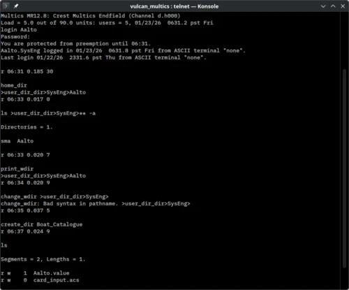

In the autumn of 1965, at the Fall Joint Computer Conference, six papers
described an operating system that did not yet exist. [MIT](kloom:e/massachusetts-institute-of-technology)'s [Compatible
Time-Sharing System](kloom:e/compatible-time-sharing-system) had already shown that many people could share one
machine from their own terminals. **[Multics](kloom:e/multics)**, the Multiplexed Information
and Computing Service, was to go much further: a _computer utility_, in the
words of **[Fernando Corbató](kloom:e/fernando-j-corbato)** and **Victor Vyssotsky**'s overview, run
"continuously and reliably 7 days a week, 24 hours a day in a way similar
to telephone or power systems".

## Three partners

The project was MIT's **[Project MAC](kloom:e/project-mac)**, founded in July 1963 with a
$2 million grant from ARPA. MAC chose [General Electric](kloom:e/general-electric)'s proposal for the
machine in May 1964, over IBM's; GE would build the **GE-645**, its 635
with paging, segmentation and an associative memory added for the purpose.
**[Bell Telephone Laboratories](kloom:e/bell-labs)** came in as the third partner. The
Multicians' own history puts that in November 1964, while their page of
myths says 1965, quoting Vyssotsky on a "murky process". Each partner sent
one member to the committee that ran the work: Corbató for MIT, Ed Vance for
GE, Vyssotsky for Bell Labs.

| Partner                     | What it wanted                                       | People, roughly |
| --------------------------- | ---------------------------------------------------- | --------------: |
| MIT Project MAC             | to advance operating systems; an information utility |              50 |
| General Electric            | profit, and the lead in the industry                 |              40 |
| Bell Telephone Laboratories | an advanced tool for its own computing research      |              20 |

The headcounts are the Multicians' estimates, and many people were
part-time.

## What it tried

- **Segments.** A program saw memory as named _segments_, each of up to a
  quarter of a million 36-bit words, and a user could have a quarter of a
  million of them. A file was a segment too, and could be mapped into a
  program's address space and used as memory, without explicit reads and
  writes.
- **Dynamic linking.** A segment knew another only by its symbolic name.
  The first call from one to the other trapped, the system found the
  segment and patched the link, and later calls ran at full speed. Multics
  needed no loader.
- **A tree of files.** **Robert Daley** and **Peter Neumann**'s paper of
  1965 laid out directories inside directories, and the system put an
  access-control list on every entry. **Jerome Saltzer** thinks it was the
  first hierarchical file system anywhere. Its paths ran from `>`, the root, as in
  `>user_dir_dir>SysEng`.
- **[Rings of protection](kloom:e/protection-ring).** The plate draws them. A process ran in one of
  eight nested rings, the supervisor in ring 0; each segment carried
  _brackets_ saying which rings could read, write or execute it, and a
  call inward was allowed only through a segment's _gates_. The GE-645 had
  only a supervisor mode and a user mode, so its rings were kept by
  software trapping on every inward call; the Honeywell 6180 of 1973 did
  it in hardware, as **Michael Schroeder** and Saltzer described in 1972.
- **A high-level language.** Nearly all of Multics was to be written in
  **[PL/I](kloom:e/pl-i)**, then a new proposal from IBM, so that it could outlive its
  hardware. No PL/I compiler was ready, and Bell Labs' **Doug McIlroy** and
  **Bob Morris** wrote a quick one for a subset, EPL, using a
  compiler-writing language called TMG. Multics was not the first system
  in a high-level language: the Burroughs B5000's was earlier.

## Bell Labs leaves

The GE-645 was late. GE had planned it for 1965 and announced and then
withdrew it; the first reached MIT in January 1967. Bell Labs was paying
rent on its own 645 and lending some of its best people with no end in
sight, and in April 1969 it withdrew. **[Dennis Ritchie](kloom:e/dennis-ritchie)**, one of the last
Bell Labs people still working on it, later wrote of "the increasing
obviousness of the failure of Multics to deliver promptly any sort of
usable system". The Multicians answer that the project did not fail in
1969; it lost a partner. MIT began a paying Multics service that October,
and a native PL/I compiler replaced EPL at the end of the year.

## Thirty-five years

GE sold its computer business to Honeywell in 1970, and Honeywell sold
Multics as a product until it cancelled it in 1985, to about eighty sites
in universities, companies and governments; Bull sold 31 in France. In 1985
it became the first system rated B2 for security by the National Computer
Security Center. MIT shut its own down in January 1988. The last, at the
Canadian Department of National Defence in Halifax, Nova Scotia, went dark
at the end of October 2000. Its source was freed in 2006 and 2007, and an
emulator has run it since 2014, with a new release as late as August 2023.

The people who left in 1969 took some of it with them. [Ken Thompson](kloom:e/ken-thompson) later
said the parts he liked enough to take were the tree of files and a shell
that was just another process; Ritchie counted the process, the file tree,
the command interpreter as a user program and device access among them. And
they took a language: BCPL, which Bell Labs had carried onto Multics, and
which became B, and then C.
