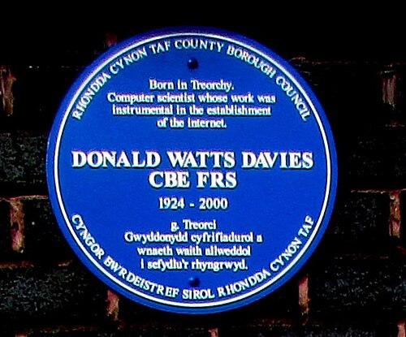

A telephone call in 1960 owned its wire: once the exchanges had connected
it, a circuit ran end to end for that call alone, carrying silence as
faithfully as speech. That
suited voice. It suited computers badly: a person at a terminal types in
bursts and then waits, and a circuit held open for them carries mostly
nothing. Two engineers on either side of the Atlantic, neither knowing of
the other, proposed the same cure. Cut every message into short blocks of
one fixed format, each carrying its own address, and let the blocks cross
a mesh of switches that store each one and pass it on.

## A network that survives damage

**[Paul Baran](kloom:e/paul-baran)** joined the [RAND Corporation](kloom:e/rand-corporation) in 1959 and took on a [Cold War](kloom:e/cold-war)
problem for the US Air Force: a communications network that could still
work after a nuclear attack. He briefed the Air Force in the summer of 1961
(briefing B-265), wrote it up as RAND paper P-2626, and in August 1964
published the whole design as eleven memoranda, _On Distributed
Communications_. The first volume, RM-3420-PR, compares three shapes: a
_centralised_ star, a _decentralised_ set of stars, and a _distributed_
mesh. A star dies with its hub. Baran measured a network by the share of
its stations still connected to the largest surviving group after nodes
and links are destroyed, and found that a mesh with three times the
minimum number of links came close to the best possible. In his graph,
with four stations in ten destroyed, it kept about nine in ten of the
survivors in touch.

The blocks were the other half. Baran proposed a _standard message block_
of "perhaps 1024 bits", mostly data, with housekeeping in front: a "to"
address, a "from" address, error-detecting bits and a _handover number_,
set to zero when the block entered the network and increased by one at
every switch. Each switch kept a table of the lowest handover numbers it
had lately seen arriving from each station on each of its links, and sent
traffic back towards that station on the best one. He called it
_hot-potato_ routing, and likened it to a postman who learns the quickest
road to San Francisco from the postmarks on letters coming from there. No
central controller was left for an attack to destroy. [AT&T](kloom:e/at-and-t)'s engineers
scoffed at voice without dedicated circuits, and the military never built
it.

## A packet, and a name

**[Donald Davies](kloom:e/donald-davies)**, at the [National Physical Laboratory](kloom:e/national-physical-laboratory-united-kingdom) (NPL) in Teddington,
came to the same idea in 1965 from the other side. After visiting MIT's
time-sharing projects he saw that computer traffic is _bursty_, and that
keeping a telephone line open for each user was the waste. He lectured on
it at the NPL on 18 March 1966, and in June wrote it up as a _Proposal for a
Digital Communication Network_. His units he called _packets_, a word
chosen after consulting a linguist because it translates without loss. A
packet was to hold at most 128 characters, about 16 of them "red tape"
(source, destination and route), on lines of at least 1.5 megabits a
second. Only later in 1966 did someone from the Ministry of Defence tell
him of Baran. The NPL built a network of its own, partly live in early 1969
and fully working in January 1970, and ran it until 1986. At a symposium in
Gatlinburg, Tennessee, in October 1967, Davies's colleague **[Roger
Scantlebury](kloom:e/roger-scantlebury)** presented the design to the people planning the [ARPANET](kloom:e/arpanet), and
they adopted packets.

## Queues

Davies had to show that a packet would not wait too long in the queues at
each switch. For that he borrowed an approximation from _Communication
Nets_ (1964), the book of **[Leonard Kleinrock](kloom:e/leonard-kleinrock)**'s MIT thesis on _message
switching_, which treats each queue as independent. A packet takes a time
_t_ to send down one link (680 microseconds, for his packet and line), and
if a switch is busy a fraction ρ of the time, the mean wait is
_t_ · ρ ⁄ 2(1 − ρ). The table works his formula through; the arithmetic is
ours.

| Share of time the switch is busy, ρ | Mean wait in its queue |
| ----------------------------------: | ---------------------: |
|                                 0.5 |                0.5 _t_ |
|                                 0.8 |                  2 _t_ |
|                                 0.9 |                4.5 _t_ |
|                                0.95 |                9.5 _t_ |

Waits grow without limit as a switch nears saturation, so Davies kept ρ
below 0.8. A packet crossing five switches meets ten queues; with the
time spent on the links, his estimate came to 30 _t_, about 20
milliseconds, against a required 100: "an ample margin". The plate sets
the two methods side by side against time. The circuit must be set up and
confirmed before a bit of data moves; the packets are pipelined, one
entering a link as the one before leaves it.

## Who invented it

Credit is argued. From the late 1990s Kleinrock and [Larry Roberts](kloom:e/larry-roberts-computer-scientist), who ran
the ARPANET project, said that his early-1960s queueing work had held the
idea of [packet switching](kloom:e/packet-switching). Davies, in a paper published in 2001, the year
after his death, found "no evidence" that Kleinrock had understood its principles,
and other pioneers, Baran among them, sided with him. In 2023 Kleinrock
acknowledged that his early work was about message switching. Historians
credit Baran and Davies as independent inventors, as they credited each
other. "You and I share a common view of what packet switching is all
about," Baran wrote to Davies.

Packets were settled. What remained was to build a network of them across
a continent, and the ARPANET had its first four switches by the end of 1969.
