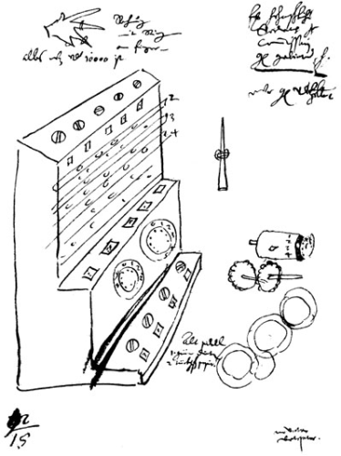
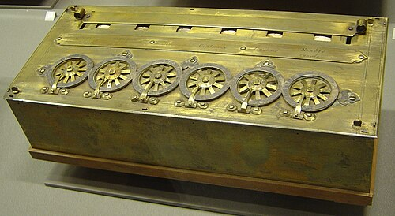

Logarithms turned multiplying into adding, but someone still had to do the
adding, column by column, carrying the tens in their head. In 1642 an
eighteen-year-old in Rouen began building a brass box that carried them
itself. It was not quite the first calculating machine. It was the first
that worked, and was sold.

## A clock that calculated, and burned

Twenty years earlier, in 1623 and 1624, **[Wilhelm Schickard](kloom:e/wilhelm-schickard)**, professor of
Hebrew at Tübingen, wrote to [Kepler](kloom:e/johannes-kepler) about an _arithmeticum organum_ he had
built: a six-digit adding machine in the base, rotatable Napier's bones
above it to help with multiplying, and a bell that rang when a sum
overflowed. The finished copy, which a clockmaker named Johann Pfister was
building, burned in a fire before it was delivered, and Schickard
gave the project up. He died of plague in 1635.

How much it matters is argued. The letters were announced as a discovery by
Kepler's biographer Franz Hammer in 1957, but the drawings had in fact been
printed at least once a century since 1718. A working replica built in 1960
by Bruno von Freytag-Löringhoff needed wheels and springs that the drawings
do not show. Its carry used a single tooth, which works for a place or two
but risks jamming when a carry has to ripple through many digits, as in
adding 1 to 9,999. It could, though, subtract simply by turning backwards.

## The falling carry

**[Blaise Pascal](kloom:e/blaise-pascal)** built his machine for his father, **Étienne Pascal**, the
supervisor of taxes in Rouen, whose accounts ran to long columns
of livres, sols and deniers. By his own account, in the _Advis nécessaire_
printed with the machine in 1645, he made more than fifty models, "some of
wood, others of ivory and ebony, and others of copper", before the one he
put on sale. An early model had been copied from hearsay by a Rouen
clockmaker: a handsome thing, Pascal wrote, that did not work, a "little
abortion". Fear of such copies nearly made him give up, until the
chancellor, Pierre Séguier, saw the machine and protected it; a royal
privilege of 1649 gave Pascal the sole right to make calculating machines
in France.

The operator put a stylus between the spokes of a dial and turned it to a
stop, like a telephone dial; the sum appeared in the windows above. The
hard part was the carry, and the plate draws Pascal's answer, simplified.
Between each wheel and the next sits a weighted lever, the _sautoir_,
resting on two pins of the lower wheel. Turning that wheel from 4 to 9
raises the lever; passing 9
to 0 lets it fall, and its pawl kicks the next wheel on by one. The energy
comes from gravity, stored during the lift, so a wheel never has to push
all the wheels to its left. Pascal claimed that a thousand or ten thousand
wheels would turn as easily as one. To clear the machine you set every
wheel to 9 and added 1, and the carry ran through all of them; every reset
tested the mechanism.

The wheels turned only one way, so the [Pascaline](kloom:e/pascaline) added. To subtract, the
operator slid a bar to show a second row of windows, holding each digit's
complement to 9, entered the first number's complement, and added the
second:

| Step                                   | Accumulator | Complement window |
| -------------------------------------- | ----------: | ----------------: |
| clear the machine                      |      00,000 |            99,999 |
| enter 45,678, the complement of 54,321 |      45,678 |            54,321 |
| add 12,345                             |      58,023 |            41,976 |

The window now reads 54,321 − 12,345 = 41,976. About twenty machines were
made by 1654, when Pascal had turned to religion and philosophy and
production stopped; they were costly and hard to build. Nine survive,
most of them for money, with wheels of 20 for sols and 12 for deniers
beside the decimal ones.

## Leibniz's drum, and a machine made in numbers

**[Gottfried Wilhelm Leibniz](kloom:e/gottfried-wilhelm-leibniz)** wanted multiplication. He showed a wooden
model to the [Royal Society](kloom:e/royal-society) in London on 1 February 1673, and built his
_stepped reckoner_ around a new part: a drum with nine teeth of increasing
length, so that a sliding gear meets from none to nine of them in a turn
and adds that digit. (His dream of a [calculus of reasoning](kloom:e/calculus-ratiocinator) is another
story.) The reckoner's carry was flawed. Two machines were built, but the
sources disagree: one dates them 1694 and 1706 and says the first
survives; another has them built in 1686–94 and 1690–1720 and says the
survivor is the later. Sent to Göttingen for repair in 1775, it was
forgotten in an attic there until workmen found it in 1876.

The stepped drum made its fortune in [Paris](kloom:e/paris). **[Thomas de Colmar](kloom:e/charles-xavier-thomas)**, who began
while in charge of supplies for the French army, patented his
[_arithmometer_](kloom:e/arithmometer) on 18 November 1820. Production began only in 1851 (1852,
says one account), and from then to 1890 it was the only calculator in
commercial production. By 1915 about 5,500 had been built, for banks,
insurers, observatories and government offices, and some twenty firms made
copies. _The Gentleman's Magazine_ reported in 1857 that it multiplied eight
figures by eight in eighteen seconds.

| Machine               | When       |   Made |
| --------------------- | ---------- | -----: |
| Leibniz's reckoner    | 1694–1706  |      2 |
| Pascal's calculator   | 1642–54    |    ≈20 |
| Thomas's arithmometer | by c. 1870 | ≈1,000 |
| Thomas's arithmometer | 1851–1915  | ≈5,500 |

A calculator does one sum at a time, and a person must set every figure.
The idea of a machine that followed a whole sequence of instructions, set
down in advance, came from the silk looms of Lyon.
