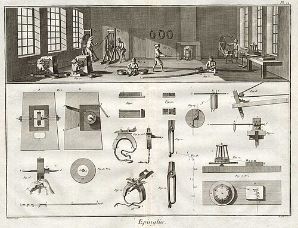

In 1791 [revolutionary France](kloom:e/french-revolution) was measuring itself anew. The [metric system](kloom:e/metric-system)
was to divide the right angle into a hundred grades, and a surveyor working
in grades needed logarithms and sines that no existing table gave. The
work fell to **[Gaspard de Prony](kloom:e/gaspard-de-prony)**, an engineer who directed the _cadastre_,
the land survey that was to map the country down to its smallest
property. He was to make tables that would leave nothing to be desired in
exactness and would be, as a pamphlet on them put it, "the vastest and most
imposing monument of calculation" ever carried out or even conceived.

## Logarithms like pins

The story of how he set about it was printed in [Paris](kloom:e/paris) in 1829, and
**[Charles Babbage](kloom:e/charles-babbage)** reprinted it in 1832. Prony reckoned that even with
three or four able colleagues he would not live to finish. Then, outside a
bookshop, he saw the fine London edition of **[Adam Smith](kloom:e/adam-smith)**'s _Wealth of
Nations_, opened it at random, and fell on the first chapter, on the
division of labor, with its famous example of the making of pins. He
conceived at once the plan of manufacturing his logarithms as one
manufactures pins. He was lecturing at the time on the _method of
differences_ and interpolation, and it was the method that made the
division possible: from a few exact values, a whole table can be built by
nothing more than addition. He set up two workshops that did the same
calculations separately, each a check on the other.

The anecdote came from a pamphlet written to win money for printing the
tables, and [Doron Swade](kloom:e/doron-swade) notes, after Ivor Grattan-Guinness, that its
grandeur may have been doing promotional work. The organization it
describes is not in doubt. Babbage's account gives three sections:

| Section | Who                                            | How many | What they did                                                              |
| ------- | ---------------------------------------------- | -------: | -------------------------------------------------------------------------- |
| First   | eminent mathematicians, Legendre among them    |   5 or 6 | chose formulas suited to many hands working at once                        |
| Second  | _calculateurs_ with a knowledge of mathematics |   7 or 8 | turned the formulas into starting values and differences; checked the work |
| Third   | people who knew addition and subtraction       | 60 to 80 | added the differences down ruled folio pages, and returned the tables      |

The third section, Babbage wrote, had nine in ten who knew no arithmetic
beyond its first two rules, and these were usually more accurate than
those who knew more. The second section could check their work without
repeating it. The plate draws the arrangement: the tree of the three
sections, and a page of differences whose rows below each exactly computed
pivot are filled in by addition alone.

## The hairdressers

The third section has a famous story attached to it: many of its computers
were hairdressers, out of work because the aristocrats whose elaborate
hair they had dressed had gone to the guillotine. It is repeated in
Wikipedia and by Swade, both after Grattan-Guinness. Lorraine Daston, who
went back further, found that Grattan-Guinness was repeating an anecdote
of Charles Dupin's, and that it is not the only one. The
novelist Maria Edgeworth, writing home from France in 1820 and claiming
Prony as her informant, called them clerks and apprentices of caterers,
confectioners and shopkeepers. Prony himself hinted only that some of them
had needed political shelter "under the aegis of science". Who they were
is not documented; the hairdressers are a good story with one early teller.

## A monument never printed

The tables were finished in 1801. Two manuscript copies were made, one now
at the [Paris Observatory](kloom:e/paris-observatory) and one at the library of the Institut de France.
Accounts of their size differ: seventeen large folio volumes in Babbage,
seventeen plus a volume of instructions in Daston, eighteen in Swade,
nineteen in Wikipedia. Daston lists what they hold:

| Table                           | Interval                      | Places |
| ------------------------------- | ----------------------------- | -----: |
| Natural sines                   | every 0.0001 of the quadrant  |     25 |
| Logarithmic sines               | every 0.00001 of the quadrant |     14 |
| Logarithms of 1 to 10,000       | every whole number            |     19 |
| Logarithms of 10,000 to 200,000 | every whole number            |     14 |

They were never printed. The metric law of 1795 left out decimal angles,
money ran out, a printer's estimate ran to 80,000 francs, and British
proposals to share the cost, in 1819 and again in the late 1820s, came to
nothing. An
extract was printed in 1891, to eight decimal places, by the French army's
geographical service. As late as that, Daston notes, no logarithm table
in print went beyond eight places; the precision had been a monument, not a tool.

## What Babbage took from it

Babbage had been thinking of calculating tables by machinery before he
heard of Prony. By 1822 he knew the project, and described it to Humphry
Davy as among "the most stupendous monuments of arithmetical calculation"
yet produced. He saw the manuscripts in Paris in 1826, and checked the
proofs of his own logarithm tables against them. In 1832, in _On the
Economy of Machinery and Manufactures_, he drew the conclusion: once a
calculating engine was finished, it would take the place of the whole
third section. Making that engine fell to a London workshop, and to its
master, [Joseph Clement](kloom:e/joseph-clement).
