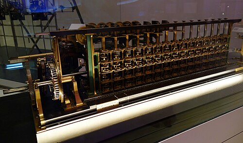

The first [difference engine](kloom:e/difference-engine) to be finished, sold and put to work was not
[Babbage](kloom:e/charles-babbage)'s. It was built in Stockholm by a publisher and his son, from a
magazine article, and it went to work in two places that wanted tables:
an observatory in upstate New York and the office that counted England's
dead.

## From a review

In July 1834 the _Edinburgh Review_ carried **[Dionysius Lardner](kloom:e/dionysius-lardner)**'s long
account of Babbage's engine. It explained the method of differences
clearly and the mechanism only in outline. In Stockholm, **[Georg Scheutz](kloom:e/per-georg-scheutz)**, a
lawyer turned publisher, translator and inventor, read it and set out to
build one of his own design. His son **Edvard** began the work in 1837, at
fifteen, as a student at the Royal Technological Institute. Their
prototype, finished in 1843, had a wooden frame, was made with hand tools
and a simple lathe, worked with three orders of differences on five-figure
numbers, and did what Babbage's never had: it printed its results through
a printer coupled to the calculating mechanism. Swade ranks it the first
automatic printing calculator. Offered to the British government in 1843,
a year after Babbage's engine was abandoned, it was turned down.

With a grant from the Swedish government and backing from friends, the
Scheutzes had a full-sized engine built in the works of **J. W.
Bergström**, completed in October 1853. The plate draws its layout: a grid
of number wheels fifteen figures wide and five rows deep, the table and
four differences, each row added into the one above. Only the table row
was printed, to its eight leading figures, pressed into a soft mould from
which a printer could cast a plate. (Babbage gave it fourteen places of
figures; Merzbach's history gives fifteen.)

## Paris, and Albany

The engine came to London in 1854, was patented and examined by a
committee of the Royal Society, and in 1855 was shown at the Universal
Exposition in [Paris](kloom:e/paris), where it won a gold medal. Babbage, who might have
been its rival, championed it: in 1856 he wrote that honour "must always
be given to Sweden" as the country that first built a machine to print
the results of calculation. At the [Paris Observatory](kloom:e/paris-observatory), though, [Urbain Le
Verrier](kloom:e/urbain-le-verrier) advised against buying it: it did, he said, only a fifth of the
work of making a table, and that fifth more slowly than a human
calculator. It was sold for £1,000 to the new Dudley Observatory at
Albany, New York, with money from a local merchant, John F. Rathbone:
in January 1857, by Swade's account of the letters, or in 1856, as
Merzbach and Wikipedia have it. It computed tables there briefly in 1858, but after the
observatory's astronomer, Benjamin Gould, was dismissed that year it was
rarely used, and in time it went to the Smithsonian Institution.

## Somerset House

In England the engine's champion was **[William Farr](kloom:e/william-farr)**, the statistician of
the General Register Office at Somerset House, which counted births and
deaths. He wanted a larger English Life Table, the table of how many die
at each age from which insurance is priced. In November 1857 the Treasury
ordered a copy for £1,200, built by the engineering firm of **Bryan
Donkin** in Bermondsey. Delivered in 1859, a few weeks late, it had 4,320
parts, 2,054 of them screws, and weighed about half a ton. Donkin lost
money on it, over £600 by his own account, and some twenty years later
refused to repair it.

It was used, as Farr intended, for the _English Life Table_ of 1864, and
it disappointed. It lacked the locks with which Babbage had guarded
against derangement, and needed, in Farr's words, "incessant attention".
Its share of the printed volume was small:

| How the page was set |     Pages |
| -------------------- | --------: |
| Wholly by the engine |        28 |
| Partly by the engine |       216 |
| By hand              | about 356 |
| Total                | about 600 |

The Stationery Office reckoned that had the machine set the whole volume
it would have saved only a tenth of the cost. Swade concludes that the
Astronomer Royal, [George Airy](kloom:e/george-biddell-airy), who had long doubted the value of such
engines, was vindicated, at least on usefulness and cost. Yet Airy,
after inspecting this one on 31 August 1859, wrote to Donkin the next day
to ask whether it could be adapted for the [_Nautical Almanac_](kloom:e/the-nautical-almanac).

## Wiberg's small engine

In Sweden, **Martin Wiberg** rebuilt the design from the ground up around
1860 as a machine the size of a sewing machine. The French Academy of
Sciences reported on it in 1863, and he printed tables of interest with it
from 1860 and of logarithms in 1875, published the next year in English,
French and German. He could sell neither the machine nor the tables,
whose look put buyers off. Printing had proved the easy part; proving that
a machine saved money had not.
Babbage's own second difference engine waited on paper for a century and
more before anyone showed it would work.
