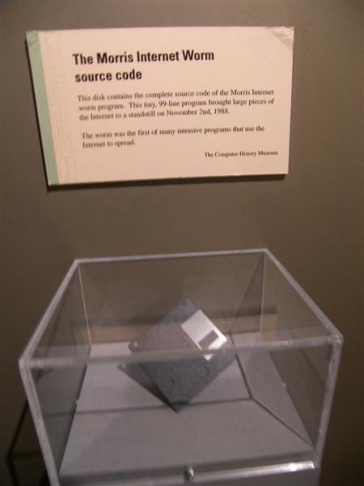

The ARPANET and the early internet were built by people who knew one
another, and trust was built in with them. A Unix machine could be told to
accept logins from its neighbours without a password; the standard mail
program had a hole in its debugging mode; passwords were often plain
words. On
the evening of 2 November 1988 a program showed what that trust was worth.

## The worm

**[Robert Tappan Morris](kloom:e/robert-tappan-morris)**, a graduate student at Cornell, released it at
about 8.30 that evening from a machine at MIT. The [_worm_](kloom:e/morris-worm), a program that
copies itself from machine to machine by its own effort, attacked [VAX](kloom:e/vax)
computers and Sun-3 workstations running Berkeley Unix. It got in through
a debugging mode left in the `sendmail` mail program, a buffer overflow in
the `finger` service, machines that trusted one another, and guessed
passwords. To stop administrators faking a "this machine is already
infected" reply, Morris had it copy itself one time in seven regardless,
and machines infected over and over slowed until they were useless.
University staff had cleared it from most computers within two or three
days, and regional networks cut themselves off from the NSFNET backbone
while they cleaned up.

How many machines it reached is not known. The
US General Accounting Office reported in June 1989 that no one had counted
officially. The figure the press repeated, about 6,000, came from an MIT
estimate that a tenth of its own machines were infected, applied to the
internet's roughly 60,000 computers. A Harvard researcher who asked around
put it at 1,000 to 3,000, and the cost at $100,000 to $10 million. Morris's was the first felony conviction under the 1986 Computer Fraud
and Abuse Act; he was
sentenced to three years' probation, 400 hours of community service and a
fine. In mid-November 1988 DARPA set up the **Computer Emergency Response
Team** (CERT), a five-person coordination centre at Carnegie Mellon
University.

## Secrets between strangers

Cryptography had an older problem that a network makes worse. Two people
who want to talk in secret must first share a key, and handing keys round
in advance does not work between millions of strangers. In November 1976
**[Whitfield Diffie](kloom:e/whitfield-diffie)** and **[Martin Hellman](kloom:e/martin-hellman)** of Stanford began "New
Directions in Cryptography" with "We stand today on the brink of a
revolution in cryptography." They showed how two parties could agree on a
secret key by exchanging messages that an eavesdropper sees in full. Each
picks a private number and sends a public one, a fixed base raised to that
power, modulo a large prime. Each then raises what it received to its own
private power, and both arrive at the same number. Undoing the
exponentiation, the _discrete logarithm_, is beyond the fastest computers
and algorithms known when the prime has at least 600 digits. The plate works the scheme with
small numbers invented for it:

| Step                       | Alice              | Bob                |
| -------------------------- | ------------------ | ------------------ |
| Shared in public           | prime 23, base 5   | prime 23, base 5   |
| Private choice             | _a_ = 6            | _b_ = 15           |
| Sent in the open           | 5⁶ mod 23 = 8      | 5¹⁵ mod 23 = 19    |
| Computes from what arrives | 19⁶ mod 23 = **2** | 8¹⁵ mod 23 = **2** |

In 1977 **[Ron Rivest](kloom:e/ron-rivest)**, **Adi Shamir** and **Leonard Adleman** at MIT
published a scheme in which anyone can encrypt with a published key and
only its owner, who knows how it was made from two large primes, can
decrypt. Together these are [_public-key_
cryptography](kloom:e/public-key-cryptography), and the protocol that carries them across the web today is
the last frame of the trail on the internet's layers. ([Quantum computers](kloom:e/quantum-computing), if large enough ones are built, could break both, and
quantum-resistant schemes are being developed to replace them.)

It had been done before, in secret. At Britain's signals intelligence
agency, [GCHQ](kloom:e/gchq), **James Ellis** showed in January 1970 that "non-secret
encryption" was possible in principle; **[Clifford Cocks](kloom:e/clifford-cocks)** found a way to
do it in November 1973 that Ellis called "essentially the [RSA algorithm](kloom:e/rsa-cryptosystem)";
and **Malcolm Williamson** wrote up a three-pass scheme in January 1974.
The two tellings of Williamson's key exchange differ. Wikipedia dates it
to 1974; Ellis's own history, written in 1987, says Williamson put it on
paper in August 1976, "much later than he thought of it"; Diffie and
Hellman's paper appeared that November. GCHQ released that history in December 1997, and Ellis
died just before it appeared.

## Where it stands

As of 28 September 2026 the FBI counts _ransomware_ among the most
reported threats to critical infrastructure: break in, encrypt or steal an
organisation's data, and demand payment.
Measures disagree by a factor of twenty-five, because they measure
different things.

| Year | Ransomware complaints to the FBI | Ransomware paid, on-chain (Chainalysis) |
| ---- | -------------------------------: | --------------------------------------: |
| 2023 |                            2,825 |                                         |
| 2024 |                            3,156 |                            $892 million |
| 2025 |                            3,611 |                            $820 million |

The FBI's Internet Crime Complaint Center counted losses reported to it
for 2025 at just over $32 million, and says itself that the figure is
artificially low. Chainalysis, tracing payments in cryptocurrency, found
$820 million, expects it to approach or pass $900 million as more
payments are traced, and reports that only 28 per cent of victims paid, a record low,
while claims of new victims on the gangs' leak sites rose by half.

The other front is _supply-chain_ attacks, which poison the software
others install. In September 2025 the US Cybersecurity and Infrastructure
Security Agency (CISA) warned of a self-replicating worm, known as
"Shai-Hulud", that had compromised more than 500 packages in npm, the
JavaScript package registry, stealing developers' GitHub tokens and cloud
keys and publishing infected versions of their other packages in their
names. On 31 March 2026 two released versions of Axios, a package on npm,
pulled in a malicious dependency that installed a remote-access
trojan. The worm of 1988 abused the trust between machines; these abuse
the trust between programmers.

Where computing as a whole now stands is the last frame.
