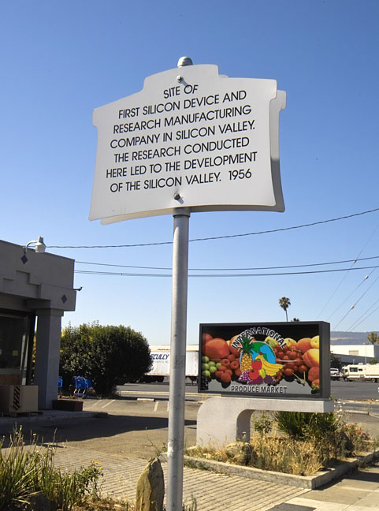

The transistor was invented in New Jersey, and for its first decade it was
made mostly of germanium. It moved west because its most famous inventor
wanted to live near his mother, and it changed material because of the
people he hired and could not keep.

## Shockley's laboratory

In September 1955 **[William Shockley](kloom:e/william-shockley)** and the instrument maker **Arnold
Beckman** agreed to found the **[Shockley Semiconductor Laboratory](kloom:e/shockley-semiconductor-laboratory)**, a
division of Beckman Instruments. Shockley rented a building at 391 South
San Antonio Road in Mountain View, California, near Palo Alto, where he
had grown up and where his mother still lived. He advertised in the East
Coast papers and recruited young physicists, chemists and engineers, among
them **[Robert Noyce](kloom:e/robert-noyce)** from Philco and **[Gordon Moore](kloom:e/gordon-moore)** from Johns Hopkins.
By September 1956 the laboratory had 32 people.

It went wrong quickly. Shockley shared the [Nobel Prize](kloom:e/nobel-prize-in-physics) that December, and
the staff found him secretive and suspicious: calls were recorded, and at
one point he asked the whole laboratory to take a lie-detector test. His
research choice worried them more. Rather than make silicon transistors,
which the market wanted, he set the laboratory on a four-layer p-n-p-n
diode he had conceived at Bell Labs for telephone switching. A group led
by Moore asked Beckman to replace him and was refused.

## The eight

On 18 September 1957 eight of them resigned: **Julius Blank**, **Victor
Grinich**, **[Jean Hoerni](kloom:e/jean-hoerni)**, **[Eugene Kleiner](kloom:e/eugene-kleiner)**, **[Jay Last](kloom:e/jay-last)**, Moore, Noyce
and **Sheldon Roberts**. Kleiner had gone to New York to look for money, and
**Arthur Rock** of the bank Hayden, Stone found them a backer in Sherman
Fairchild's Fairchild Camera and Instrument. It lent the new **[Fairchild
Semiconductor](kloom:e/fairchild-semiconductor)** $1.38 million, with the right to buy the founders out,
which it did in 1959. Shockley called the departure a betrayal, and the
group became known as the ["traitorous eight"](kloom:e/traitorous-eight), though no one knows who
coined the name. His own company never made a profit and was sold in 1960.

Fairchild set up in Palo Alto and had its first order early in 1958: 100
silicon transistors, at $150 each, from IBM's Federal Systems Division for
a computer on the B-70 bomber. It chose silicon deliberately. Germanium was
easier to work, but a germanium transistor leaked badly when it should
have been off, the worst fault in a logic circuit, and worked only from 0
to 70 °C; silicon worked from −55 to 125 °C. The Computer History Museum
dates silicon's arrival as the industry's preferred material to the end of
the 1950s.

## Oxide as a mask and a seal

Silicon had one gift germanium lacked: its own oxide. In 1955 **Carl
Frosch** and **Lincoln Derick** at Bell Labs found that a layer of silicon
dioxide grown on a wafer blocked the impurities used to make p-type and
n-type regions, and that windows etched in it let them diffuse in only
where wanted. Fairchild's first transistors used the oxide that way and
then stripped it off, as everyone did, leaving a raised _mesa_ with its
junctions bare at the edges. Particles flaking inside the metal can could
short them.

**Jean Hoerni** saw that the oxide could stay. His [planar process](kloom:e/planar-process) diffuses
the base and then the emitter through windows in the oxide, and the
impurity spreads sideways under the edge of each window as well as down,
so every junction ends under the oxide that masked it, as
the plate shows. Leave that oxide in place, open only small windows for
the metal contacts, and the junctions are sealed from the start. Hoerni's
patent, filed on 1 May 1959, puts it plainly: the junctions are "at all
times fully protected by an oxide layer". The surface is flat, which gave
the process its name.

| Step                      | What the oxide does                            |
| ------------------------- | ---------------------------------------------- |
| grow oxide, open window   | masks the wafer                                |
| diffuse the base (p)      | the junction curves up under the window's edge |
| regrow oxide, open window | masks again, inside the base                   |
| diffuse the emitter (n⁺)  | the second junction also ends under oxide      |
| open contact windows only | the rest stays as a seal; aluminium goes down  |

The dates are told two ways. The museum has Hoerni recording the idea in
December 1957, writing a patent disclosure in January 1959 and showing a
working planar transistor that March; Wikipedia's account of the eight
dates his proposal to 1 December 1957 and describes night experiments in
spring 1958. Fairchild sold its first planar transistor, the 2N1613, in
April 1960. Credit was contested too: Hoerni felt his work was undervalued,
and Moore later attributed the process to Fairchild's engineers without
naming him.

The planar process did more than seal a transistor. A flat, insulated
surface is a place to lay wires, and within months Noyce saw what could be
built on it: the [integrated circuit](kloom:e/integrated-circuit).
