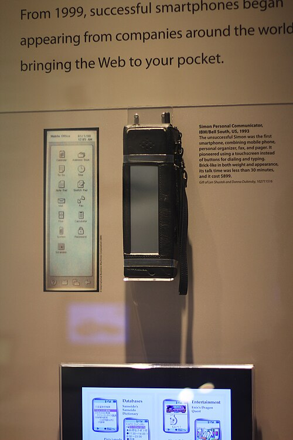
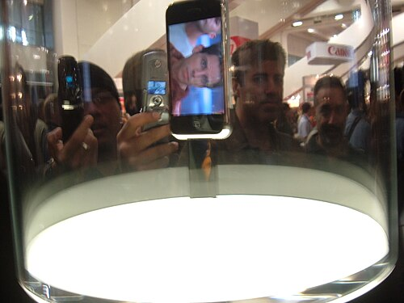

A telephone, a diary and a postbox had been separate things; a pocket
computer, from the 1990s, joined them. It took fifteen years, several false
starts and one theatrical launch, and the result was a computer that more
people carry than any other. This frame describes the [smartphone](kloom:e/smartphone) as of 28
September 2026.

## Phones that did more

The first was a brick. [**IBM**](kloom:e/ibm) showed a prototype, code-named Sweetspot, at
the COMDEX trade show in Las Vegas in November 1992, the idea of its
engineer **Frank Canova**. As the [**Simon Personal Communicator**](kloom:e/ibm-simon), made
by Mitsubishi Electric, it went on sale through BellSouth on 16 August 1994:
a mobile phone with a touch screen worked by a stylus, a calendar, an
address book, fax and email, on an x86 processor, for $899 with a two-year
contract. Its battery lasted about an hour. BellSouth sold about 50,000
before it was withdrawn in February 1995.

Business took up the idea from Canada. **Research In Motion** of Waterloo,
Ontario, launched the first [**BlackBerry**](kloom:e/blackberry) in 1999, a two-way pager for
email with a keyboard, and in 2002 the 5810, which was also a phone.
Its email arrived by itself, and it spread through offices in the United
States and Canada. At
its peak, in September 2011, BlackBerry had 85 million subscribers.

## The iPhone, the App Store and Android

On 9 January 2007 [**Apple**](kloom:e/apple-inc) announced the [**iPhone**](kloom:e/iphone), as, in its words, three
products in one: a mobile phone, a widescreen iPod and an internet device
with desktop-class email and web browsing. It had no keyboard. It was
worked with the fingers, on a 3.5-inch _multi-touch_ screen. It went on
sale in the United States on 29 June 2007, at $499 for 4 GB and $599 for 8
GB with a two-year contract, and ran on a Samsung-made [ARM](kloom:e/arm-architecture-family) processor
slowed to 412 MHz to save the battery. The original model sold about 6.1
million before it was replaced a year later.

The plate draws what a finger does to a capacitive multi-touch screen. Under the glass lie
two sets of transparent electrodes, rows and columns, crossing without
touching; each crossing is a small capacitor. The controller drives the
rows in turn and measures the columns, and a finger near a crossing draws
off some of the field and lowers the capacitance there. Two fingers make
two separate dips in the map, which is what lets a phone see a pinch. [CERN](kloom:e/cern)
engineers built a mutual-capacitance screen of this kind in 1977.

At first the iPhone ran only Apple's programs. The **App Store** opened on
10 July 2008 with about 500 applications. By 14 July, Apple said, users had
downloaded more than ten million, and more than 800 were on offer.

[Google](kloom:e/google) had bought [**Android**](kloom:e/android-operating-system), a start-up founded by **Andy Rubin**, in 2005. Its early prototype looked like a BlackBerry, with a keyboard and no
touch screen; after the iPhone, it went back to the drawing board. The Open
Handset Alliance of Google, handset makers, carriers and chip makers
announced it on 5 November 2007, and the first Android phone, HTC's Dream,
sold as the T-Mobile G1, came out in October 2008 for $179 on contract.
Android is built on the Linux kernel and given away as open source, so any
maker could build a phone on it.

| Year | Device                    | What it added                                 |
| ---- | ------------------------- | --------------------------------------------- |
| 1994 | IBM Simon                 | Phone, organizer, fax and email, touch screen |
| 1999 | BlackBerry 850            | Email pushed to a pager with a keyboard       |
| 2002 | BlackBerry 5810           | The same, and a phone                         |
| 2007 | iPhone                    | Multi-touch, a full web browser               |
| 2008 | App Store; HTC Dream (G1) | Anyone's software; the first Android phone    |

## The most common computer

BlackBerry fell to 23 million subscribers by March 2016, and that
September stopped designing its own phones. The market now has two
systems. In August 2026, by StatCounter's count of web pages viewed on mobile
devices, 67.6 percent came from Android and 32.4 percent from Apple's
iOS.

The research firm **IDC** counted 1.26 billion smartphones shipped in 2025,
up 1.9 percent on the year before; in the same year it counted 284.7
million personal computers, desktops, laptops and workstations together.
So about four phones were made for every PC. The GSMA, the mobile
operators' association, counted 5.8 billion people with a mobile
subscription in its 2026 report, about seventy percent of the world. Not all of those
phones are smartphones, and the phone has not simply replaced the desk:
StatCounter measured 49.4 percent of web traffic in August 2026 coming
from mobiles and 49.1 from desktops.

A phone does not work alone. Its maps, mail, photographs and messages live
in buildings full of servers far away, and the [cloud](kloom:e/cloud-computing) is the next frame's
subject.
